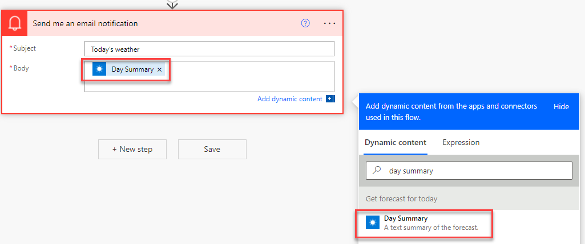
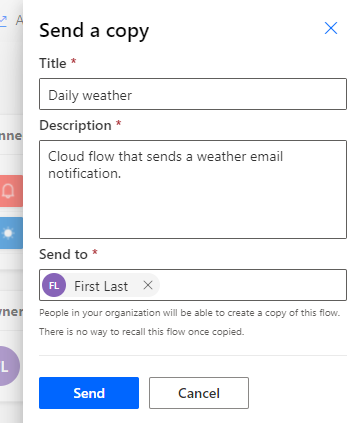
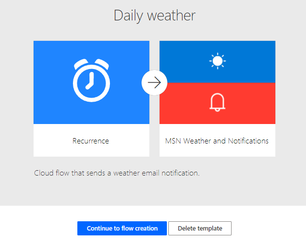

In this exercise, you'll create a cloud flow, send a copy of the cloud flow to yourself, and then test the cloud flow.

> [!IMPORTANT]
> Use a test environment.

## Task 1: Create cloud flow

In this task, you'll create a cloud flow that will send a daily weather notification for a given city.

1. Navigate to [Power Automate](https://us.flow.microsoft.com/?azure-portal=true) and make sure you're in the correct environment.

1. Select **My flows** and select **Scheduled cloud flow**.

1. Enter **Daily weather** for Flow name, select Repeat every **1 Day**, and select **Create**.

    > [!div class="mx-imgBorder"]
    > 

1. select **+ New step**.

1. Search for weather and select **Get forecast for today** (MSN Weather).

1. Enter **Denver** or any city you like for Location, select **Imperial** for Units, and select **+ New step**.

    > [!div class="mx-imgBorder"]
    > 

1. Search for send email and select **Send me an email notification**.

1. Enter **Today's weather** for Subject, select the Body and select **Day Summary** from the dynamic content pane.

    > [!div class="mx-imgBorder"]
    > 

1. Type **with High** on the body and select **Temperature High** from the dynamic content pane.

1. Type **and Low** on the body and select **Temperature Low** from the dynamic content pane.

1. The **Send me an email notification** step should now look like the image below. Select **Save** and wait for the flow to be saved.

    > [!div class="mx-imgBorder"]
    > 

1. Select the back button.

    > [!div class="mx-imgBorder"]
    > 

1. Select **Run**.

1. Select **Run flow**.

1. Select **Done**.

1. The flow run should succeed.

    > [!div class="mx-imgBorder"]
    > 

1. Select the **App** launcher, right select **Outlook** and select **Open in a new tab**.

    > [!div class="mx-imgBorder"]
    > 

1. You should receive the email notification sent by the flow. Select to open the email.

1. The email should look like the image below.

    > [!div class="mx-imgBorder"]
    > 

1. Go to the flow details browser tab.

1. Don't navigate away from this page.

## Task 2: Send a copy

In this task, you'll send a copy of the cloud flow you created to yourself. You may send the copy to another user if you have more than one user in your tenant.

1. Select **Send a copy**.

    > [!div class="mx-imgBorder"]
    > 

1. Enter **Cloud flow that sends a weather email notification** for Description, select your username and any other user you would like to send the copy, and select **Send**.

    > [!div class="mx-imgBorder"]
    > 

1. Go to the Outlook browser tab.

1. You should receive an email from Power automate. Select **Create my flow**.

    > [!div class="mx-imgBorder"]
    > 

1. Power automate should launch and display the flow template. Select **Continue to flow creation**.

    > [!div class="mx-imgBorder"]
    > 

1. Power automate should show you the connectors the flow uses. Select **Create flow**.

1. Select **Run**.

1. Select **Run flow**.

1. Select **Done**.

1. The flow should succeed, and you should receive te weather email notification.

1. Select **My flows**.

1. You should see the original flow you created, and the flow copy you sent to yourself. Assuming you sent the copy to yourself.

    > [!div class="mx-imgBorder"]
    > 
