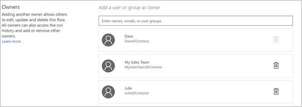

When you select the share option on a selected cloud flow, you'll navigate to a page to manage the owners of the flow.

By adding users or groups to the list of Owners, you create co-ownership of the flow with those users.

> [!div class="mx-imgBorder"]
> 

In the above example, Dave is the original flow owner, and they've shared it with Julie and My Sales Team. My Sales Team is a group, and anyone who is a group member automatically becomes the flow co-owner.

As co-owners of the flow, these users have permission to perform the following actions:

- Run the flow on demand for instant and scheduled flows.

- Edit the flow definition (for example, add or remove an action or condition).

- Perform test runs of the flow.

- View the run history.

- Manage the properties of the flow (for example, start or stop the flow, add owners, or update credentials for a connection).

- Add or remove other owners (but not the flow's creator).

- Delete the flow.

Given that co-owners have full permissions including delete access, you should only add users that you trust and need to perform these activities. If the flow is an instant flow and all the users need is to run the flow, it's better to add them as run-only users instead of co-owners. You'll learn about run-only users in the next unit.

Users with the Global Administrator and Power Platform Administrator tenant roles can also manage the flows Owners, including adding themselves to the list.

Sharing critical business flows with at least one other user can be important in case the flow creator is out of the office or left the company and a change is required.

> [!VIDEO https://www.microsoft.com/videoplayer/embed/]

## Connections

When you build a flow and add actions, some of the actions will use connectors. The first time a connector is used, a connection will be established and will be used by the actions. To establish the connection the user modifying the flow is required to authenticate. That connection will be associated with that user and actions performed will be in that context. For example, if Dave added a SharePoint action to add an item to a list, it would show Dave added the list item when that action ran.

On the share page, in the Embedded connections section, you can see which connections are used in the flow.

All flow owners have access to these connections only for this flow. That allows them to add more steps to the flow using these connections without the need to authenticate or create new connections. But it doesn't allow them to use the connection outside of the flow.

If Julie edits the flow and adds a step to send an email using the Office 365 connector, it's added to the list of connections with Julie as the connection user. If the flow is executed, the emails are sent from Julie, and Dave is still the creator of the SharePoint list item. The connection list now looks like the following, showing the connection Julie added.

When collaborating with others on a flow, you might want to designate one user to manage the connections so they're all in the same context.

Any of the flow owners can use any of these connections in this flow to perform actions on your behalf. So you should watch out for inadvertent elevation of the permissions and only add owners that you trust. For example, in the flow above, Julie can access information in SharePoint as Dave regardless of whether they have permissions to do so as themself.

## Do I need to share using co-ownership?

| Scenario | Options |
| -------- |-------- |
| I want to allow another user to edit my flow | Co-ownership is the best option. |
| I have a flow that triggers when someone adds a list item to SharePoint, or creates a row in a Dataverse table. Do I need to add each user that adds items as a co-owner of my flow? | No, this is an automated flow triggered by an event. As long as the flow connection user has access to the list or table the flow will run properly without needing to add all users as owners or run-only. |
| I have an instant flow and I want others to run the flow. | Co-ownership isn't required; you should set them up as run-only users. |
| I have a scheduled flow and I want others to run it on demand in addition to the scheduled times. | Co-ownership is the best option just be aware they'll have more permissions than just running the flow. |
