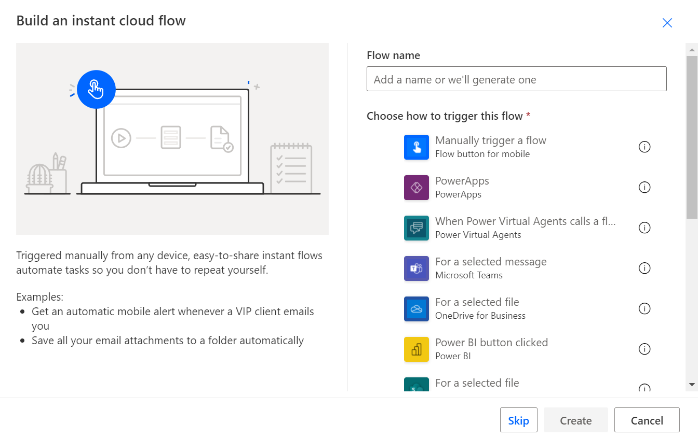
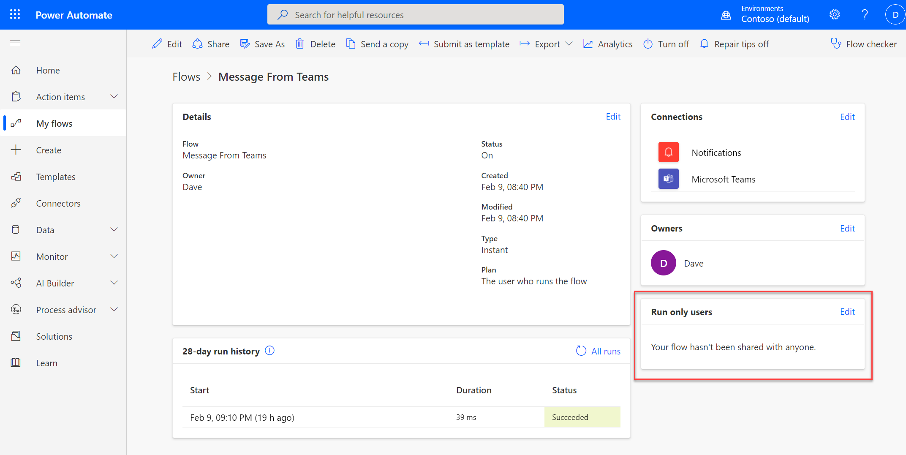
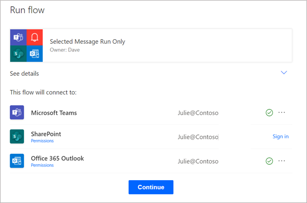
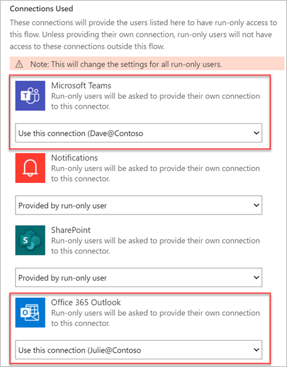

An alternative to sharing a cloud flow with co-owners is to share it by using the run-only option.

> [!VIDEO https://www.microsoft.com/videoplayer/embed/RE4PlRj]

When a flow is shared as run-only, the user can run the flow but can't make changes to it. Run-only sharing is only available for instant cloud flows. Instant cloud flows are triggered manually from one of the supported applications. The following image shows a few available triggers that make a cloud flow support run-only sharing.

> [!div class="mx-imgBorder"]
> 

To share an instant cloud flow as run-only, select the **Edit** link in the **Run only users** section of the detail page to open the share panel.

> [!div class="mx-imgBorder"]
> 

The run-only section is only visible for instant cloud flows. If the run-only section isn't present, the flow isn't using an eligible trigger.

On the share panel that is displayed, you can choose to invite one or more users and groups.

:::image type="content" source="../media/invite.png" alt-text="Screenshot showing the share panel where you can choose to invite one or more users or groups.":::

If your flow uses the SharePoint connector, the **SharePoint** tab will display, where you can select a **Site** and **List** that can run the flow. List users must have edit permissions for the list items to be eligible to run the flow.

:::image type="content" source="../media/sharepoint.png" alt-text="Screenshot showing the share panel where you can set up a Microsoft Lists user to have permission to run the flow.":::

## Connection options

In the lower part of the share panel for each connector that is used by the flow, you can set up which connection to use when a user runs the flow. You can choose the **Provided by run-only user** or the **Use this connection** option.

:::image type="content" source="../media/connections.png" alt-text="Screenshot showing the connections used, which will allow you to set up which connection to use for each connector.":::

The default option is **Provided by run-only user**, meaning that when a new user first uses the flow, they'll be prompted to create a connection for the connectors that use that option. In the following example, Dave (the flow owner) has shared a flow with Julie and the following prompt for connections will show on first use.

> [!div class="mx-imgBorder"]
> 

The preceding image shows that Julie already had a Microsoft Teams and Office 365 Outlook connection but needs to sign in to SharePoint. All connectors for this flow will be in the context of Julie's connections.

In the following example, Dave shared with Julie again but changed the Microsoft Teams and Office 365 Outlook connection to use the existing connection. With this approach, when the flow runs, those connectors' actions will use Dave's connection and permissions. This approach allows the flow to take actions that the implementing user might not have access to do. For example, it can post to a Teams channel that the user isn't a member of.

> [!NOTE]
> You can change these selections anytime, but they'll apply to all users simultaneously. You can't have some users with different options.

With the new connection options, when Julie accesses the flow, it will now only prompt for the SharePoint connection.

Sharing an instant flow by using the run-only option is a great way to let others use the automation that you built without having to give them full ownership access.
