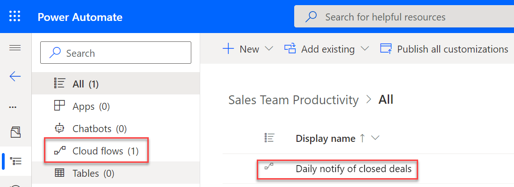

When a Power Automate cloud flow is created in a solution or added to a solution, an extra layer of security is enabled, and it changes how sharing of a cloud flow works.

Solutions are the Power Platform mechanism for implementing [Application Life Cycle Management](/power-platform/alm/?azure-portal=true) (ALM) for Power Apps, Power Automate and Power Virtual Agents. Power Automate cloud flows can be added as a solution component along with other resources like Power Apps and Dataverse table definitions. Solutions then act as a container for your changes and allow you transport them from one Power Platform environment to another. Solutions can also be exported and stored in source control as part of your ALM strategy.

You can only create solutions in a Power Platform environment with Microsoft Dataverse configured. Cloud flows associated with a solution have their definition stored in a Dataverse table named Processes. The ability of a user other than the creator of the cloud flow to run or modify the flow depends on the user's Dataverse security privileges.

For a user to run or modify a cloud flow, they must first be added as a Dataverse environment user. For example, if you try to share with a user that isn't a member, you'll see the following not found message.

> [!div class="mx-imgBorder"]
> 

If you created the environment, you're an environment administrator and can [add the user](/power-platform/admin/add-users-to-environment/?azure-portal=true), otherwise any of the environment administrators can. The newly added user will need to have a security role assigned that gives them at least user-level privileges to the Processes table. A good built-in security role that would give them that would be the [Environment Maker role](/power-platform/admin/database-security?azure-portal=true#environments-with-a-dataverse-database). However, you can also use or create a custom security role as well.

Once added, you can share a solution cloud flow with the user, and they'll be able to see the flow in the Solution Explorer. They won't see the shared flow in **My Flows** > **Shared with me**. They'll only see it when using Solution Explorer.

> [!div class="mx-imgBorder"]
> 

You can share a solution flow with a group of users, but it's done using [Dataverse Teams](/power-platform/admin/manage-teams/?azure-portal=true) instead of user groups. You can still use Azure Active Directory Security groups or Office Groups, but the group must first be associated with a Dataverse Team. In the following image, we show adding a Dataverse team that is associated with the Office Group My Sales Team.

> [!div class="mx-imgBorder"]
> 

Before you can share flows with the team, just like a user, it will need to be associated with a security role. Once completed, you can share a solution cloud flow with the team and that will give owner access to the cloud flow to all members of the group.

## Run-only flows

Cloud flows in solutions can also be shared as run-only using a similar process. To be effective at limiting a user's access to read-only, the security role granting them privileges to the Dataverse Processes table must be limited to their own processes. That way the users won't be able to modify the processes they didn't create. A good built-in role for run-only use would be the [Basic User role](/power-platform/admin/database-security?azure-portal=true#environments-with-a-dataverse-database).

## Impact of Dataverse security roles

Since Dataverse security controls the sharing of solution cloud flows, users can also gain access to solution cloud flows based on their security roles assigned directly or indirectly via a Dataverse team. For example, users with the System Administrator or System Customizer built-in roles have the equivalent of owner access to all cloud flows in the environment without a direct share being required. Users who gain access to a cloud flow via a security role and not a direct share aren't listed in the Owner's list on the cloud flow. You can check what privileges a security role provides by looking at its configuration.

> [!div class="mx-imgBorder"]
> 

The full circle for each Process table privilege would grant permissions to perform the relevant operation, that is, create, read, write, delete, for any solution flow in this environment. The following image shows what the Basic User role looks like.

> [!div class="mx-imgBorder"]
> 

Only a quarter of the circle is filled, giving user-level access where the operation is only permitted on the solution cloud flows the user created themselves. This security role configuration allows individual sharing of cloud flows with the user or team while only sharing the privileges granted by the type of share, for example, owner or run-only.

A complete discussion of Dataverse security is beyond the scope of this module, however you can learn more by reading [Security concepts in Microsoft Dataverse](/power-platform/admin/wp-security-cds/?azure-portal=true).
