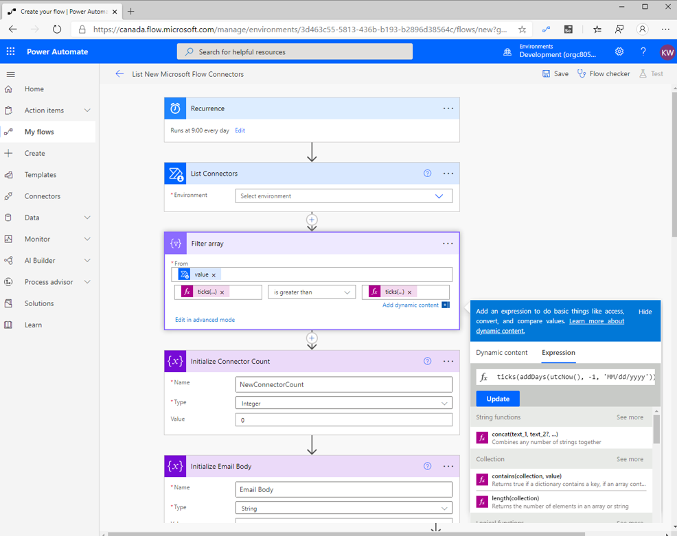
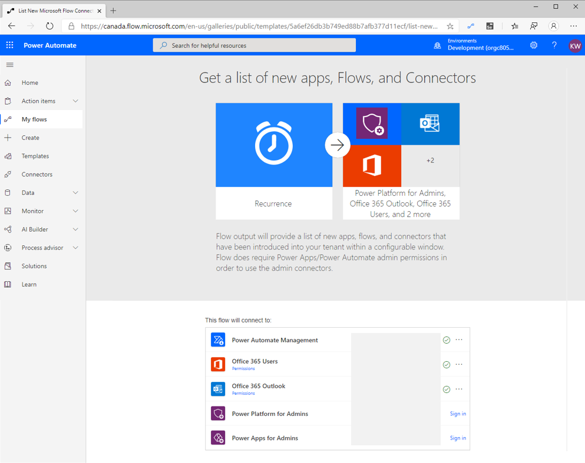
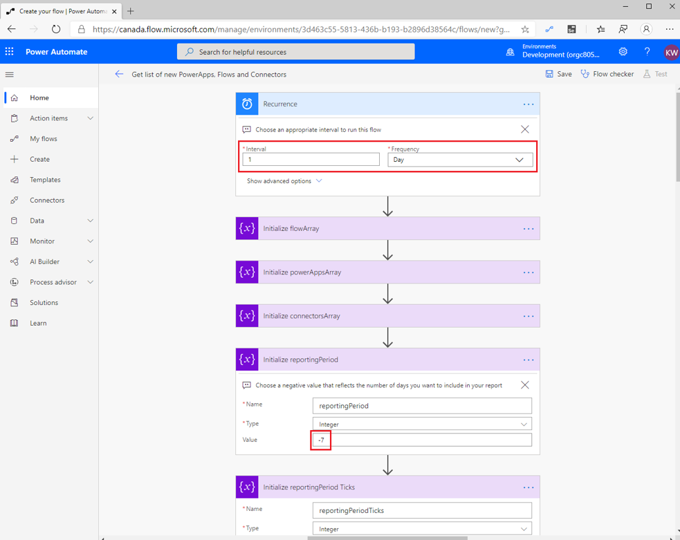
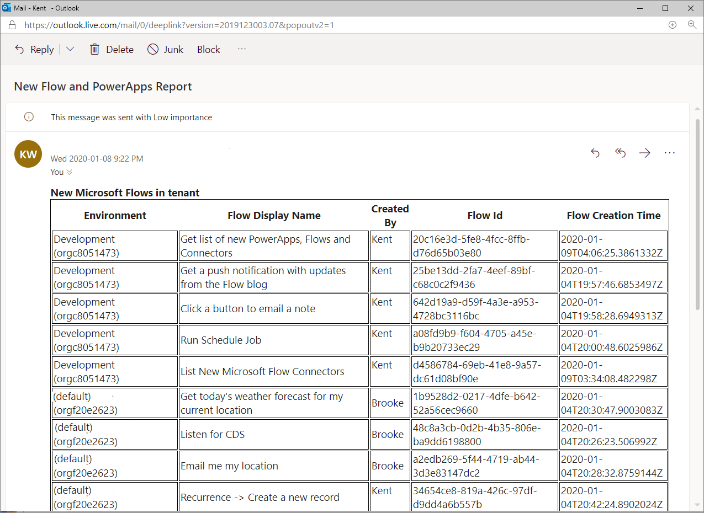
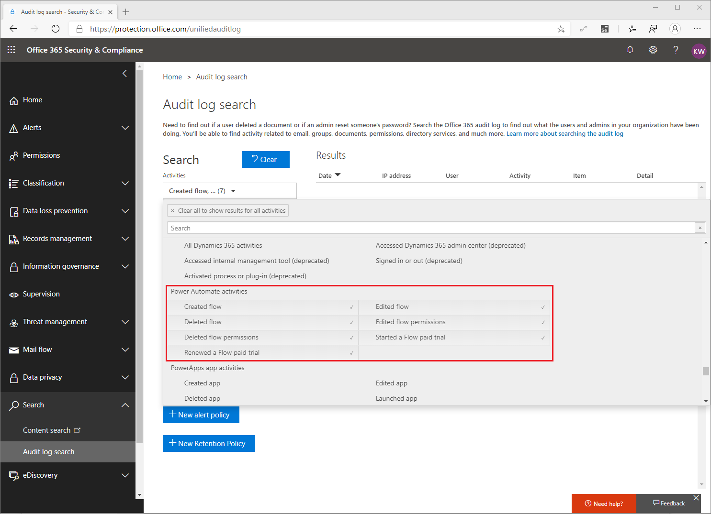
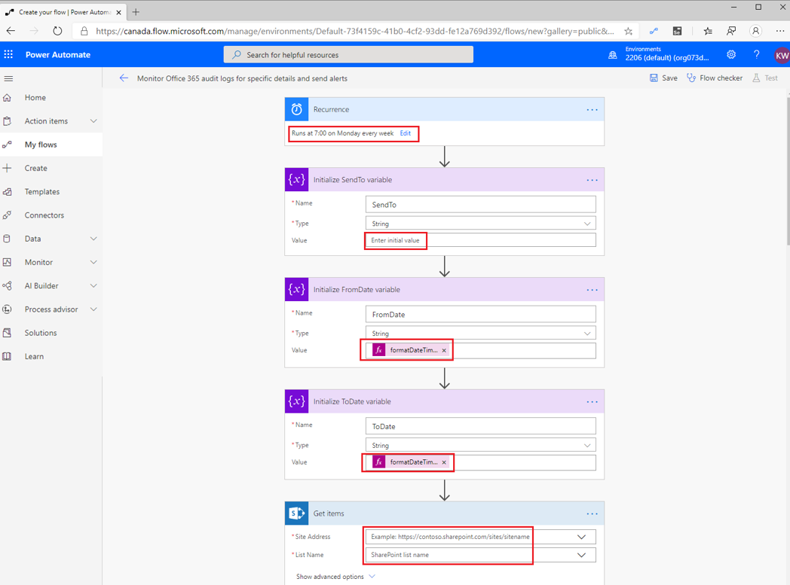

In this section we are going to discover templates that allow
administrators to automate the governance of their environments.

### Template #1 - List New Microsoft Flow Connectors

The first template that we are going to explore is called List New
Microsoft Flow Connectors. This template will help us discover new
connectors that have been deployed in a Power Platform environment. You
can provision this template by clicking on the following
[link](https://canada.flow.microsoft.com/galleries/public/templates/5a6ef26db3b749ed88b7afb377d11ecf/list-new-microsoft-flow-connectors/?azure-portal=true)
or searching for it in the Template gallery.

Once we click on this template, we will find a description of what the
flow does and will be prompted to establish new connections for the
connectors that are used by the flow. If you already have existing
connections for these connectors, we can simply click on the
**Continue** button.

After clicking on the Continue button, our flow will be loaded into the
Power Automate designer experience. From here, we can modify the flow to
suit our needs. For example, this flow is configured to run every day at
9 am. The flow will then allow you to select an environment and the flow
will check to see if there are any connectors that have been provisioned
within the past 24 hours. We can modify this expression to include a
broader duration if we wish.

There are no additional configuration changes that we need to make. We
can now run this flow, and if new connectors have been deployed in the
past day, we will receive an email like the following. In this case, we
have a custom connector that has been recently deployed in our
environment.

As an administrator this is an important email as I can now go ahead and
adjust DLP policies to ensure this connector has been placed in the
correct data group.

> [!NOTE]
> Depending upon what environment you are running this flow in,
you may encounter a DLP error based upon our activities performed in
previous modules. Modify or remove DLP policies as appropriate.

### Template #2 - Get list of new PowerApps, Flows and Connectors

Another useful template that administrators can take advantage of is Get
list of new PowerApps, Flows and Connectors which can be found by
searching in the template gallery or by clicking on this
[link](https://canada.flow.microsoft.com/galleries/public/templates/0b2ffb0174724ad6b4681728c0f53062/get-list-of-new-powerapps-flows-and-connectors/?azure-portal=true).

This template is like the template that we just discussed, with the
exception that it will search all environments within the tenant and
will also identify new apps and flows, in addition to connectors.

When we click on this template, we will also have to create connections
to the connectors used in the flow, if they have not already been
established. Once our connections have been established, we can click on
the **Continue** button to provision our flow.

This flow is also configured to run daily and there is a variable called
reportingPeriod that can be modified. This value indicates the number of
days back that the flow should evaluate when looking for new apps, flows
and connectors. The default value is -7 which means that this flow will
look for new assets created in the past 7 days.

When we run this flow, a report will be generated that identifies every
new flow, app and connector that has been created in our tenant over the
past seven days. Depending upon how many environments and apps/flows you
have in your tenant, this flow may take several minutes to complete
execution.

### Template #3 - Monitor Office 365 audit logs for specific details and send alerts

The last template that we are going to explore is called Monitor Office
365 audit logs for specific details and send alerts and can be found by
searching for it in the template gallery or by clicking
[here](https://canada.flow.microsoft.com/galleries/public/templates/4a7ea95259f1404e95855f6b053360b1/monitor-office-365-audit-logs-for-specific-details-and-send-alerts/?azure-portal=true).

The purpose of this template is to search the [Office 365 Security and Compliance](https://protection.office.com/unifiedauditlog/?azure-portal=true) logs for Power Automate events on a configured interval. The events that are captured in these logs include:

-   Created flow

-   Edited flow

-   Deleted flow

-   Edited flow permissions

-   Deleted flow permissions

-   Started a Flow paid trial

-   Renewed a Flow paid trial

Before we can use this flow, we need to establish connections to
SharePoint and Office 365 Outlook. The reason for this is that we will
store the names of events that we want to subscribe to in SharePoint and
we will use the Office 365 Outlook connector to send our results out to
our intended audience. Once we have created our connections, we can
click on the **Continue** button to edit our flow.

Before we configure our flow, we need to create a custom SharePoint list
where we can store the operations that we will pass into the Office 365
API. In our scenario we are interested in knowing when there are new
flows created. As a result, we will add a record that includes a Title
of CreateFlow**.** A complete list of supported operations may be found
[here](https://flow.microsoft.com/blog/accessing-office-365-security-compliance-center-logs-from-microsoft-flow/?azure-portal=true).

With our SharePoint list created we can now edit our flow so that we can
connect to our list. While we are in the flow designer, there are a few
actions that we need to configure including our Recurrence trigger that
indicates when our flow will run. We also need to populate a SendTo
variable which represents an email address that we want to send our
output to. Should we want a different duration of events that we should
query for, we can modify the expressions in the FromDate and ToDate
variable.

When connecting to the Office 365 Security and Compliance API, we are
going to provide our Office 365 admin credentials. We will do so by
populating the **Username** and **Password** that are found in the
**advanced options** in the **HTTP** action.

We are now ready to run our flow. Provided we have created a flow within
our tenant in the past 30 days, we should receive an email that looks
like the following:

