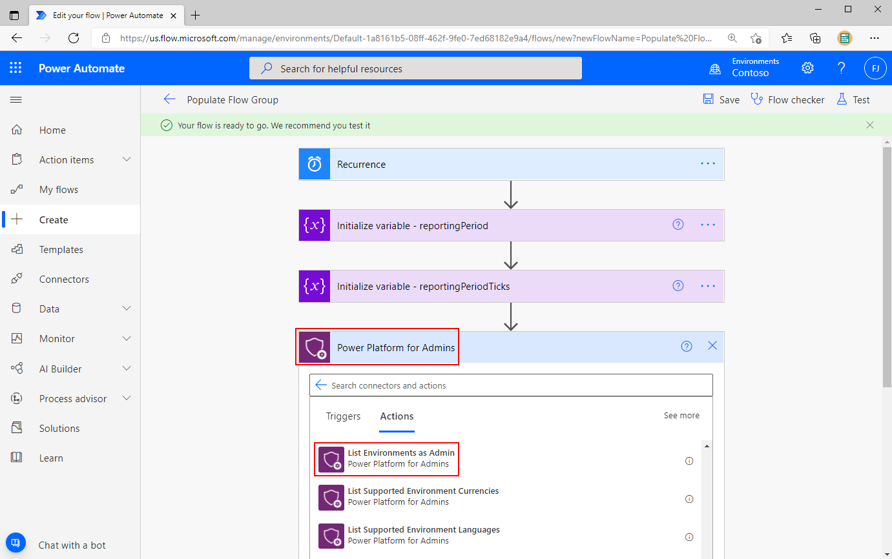
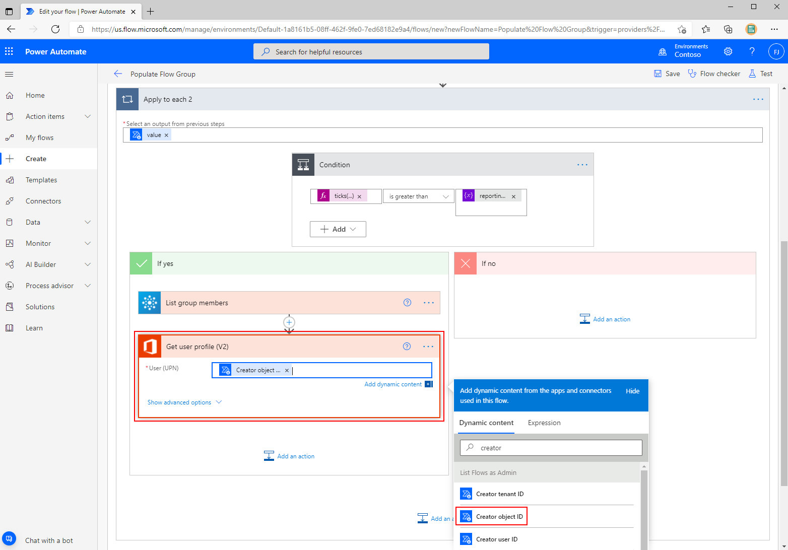

The previous module of this learning path discussed the need to
maintain a digital tracking list that can be used to communicate governance
changes to users. One way to track users is to put them in an Office 365 Group.
If your DLP policies change, you can use this Office 365 group to send updates.

However, to ensure that users are aware of an organization's governance
policies, you can include training materials that they must complete
prior to being added to this Office 365 group. This step will help you verify that the users are
aware of permitted activities and will ensure that they are aware of training
materials that will accelerate their learning journey.

1. Before building your flow, create your Office 365 group. Launch Outlook mail in a web browser. In the left navigation pane, select **Groups** and then select **New Group**.

1. Enter **Flow Users** in the **Group name** field and then select the **Create** button.

    

1. Go to the [Power Automate Maker Portal](https://flow.microsoft.com/?azure-portal=true) and then select **Create** to make a new flow.

    

1. Select the **Scheduled flow** icon to create a flow that will run on a regular interval.

    

1. Provide a name for your flow, such as **Populate Flow Group**.

1. Set the **Repeat every** value to **1 Day** so that your process will run once a day. Select the **Create** button to proceed.

    

1. Create the following two variables by selecting **+New step**, followed by searching for variables and then selecting **Initialize variable**.

    

    Name your variables and include the appropriate **Value** as outlined below:

    1. **reportingPeriod** - Set the Type to Integer and the Value to **-1**. This variable will be your window that you will look back on to determine if you have any new flows created. If you want to run this process weekly, then a value of **-7** would be appropriate.

    1. **reportingPeriodTicks** - Set the Type to Integer and the Value to the following expression ```ticks(addDays(utcNow(),variables('reportingPeriod')))```. This variable represents the number of ticks that exist for your reporting period.

        

1. For the next action, select **+New step**, search for and select the **Power Platform for Admins** connector and then select the **List Environments as Admin** action.

    

    This action will return a list of environments that can be selected in the next action.

1. For the next action, select **+New step**, search for and select the **Power Automate Management** connector and then select the **List Flow as Admin** action.

    1. To set the Environment, select the drop-down and select **Enter custom value**. Select **Name** value in the **Dynamic content** window. This will wrap the action in an **Apply to each** loop automatically to iterate through each environment.

        

        Listing all the flows within an environment will return an array of flows.

1. To iterate though this array of flows, add an **Apply to each** loop action. This loop will automatically be named **Apply to each 2**. Within this loop, select **Add an action** and then select **Condition** to check if there are new flows in each environment by verifying if the ticks of the current flow's created date are greater than the ticks value of the reportingPeriodTicks variable.

    1. In the **Condition**, set the left value to the following expression ```ticks(items('Apply_to_each_2')?['properties/createdTime'])```. Set the logical operator to **is greater than** and then set the right value to the reportingPeriodTicks variable.

        If any flows were created before the reporting period, no other actions will be executed. If any flows were created after the reporting period, the actions outlined below will be executed in the **If yes** branch of the **Condition**.

        

1. Add the following actions to the **If yes** branch of the **Condition**:

    1. Select **Add an action**, search for and select the **Office 365 Groups** connector and then select the **List group members** action. To set the **Group Id**, select the drop-down and select the **Flow Users**, the group you previously created.

        

        This action will return a list of all the members of the selected Office 365 group.

    1. For the next action, select **Add an action**, search for and select the **Office 365 Users** connector and then select the **Get user profile (V2)** action. Set the **User (UPN)** value by selecting the **Creator Object ID** value from the **List Flows as Admin** action in the **Dynamic content** window.

        

        This action will retrieve the UPN (User Principal Name) of the flow creator.

1. At this point, you have a flow that has been created, and the owner and related metadata for that flow. However, it is unknown whether the use that owns the flow exists in the **Flow Users** group you previously created. The flow now needs to check if the user exists in the group.

1. Select **Add an action** and then select **Condition**. In the **Condition**, set the left value to the following expression ```string(outputs('List_group_members)?['body'])```. Set the logical operator to **contains** and then set the right value to the **User Principal Name** value from the **Get user profile (V2)** action in the **Dynamic content** window.

    The purpose of the expression ```string(outputs('List_group_members)?['body'])``` is to convert the output of the **List group members** from array to string. This way, the **Condition** can check if the output contains the value of the **User Principal Name**.

1. If the **User Principal Name** is not found, it needs to be added to the **Flow Users** group you previously created. To achieve this, select **Add an action** in the **If no** branch of the **Condition**, search for and select the **Approvals** connector and then select the **Start and wait for an approval** action.

    

1. Set the **Approval type** value to **Approve/Reject - Everyone must approve** and then set the **Assigned to** value to the **Mail** value from the **Get user profile (V2)** action in the **Dynamic content** window. Additionally, provide the appropriate **Title**, **Details**, and **Item link** information that reflects the actions you want the user to take.

    

1. To determine the outcome of the approval, select **Add an action** and then select **Condition**. In the **Condition**, set the left value to the **Outcome** value from the **Start and wait for an approval** action in the **Dynamic content** window. Set the logical operator to **is equals to** and then set the right value to **Approve**.

    

    

1. You are now ready to add the user to the **Flow Users** group you previously created. To achieve this, select **Add an action** in the **If yes** branch of the **Condition**, search for and select the **Office 365 Groups** connector and then select the **Add member to group** action. To set the **Group Id**, select the drop-down and select the **Flow Users**, the group you previously created. Set the **User Principal Name** value to the **User Principal Name** value from the **Get user profile (V2)** action in the **Dynamic content** window.

    

1. Select the Save button on the upper-right corner and the flow is now complete. It should resemble the example below.

    

1. Test your flow. This step will help you validate your solution because your logic is going to look for any flows that have been created in the past day. You can create a flow manually or use a template. To keep things simple, create a new flow using the **Send myself a reminder in 10 minutes** template.

1. You can test your **Populate Flow Group** flow by clicking on the Test button found in the upper-right corner of the flow editor.

   Depending on the number of flows in your tenant, this flow might take a few minutes to run. It should detect any new flows that have been created in the past day, and check to see if the creator of that flow is part of your Office 365 Group.

   If the creator of this flow is not a member of the **Flow Users** group, an approval will be sent to your user who created a new flow. They will have the opportunity to review the orientation information and approve (attest) that they have reviewed the orientation information. After they have done so, their account will be added to the **Flow Users** group. The way that approvals work, expect that the approval response is required before the flow can continue.

You now have a flow that will continue to run and will look for new users who have completed their orientation and add users to your Office 365 group. In the future, if you need to communicate with these users, you can send an email to this group.