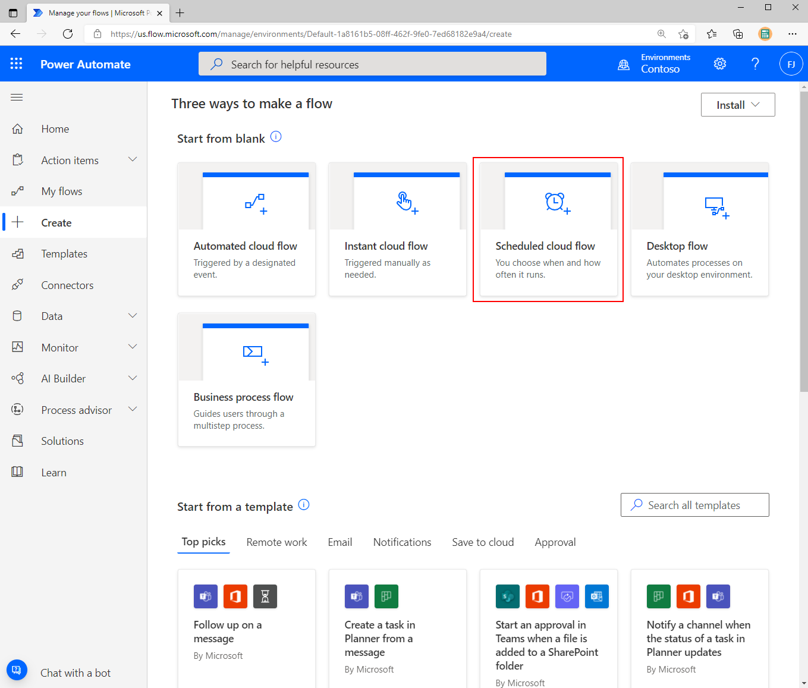
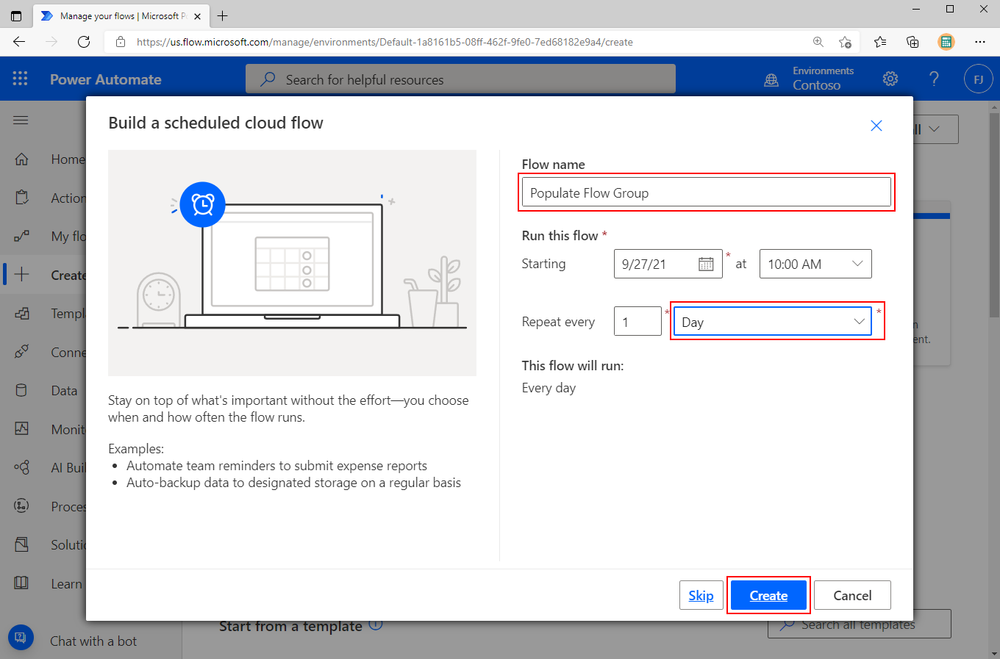
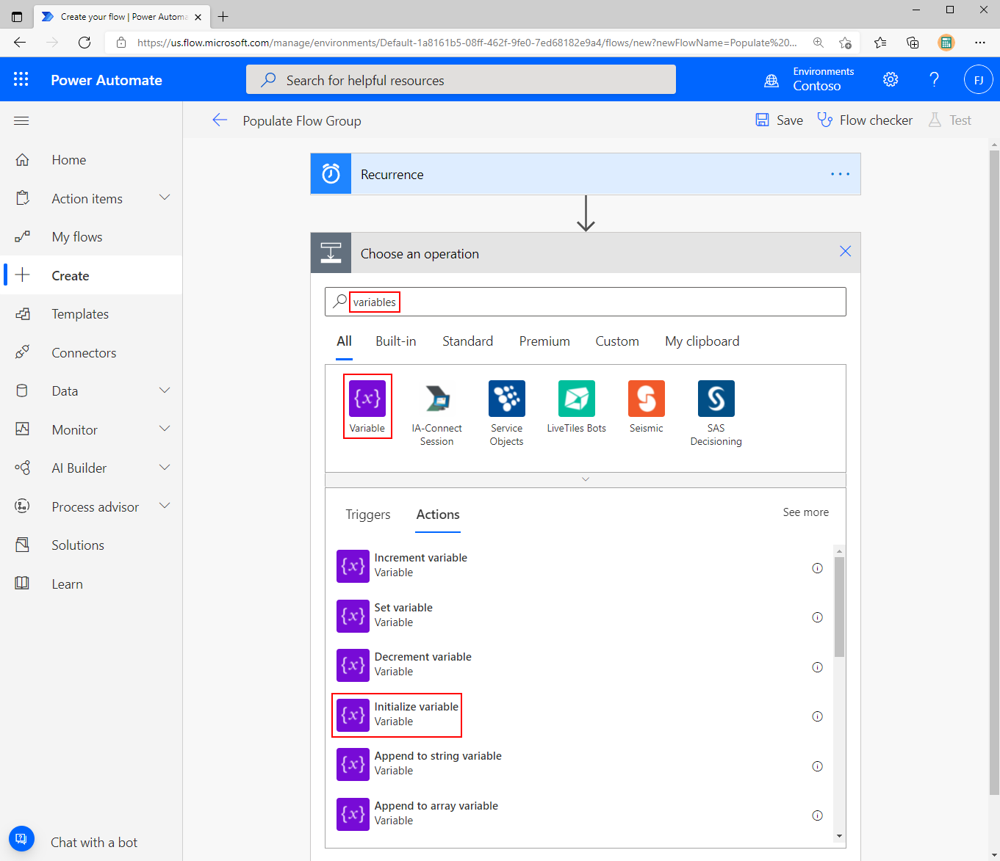
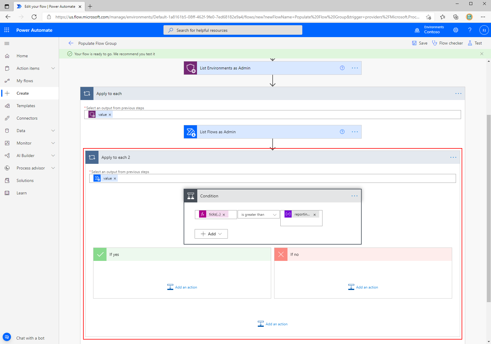
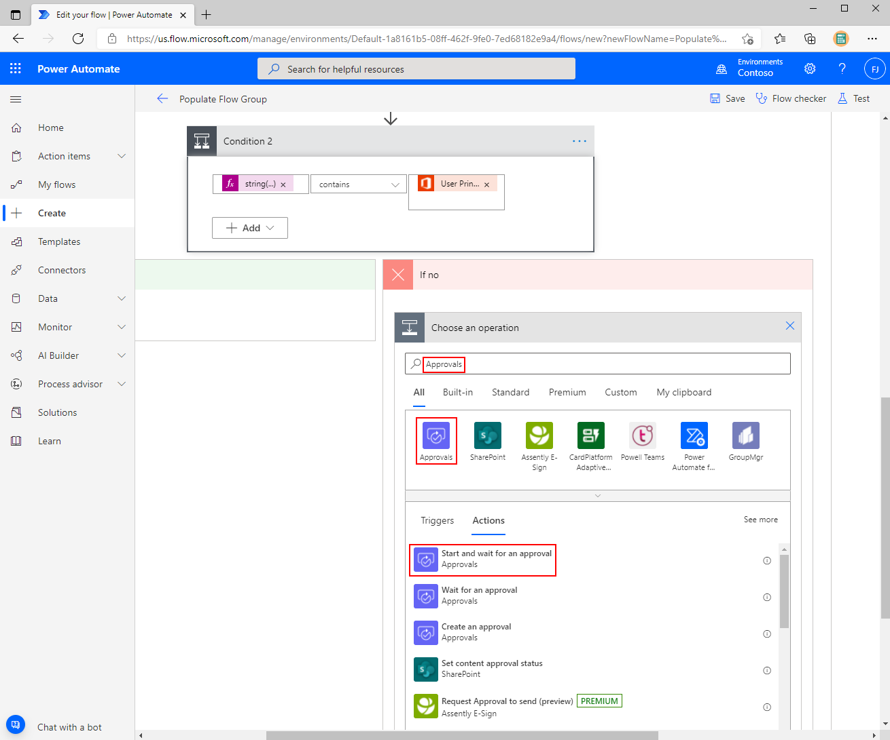
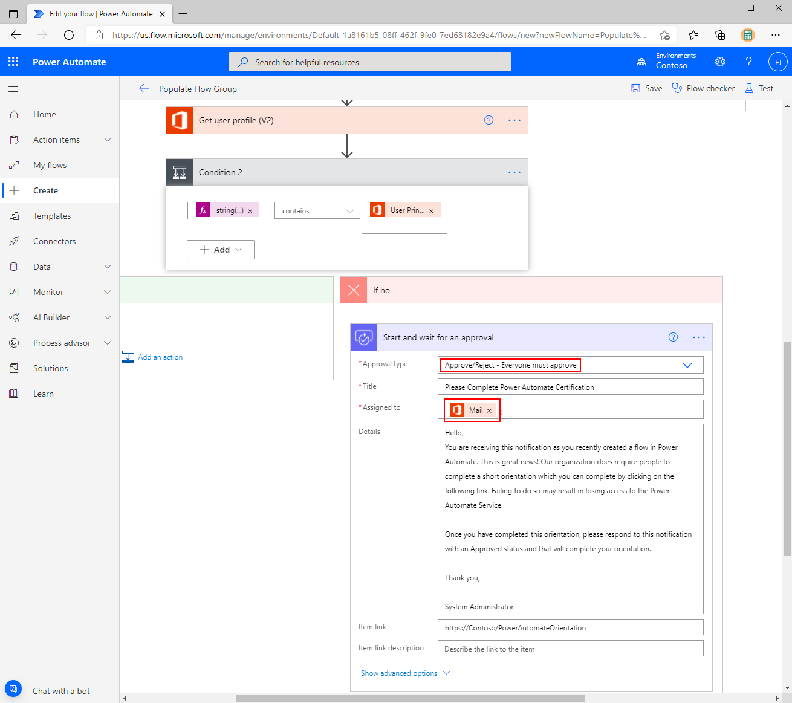
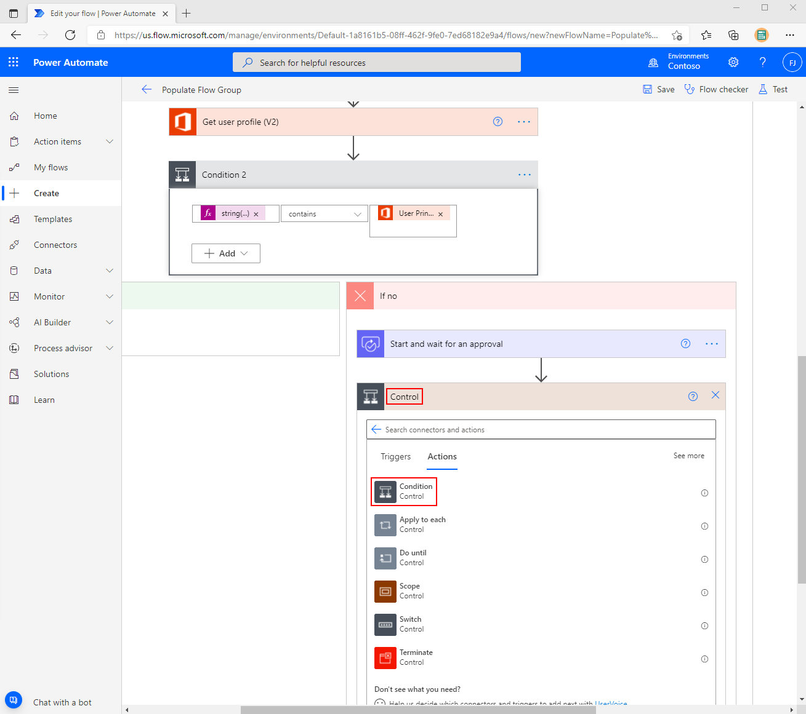
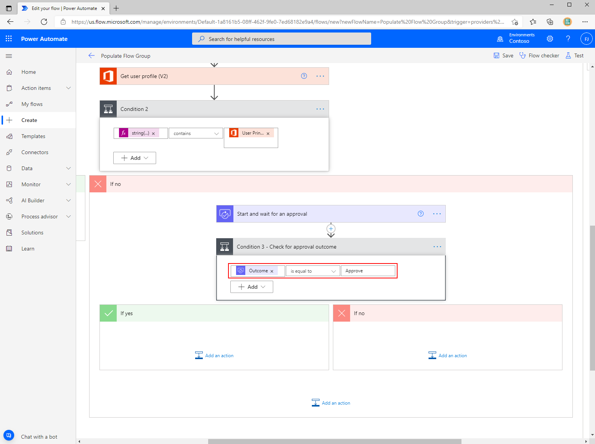
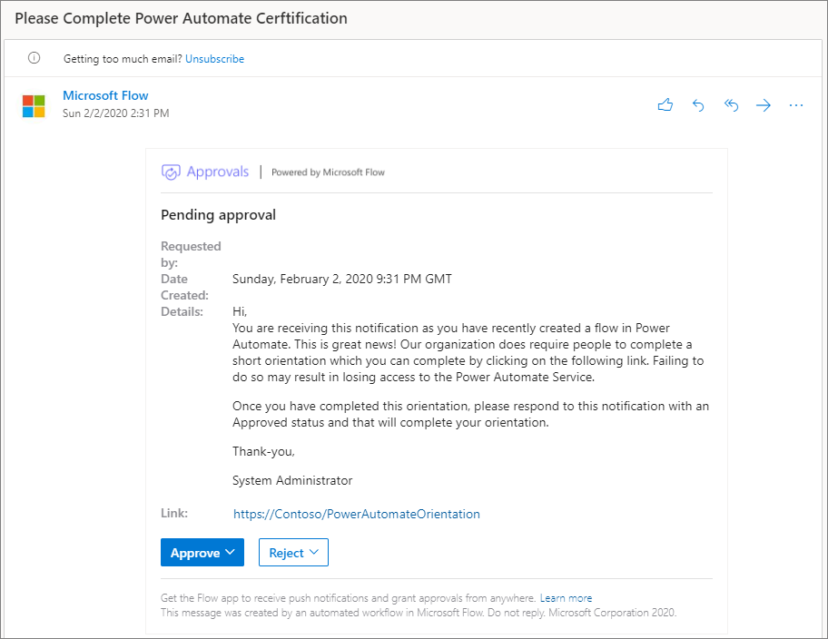

The previous module of this learning path discussed the need to 
maintain a digital tracking list that can be used to communicate governance 
changes to users. One way to track users is to put them in an Office 365 Group. 
If your DLP policies change, you can use this Office 365 group to send updates.

However, to ensure that users are aware of an organization's governance
policies, you can include training materials that they must complete
prior to being added to this Office 365 group. This step will help you verify that the users are
aware of permitted activities and will ensure that they are aware of training
materials that will accelerate their learning journey.

1.  Before building your flow, create your Office 365 group. Launch Outlook mail in a web browser. In the left navigation pane, select **Groups** and then select **New Group**.

1.  Enter **Flow Users** in the **Group name** field and then select the **Create** button.

    

1.  Go to the [Power Automate Maker Portal](https://flow.microsoft.com/?azure-portal=true) and then select **Create** to make a new flow.

	

1.  Select the **Scheduled flow** icon to create a flow that will run on a regular interval.

	

1.  Provide a name for your flow, such as **Populate Flow Group**.

1.  Set the **Repeat every** value to **1 Day** so that your process will run once a day. Select the **Create** button to proceed.

	

1.  Create the following two variables by selecting **+New step**, followed by searching for variables and then selecting **Initialize variable**.

	

	Name your variables in the following manner and include the appropriate **Value** as outlined:

    1.  **reportingPeriod** - Is an Integer type and has an initial value of **-1**. This variable will be your window that you will look back on to determine if you have any new flows created. If you want to run this process weekly, then a value of **-7** would be appropriate.
    
    1.  **reportingPeriodTicks** - Is also an Integer type and represents the number of ticks that exist for your reporting period. The value of this integer is achieved through an expression of ```ticks(addDays(utcNow(),variables('reportingPeriod')))```.

    	

1.  Add a **List Environments As Admin** action by using the PowerPlatform for Admin connector. Add this action by selecting **+ New Step**, followed by searching for **PowerPlatform** and then selecting **List Environments as Admin**.

	

1.  The environment listing call will return a list of environments and will subsequently add an **Apply to each** loop to your flow when you try to use data that is returned from your list.

	Next, add the **List Flows as Admin** action from the Flow Management connector and pass in the **Name** value of the current environment that you are iterating through, in your environments loop.

	

1. Listing all flows within an environment will naturally return an array of flows. To address iterating through this array of flows, you will add an **Apply to each** loop. Within this loop, you want to check if you have any new flows in this environment. To complete this task, use the **Condition** action to verify if the ticks of the current flow create date are greater than the ticks value of your reporting period variable that you established earlier. As a result, verify by using an expression of **```ticks(item()?\['properties'\]?\['createdTime'\]) is greater than our reportingPeriodTicks variable```**.

    

   If your flow was created before your reporting period, that is acceptable; you won't perform additional actions. If your flow was created after your reporting period, then your logic will travel down the **If yes** *green* path.

1. Perform the next steps in the process:

    1.  List Office 365 group members (for the group previously created) by selecting **+New step**, searching for the Office 365 Groups connector, and then selecting the **List group members** action. When this action has been added to your designer, provide a **Group ID** of **Flow Users**, the group that you created previously.

		

	1.  Get the UPN for your flow creator by passing in the **Creator object ID** that is returned from your Flow Management connector into the Office 365 Users connector. After you have searched for this connector, select the **Get user profile (V2)** action and specify your **Creator object ID** value from the **List Flows as Admin** action.

		

1. At this point, you have a flow that has been recently created and the owner and related metadata for that flow. However, you don't know if your user exists in your Office 365 group. To verify the user's status, use a condition that will turn your Office 365 group membership into a string by using the following expression: **```string(body(‘List_group_members’))```**.  Next, verify if your group contains the name of your User Principal Name (UPN). If your UPN is not in your group, you need to add them by using the Office 365 Group connector and the **Add member to group** action, after they have completed the orientation material.

1. If your user is not found in your list of users, start an approval process by using the Approvals connector and the **Start and wait for an approval** action in the **If no** branch of your condition.

    

1. Set the **Approval type** to **Approve/Reject - Everyone must approve** and set the **Assigned to** value to your **Mail** property from the Office 365 Users output. In addition, provide appropriate **Title**, **Details**, and **Item link** information that reflect the actions that you want the user to take.

    

1. Respond to the outcome of the approval. To complete this task, add another condition by adding a new Control and then selecting the **Condition** action.

    

1. To determine if your user has acknowledged their orientation, check the **Outcome** attribute from the **Approvals** output to see if it is equal to **Approve**.

    

1. You are now ready to add this user to your security group by using the Office 365 Groups connector and the **Add member to group** action. Within this action are a couple inputs that you need to provide, including a **Group ID** of **Flow Users** and your User Principal Name (UPN) that was returned from your Office 365 Users connector.

    

   Your complete flow should now resemble the following example.

    

1. Test your flow. This step will help you validate your solution because your logic is going to look for any flows that have been created in the past day. You can create a flow manually or use a template. To keep things simple, provision the **Send myself a reminder in 10 minutes** template.

1. You can test your **Populate Flow Group** flow by using the Test feature that is found in the upper-right corner of the Power Automate maker portal.

   Depending on the number of flows in your tenant, this flow might take a few minutes to run. It should detect any new flows that have been created in the past day, and check to see if the creator of that flow is part of your Office 365 Group.

   If the creator of this flow is not a member of your Flow Users security group, an approval will be sent to your user who created a new flow. They will have the opportunity to review the orientation information and approve (attest) that they have reviewed the orientation information. After they have done so, their account will be added to your Flow Users group. The way that approvals work, expect that the approval response is required before the flow can continue.

    

You now have a flow that will continue to run and will look for new users who have completed their orientation and add users to your Office 365 group. In the future, if you need to communicate with these users, you can send an email to this group.
