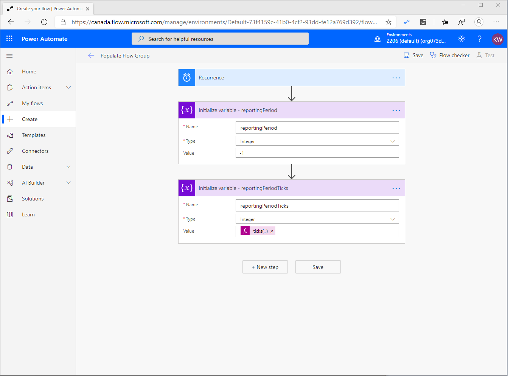
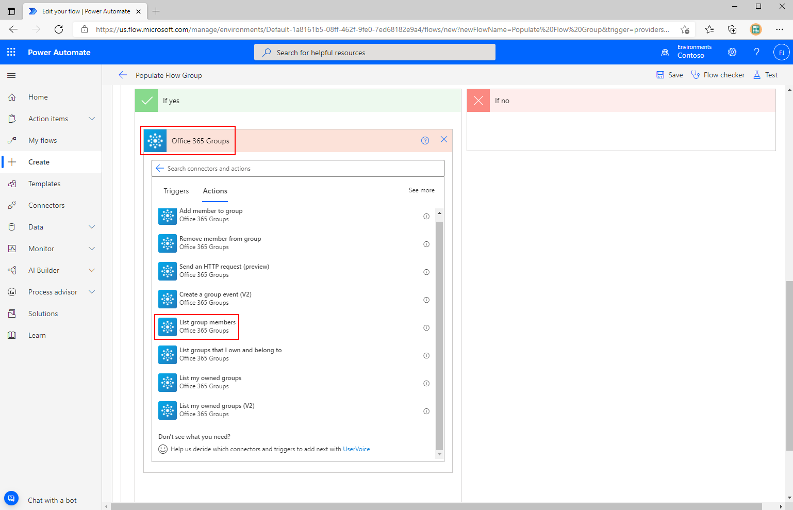
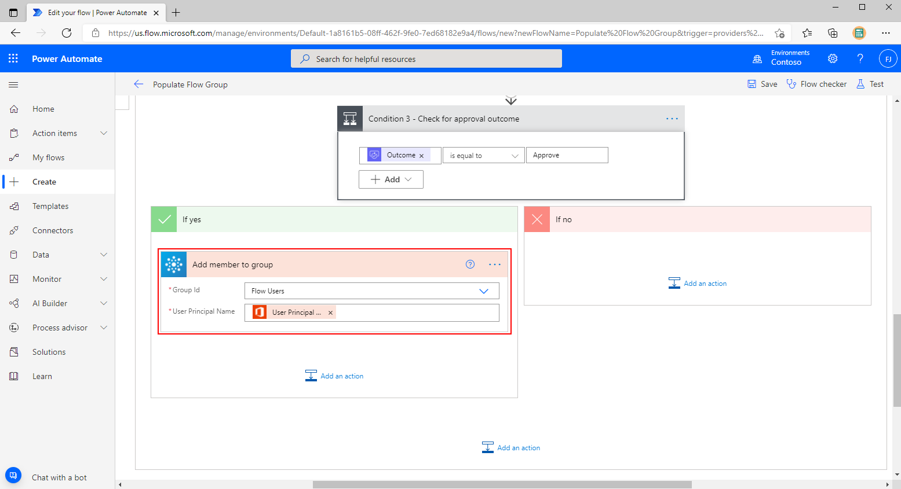

In Module 4 we discussed the need to maintain a digital tracking list
that can be used to communicate governance changes to users. One way to
track users is to put them in an Office 365 Group. Should our DLP
policies change, we can use this Office 365 group to send them updates.

However, to ensure users are aware of an organization's governance
policies, we can include training materials that they must complete
prior to be added to this Office 365 group. This will attest they are
aware of permitted activities and ensure they are aware of training
materials that will accelerate their learning journey.

1.  Before we build our flow, let's create our Office 365 group. We can do so by launching Outlook mail in a web browser. In the left navigation select **Groups** and then click on **New Group**.

1.  Provide a Group name of **Flow Users** and then click on the
    **Create** button.

    

1.  Navigate to the [Power Automate Maker Portal](https://flow.microsoft.com/?azure-portal=true) and click on **Create** to make a new flow.

	

1.  Select the **Schedule flow** icon to create a flow that will run on a regular interval.

	

1.  Provide a Name for your flow, such as Populate Flow Group.

1.  Set the Repeat every value to 1 Day so that our process will run once a day. Click the **Create** button to proceed.

	

1.  We will now create the following two variables by clicking on +New step, followed by searching for variables and then selecting Initialize variable.

	

	Name your variables in the following manner and include the appropriate Value as outlined below:

    1.  reportingPeriod -- is an Integer and has an initial value of -1. This will be our window that we will look back on to see if we have any new flows created. If we want to run this process weekly, then a value of -7 would be appropriate.
    
    1.  reportingPeriodTicks -- which is also an Integer and represents the amount of ticks that exist for our reporting period. The value of this integer is achieved through an expression of ```ticks(addDays(utcNow(),variables('reportingPeriod')))```

    	

1.  The next step that we need to perform is adding a List Environments As Admin action using the PowerPlatform for Admin connector. We can add this action by clicking on + New Step, followed by searching for PowerPlatform and then selecting List Environments as Admin.

	

1.  Naturally, our environment listing call will return a list of environments and subsequently add an Apply to each loop to our flow when we try to use data returned from our list.

	We will now add List Flows as Admin action from the Flow Management connector and pass in the Name value of the current environment that we are iterating through in our environments loop.

	

1. Listing all flows within an environment will naturally return an array of flows. To address iterating through this array of flows, we will add an Apply to Each loop. Within this loop, we now want to check if we have any new flows in this environment. To do this, we will use the condition action to check to see if the ticks of current flow create date are greater than the ticks value of our reporting period variable that we established earlier. As a result, we will check to see if an expression of ```ticks(item()?\['properties'\]?\['createdTime'\]) is greater than our reportingPeriodTicks variable```.

    

1. If our flow was created before our reporting period, that is ok, we won't perform any additional actions. If our flow was created after our reporting period, then our logic will travel down the If yes 'green' path.

1. Our next steps include:

    1.  Listing O365 group members (for the group we created in step 1). We can accomplish this by clicking on +New step, searching for the Office 365 Groups connector and then selecting List group members action. Once this action has been added to our designer, we need to provide a Group Id of Flow Users, the group that we created earlier in this exercise.

		

	1.  We now need to get the UPN for our flow creator. To obtain this, we will pass in the Creator object ID that is returned from our Flow Management connector into the Office 365 Users connector. Once we have searched for this connector, we will select the Get user profile (V2) action and specify our Current object ID value from the List Flows as Admin action.

		

1. At this point, we have a flow that has been recently created and the owner and related metadata for that flow. But we don't know if our user exists in our O365 group, so that is our next step. To accomplish this, we will use a condition that will take our Office 365 group membership and turn it into a string by using the following expression: ```string(body(‘List_group_members’))```.  Next, we will see if our group contains the name of our User Principal Name (UPN). If our UPN is not in our group, we now need to add them by using the Office 365 Group connector and the Add member to group action, once they have completed the orientation material.

1. If our user is not found in our list of users, we will start an approval process using the Approvals connector and the Start and wait for an approval action in the If no branch of our condition.

    

1. Set the Approval type to Approve/Reject - Everyone must approve and set the Assigned to value to our Mail property from the Office 365 Users output. In addition, provide appropriate Title, Details and Item link that reflect the actions that you would like the user to take.

    

1. Next, we need to respond to the outcome of the approval. To do this, we need to add another condition by adding a new Control and then selecting the Condition action.

    

1. To determine if our user has acknowledged their orientation, we will check the Outcome attribute from the Approvals output to see if it is equal to Approve.

    

1. We are now ready to add this user to our security group by using the Office 365 Groups connector and the Add member to group action. Within this action there are a couple inputs that we need to provide including a Group Id of Flow Users and our User Principal Name (UPN) that was returned from our Office 365 Users connector.

    

1. Our complete flow should now look like the following:

    

1. Let's now test our flow. This will help us validate our solution, since our logic is going to look for any flows that have been created in the past day. We can create a flow manually or use a template. To keep things simple, provision the [Send myself a reminder in 10 minutes](https://canada.flow.microsoft.com/galleries/public/templates/2ec8fd1095d711e69e6b05429ec0d0d7/send-myself-a-reminder-in-10-minutes/?azure-portal=true) template.

1. We can now test our Populate Flow Group Flow by using the Test feature found in the upper right-hand corner in the Power Automate Maker portal.

1. Depending upon the number of flows in your tenant, this flow may take a few minutes to run. But, it should detect any new flows that have been created in the past day, check to see if the creator of that flow is part of our Office 365 Group.

1. If the creator of this flow is not a member of our Flow Users security group, an approval will be sent to our user who just created a new flow. They will have the opportunity to review the orientation information and approve (attest) they have reviewed the orientation information. Once they have done so, their account will be added to our Flow Users group. Note, the way approvals work, the approval response is required before the flow can continue.

    

1. We now have a flow that will continue to run and will look for new users who have completed their orientation and add users to our Office 365 group. In the future, if we need to communicate with these users, we can just send an email to this group.
