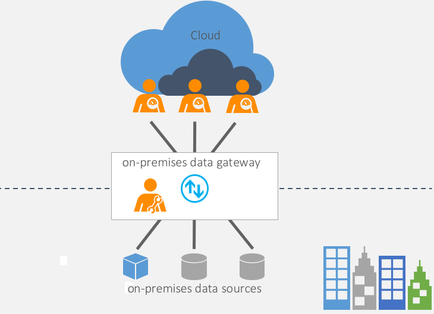

Limitations are in place on how you can use SharePoint with Microsoft Power Automate.

## Throttling limits

The throttling limit is 600 API calls for each connection for every 60 seconds.

Also, a cloud flow can run only a limited number of actions. These runs include all types of actions, such as connector actions, HTTP actions, and built-in actions, from initializing variables to a simple compose action. Successful and failed actions count toward these limits. Additionally, retries and other requests from pagination count as action runs.

| Name | Limit |
|------|-------|
| Runs every 5 minutes | 100,000 |
| Runs every 24 hours | 10,000 for Low, 25,000 for MediumLow1, 100,000 for MediumLow2, 125,000 for Medium, and 500,000 for High |
| Concurrent outbound calls | 500 for Low and 2,500 for all others |
| Content throughput every 5 minutes | 600 MB for Low and 6 GB for all others |
| Content throughput every 24 hours | 1 GB for Low, 10 GB for MediumLow1, MediumLow2, and Medium, and 50 GB for High |

Known issues and limitations:

- For flows that use the **For a selected item** or the **For a selected file** trigger, only those flows that are part of the default environment in Power Automate are listed within the SharePoint menu in Power Automate.

- Default SharePoint flows such as **Request sign-off** won't be listed on the Power Automate portal and aren't editable.

- If you're getting an incomplete dataset, or you aren't able to return accurate results from the SharePoint list, it might be because of delegation limits.

- If you receive the **CannotDisableTriggerConcurrency** error while you are using SharePoint triggers in a flow, after you enable and disable the concurrency control, it can't be undone. To work around this issue, export the flow and edit the JSON file to remove the "concurrency control" part so that the concurrency option will be disabled during the reimport of the flow.

## Request limits based on user licenses

Power Automate has two license plans available: **per-user** and **per-flow**.

The **Power Automate per-user plan** equips individual users with the ability to create and run unlimited workflows and business processes based on their unique needs. The **per-user plan** is intended to support the broad adoption of an automation culture in an organization. Should the entire organization be licensed with the **Power Automate per-user plan**, admins will have minimal overhead with tracking how many flows are being activated/used within the organization. With this plan, a user is allowed 5,000 daily API requests.

The **Power Automate per-flow plan** is licensed by flow and allows customers to implement critical business processes with a capacity that serves teams, departments, or the entire organization without individually licensing each user who triggers the licensed flow. The **Power Automate per-flow plan** is useful in departmental scenarios where one power user typically sets up a flow and shares the same with the broader group. This plan alleviates the need to license each user who knowingly/unknowingly triggers implementation of the licensed flow. With this plan, 15,000 daily API requests per flow are allowed.

## On-premises connector

The on-premises data connector acts as a bridge to provide quick and more secure data transfer between on-premises data (data that isn't in the cloud) and Power Automate. By using a gateway, organizations can keep databases and other data sources on their on-premises networks yet use that on-premises data in cloud services.

> [!div class="mx-imgBorder"]
> 

Available internet speed at the location where your on-premises gateway is running can directly affect the performance of the Power Automate flow.

Microsoft Azure ExpressRoute is an alternative to the on-premises data connector. ExpressRoute lets you extend your on-premises networks into the Microsoft cloud over a private connection with the help of a connectivity provider. With ExpressRoute, you can establish connections to Microsoft cloud services, such as Microsoft Azure and Microsoft 365. ExpressRoute provides a faster network to Microsoft 365 and has a backup secondary connection in case the first one goes offline, as shown in the following image.

:::image type="complex" source="../media/image-2.png" alt-text="ExpressRoute connection overview diagram.":::
   Diagram showing flow from customer's network through partner edge, then separating into primary and secondary connections through the express route circuit. Each connection receives two types of peering. Microsoft Peering for Office 365, Dynamics 365, Azure public services (public IPs) and Azure Private Peering for Virtual Networks. The flow continues through Microsoft Edge and on to the appropriate public IPs and virtual networks.
:::image-end:::

Each environment is different, and throughput depends on the amount of data that is sent. To ensure a minimum level of throughput between your on-premises data source and Azure datacenters, use Azure ExpressRoute. To help measure your throughput, you can use the [Azure Speed Test app](https://azurespeedtest.azurewebsites.net/?azure-portal=true).
