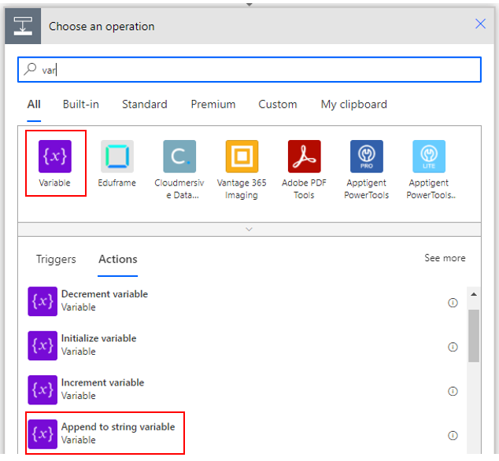

There are scenarios where the flow runs successfully, however, you don't get the results you intended because of the flow. It's times like these where using the compose and variable actions helps.

## Compose action to view the data created by a previous action

The **Compose** action constructs an arbitrary object from the users input based on an action.

> [!div class="mx-imgBorder"]
> 

As an example, we want to see what is the format of the time stamp that is generated by the **Manually trigger a flow** trigger. So we take the **Timestamp** dynamic content and add it to the **Compose** action.

> [!div class="mx-imgBorder"]
> 

You can rename the action to add some meaningful text.

> [!div class="mx-imgBorder"]
> 

Now when you save and run this flow, you see the timestamp format, which isn't the desired outcome.

> [!div class="mx-imgBorder"]
> 

Now you can use the **formatDateTime** expression to get the format you need.

> [!div class="mx-imgBorder"]
> 

## Variables to view appended data

Consider a scenario where you would like to send a single approval action to multiple users. The data is stored in a SharePoint list with a Title column, which is a single line of text, and approvers, which are a people and groups column. The approvers have a multiple selection option.

> [!div class="mx-imgBorder"]
> 

To view all the names of all the approvers that have been selected, you initialize a variable.

> [!div class="mx-imgBorder"]
> 

Assign it a name and set it as type **String**.

> [!div class="mx-imgBorder"]
> 

Then search and select the **Append to string variable** action.

> [!div class="mx-imgBorder"]
> 

Now, you can append the email addresses of all the Approvers Emails.

> [!div class="mx-imgBorder"]
> 

This will automatically count how many approvers have been added and then append them, one at a time to the string variable.

> [!div class="mx-imgBorder"]
> 
