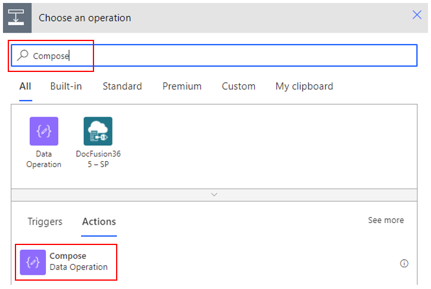
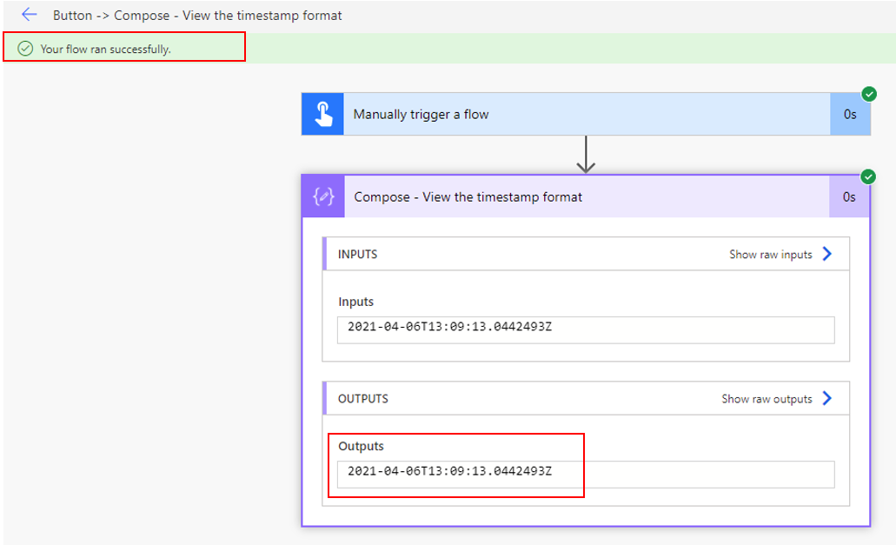
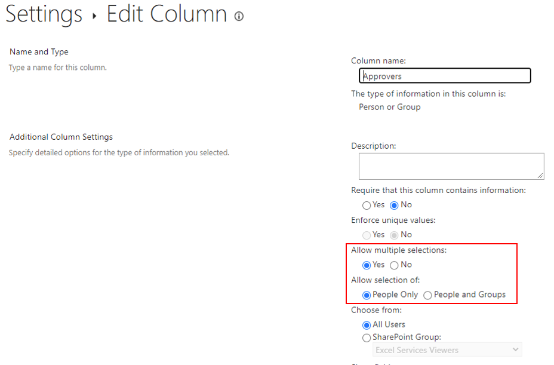
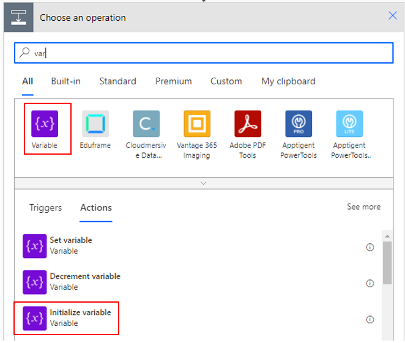
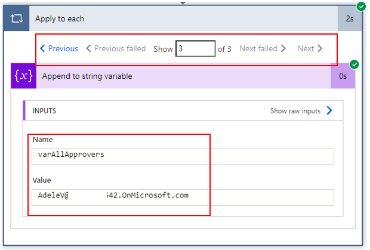

Occasionally, scenarios occur where the flow runs successfully but you don't get the results that you intended because of the flow. These situations are when using the **Compose** and **Variable** actions helps.

## Compose action to view data created by a previous action

The **Compose** action constructs an arbitrary object from the user's input based on an action.

> [!div class="mx-imgBorder"]
> 

For example, you want to see the timestamp format that is generated by the **Manually trigger a flow** trigger. Consequently, you add the **Timestamp** dynamic content to the **Compose** action.

> [!div class="mx-imgBorder"]
> 

You can rename the action to add some meaningful text.

> [!div class="mx-imgBorder"]
> 

Now, when you save and run this flow, the timestamp format will show, which isn't the desired outcome.

> [!div class="mx-imgBorder"]
> 

You can now use the **formatDateTime** expression to get the format that you need.

> [!div class="mx-imgBorder"]
> 

## Variable action to view appended data

Consider a scenario where you want to send a single approval action to multiple users. The data is stored in a SharePoint list with a Title column, which is a single line of text, and approvers, which is a people and groups column. The approvers have a multiple selection option.

> [!div class="mx-imgBorder"]
> 

To view all names of all approvers that have been selected, you will initialize a variable.

> [!div class="mx-imgBorder"]
> 

Assign the variable a name and then set it as type **String**.

> [!div class="mx-imgBorder"]
> 

Search and select the **Append to string variable** action.

> [!div class="mx-imgBorder"]
> 

Now, you can append the email addresses of all approvers' emails.

> [!div class="mx-imgBorder"]
> 

This action will automatically count how many approvers have been added and then append them, one at a time, to the string variable.

> [!div class="mx-imgBorder"]
> 
