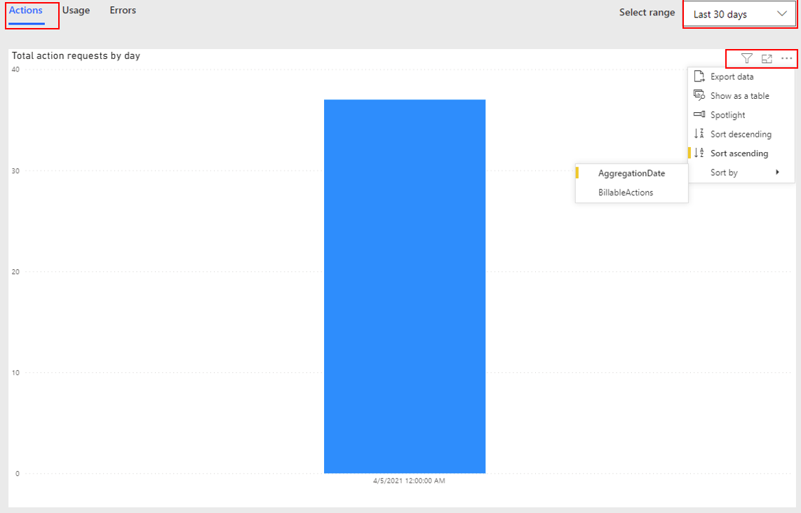
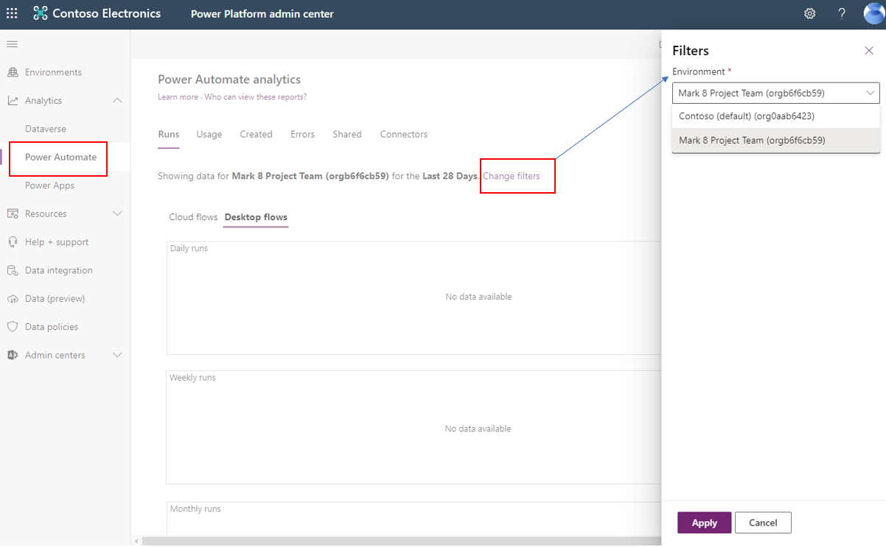
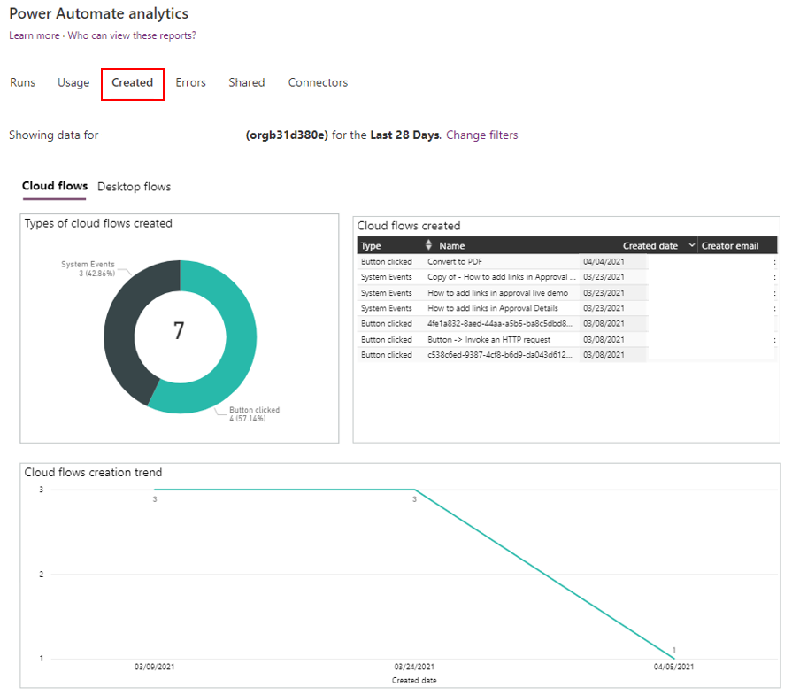
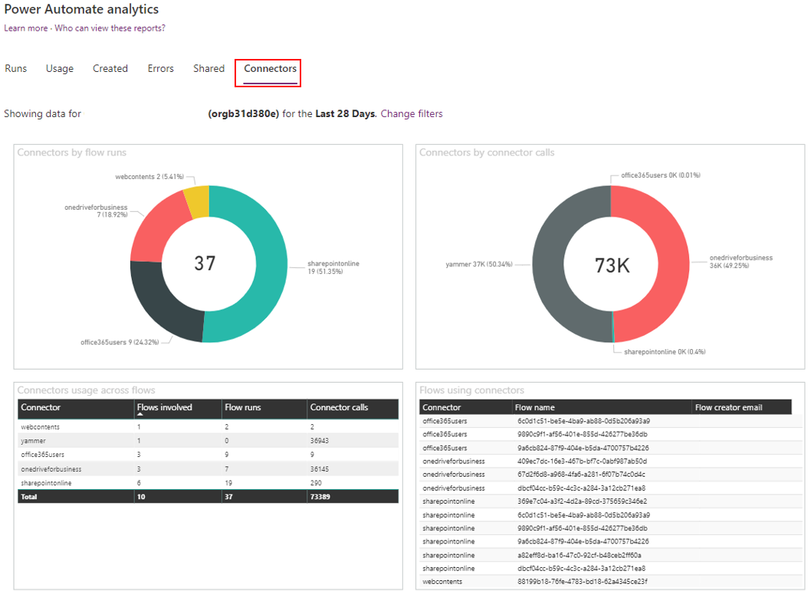

As the Power Automate flow consumption increases, it's important to monitor the health of these flows. Analytics is available at the flow level and the environment level.

## View analytics at the flow level

The flow level analytics can be accessed from two locations. One is from the list of flows you have access to.

> [!div class="mx-imgBorder"]
> 

The second is in the flow settings.

> [!div class="mx-imgBorder"]
> 

The flow level analytics provides information such as Actions, Usage, and Errors. Each of them is a Power BI report and the data presented is in the range of last 7, 14 and 30 days.

Here's an example of what the flow **Actions** analytics looks like. It presents the total number of billable actions that have run so far.

> [!div class="mx-imgBorder"]
> 

Here's an example of what the flow **Usage** analytics looks like. This one gives you a breakdown of the total number of runs you had in a day and how many of them were successful and failed. This report only provides numbers.

> [!div class="mx-imgBorder"]
> 

The **Errors** also provide you a total count by day, in addition to details. Details such as what are the error types and details of that error.

> [!div class="mx-imgBorder"]
> 

## View analytics at the environment level

Admins with the following roles and a license can view the reports in Power Automate analytics:

- Environment Admin - can view reports for the environments that the admin has access to.

- Power Platform admin - can view reports for all environments.

- Dynamics 365 admin - can view reports for all environments.

- Microsoft 365 Global admin - can view reports for all environments.

The reports provide insights into runs, usage, errors, types of flows created, shared flows, and details on connectors associated with all the different flow types like automated flows, button flows, scheduled flows, approval flows, business process flows. Each of them is a Power BI report and the data presented is in the range of last 7, 14 and 28 days.

> [!div class="mx-imgBorder"]
> 

By default, you see the Runs report. It provides a view into the daily, weekly, and monthly run data of all flows in an environment.

> [!div class="mx-imgBorder"]
> 

This report provides insights into the different types of flows in use, the trends, and the flow creator's names.

> [!div class="mx-imgBorder"]
> 

This report provides insights into the types of flows created, trends, and details like the created date and the creator's email address.

> [!div class="mx-imgBorder"]
> 

This report provides insights into recurring error types and details like the error count, creator's email address, last occurred time, and the creator's email address for each flow.

> [!div class="mx-imgBorder"]
> 

This report provides details on the flows shared and trends in the environment.

> [!div class="mx-imgBorder"]
> 

This report provides details on connectors and their associated flows. Metrics like the number of calls from each flow per connector, flow runs, and the flow creator's email address are available for both standard and custom connectors.

> [!div class="mx-imgBorder"]
> 
