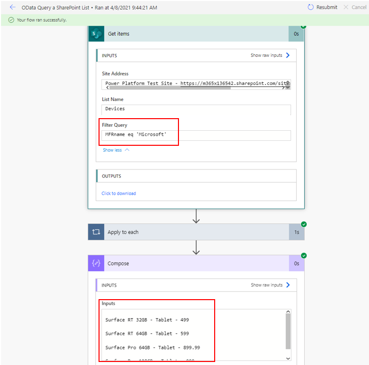
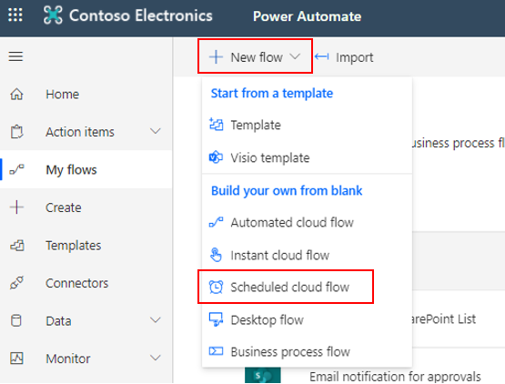

Sometimes it's best to revisit the flow and see if its design can be modified to improve the overall performance. This also allows you to apply new features or enhancements that weren't available when the flow was originally implemented.

## Use OData filter query to restrict the entries returned

Since SharePoint connector is built-upon REST APIs, it supports the ability to filter data on the server-side using OData. Some of the benefits of using OData include reducing the amount of data you're bringing into your flow, reducing the need to loop through a recordset to find values of interest.

Consider a SharePoint list that has over 100 items of computer device information. The list has a column called MFR Name that has all the manufacturers listed there. Thanks to the availability of this column and OData, we can filter down to the manufacturer level on the server-side, reducing the total amount of time it takes for this flow to run.

> [!div class="mx-imgBorder"]
> 

In the SharePoint Get items action, in the Filter Query, add the formula to filter the Microsoft devices.

> [!div class="mx-imgBorder"]
> 

Now when you run the flow you can see only the Microsoft devices.

> [!div class="mx-imgBorder"]
> 

## Modify the 'Do Until' or 'For each item' loops

As the names suggest, the **Do Until** step does a certain action until a certain condition is true.

Changing the limits of the **Do Until** condition can help speed the flow. The default setting is a count of 60, which is run every 1 hour. What this means is that the flow will check every 1 hour, 60 times, to see if the condition has been met. The highest duration count is 30 days and the count of 5000.

> [!div class="mx-imgBorder"]
> 

There are a few things you can do to improve performance:

- You can change the **PT1H** to **PT24H** for 24 hours, or to **PT72H**, which means 72 hours.

- You can reduce the count, which will reduce the total number of loops.

- If you're adding a query type action such as **Get Items** inside the **Do Until**, then add a filter query.

- In its **Configure run after**, leave the checkbox as **is successful**. We don't want this step to run if the previous one has failed.

- Avoid nesting of actions.

## Reduce the frequency of scheduled flows

Power Automate allows you to create scheduled cloud flows that trigger a flow based on the starting time.

> [!div class="mx-imgBorder"]
> 

While you do have the flexibility to run flows every second, running them this often will exhaust your API request limits.

> [!div class="mx-imgBorder"]
> 

All users of Microsoft Power Platform have limits on the number of requests based on the license they're assigned. The following table defines the number of requests a user can make in a 24-hour period:

| User licenses | Number of API requests per 24 hours |
|---------------|-------------------------------------|
| Power Apps per-user | 5000 |
| Power Automate per-user plan | 5000 |
| Microsoft 365 licenses | 2000 |
| Power Apps per app plan | 1,000 per app pass |
