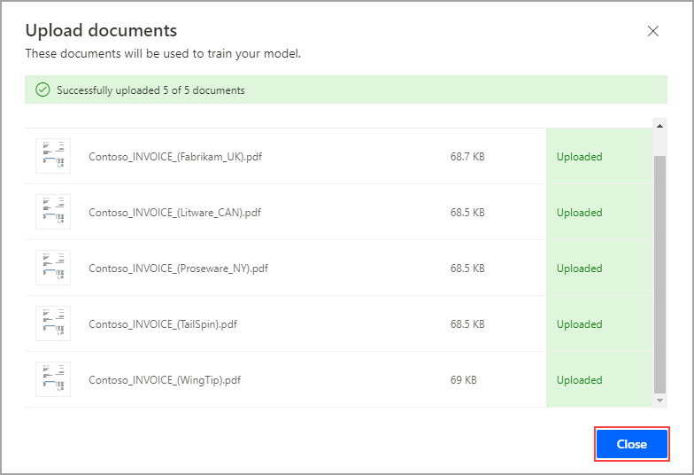

Now that you've initialized a model, the first step toward customization is to choose information to extract, called fields. You can use fields in flows later inside of actions to contribute to your RPA. In this case, we'll use the fields to populate the input variables for a desktop flow.

To add fields, type the field name in the provided text box and select **+** or press **Enter**. Below we've added "Bill to," "Contact," "Date," and "Total."

> [!div class="mx-imgBorder"]
> 

Select **Next** to continue.

Now you'll add collections of documents for your model to study. Collections allow for the grouping of documents with different layouts, for example, if you have customers or organizers who have different layouts for invoicing or other repeated documentation. The same model can process as many as 100 distinct collections. To add a new collection, select **New collection**. To rename the newly created collection, double-click the automated collection name (in this case, **Collection 1**).

> [!div class="mx-imgBorder"]
> 

For this example, we'll rename the collection to Contoso and add five invoice documents. To add documents, select the **+**, **Add documents**, and select your desired data source.

> [!div class="mx-imgBorder"]
> 

Select the documents you want. You'll see an upload screen with the documents you've chosen. Select **Upload documents**. You'll see a screen with the status of each document. Once the upload is complete, select **Close**.

> [!div class="mx-imgBorder"]
> 

Now that you've completed your collection and added your fields, you're ready to analyze and train your model.
