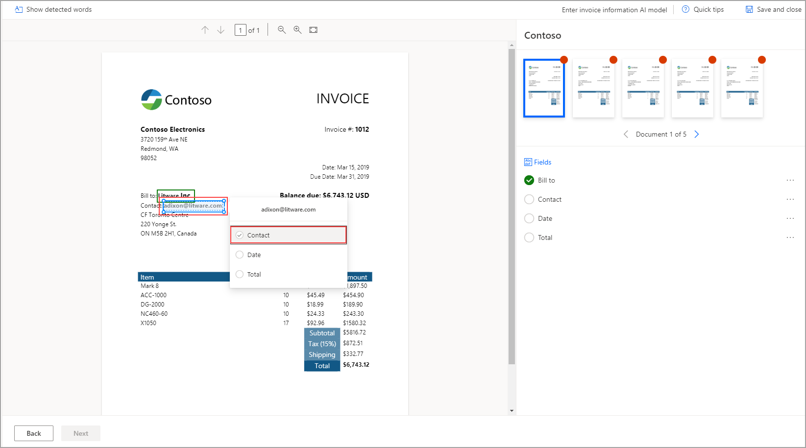
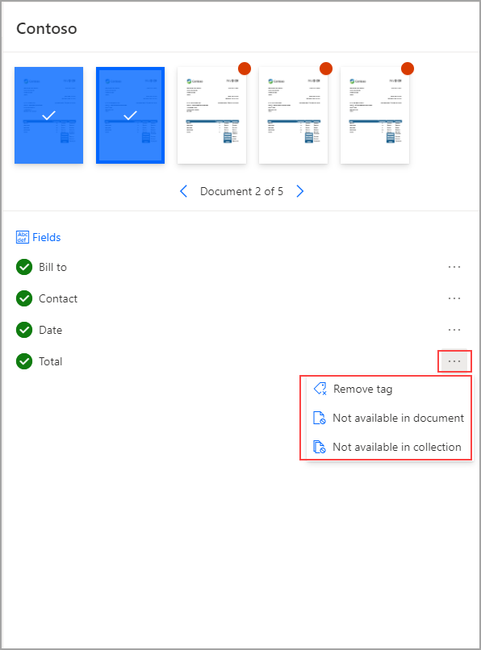
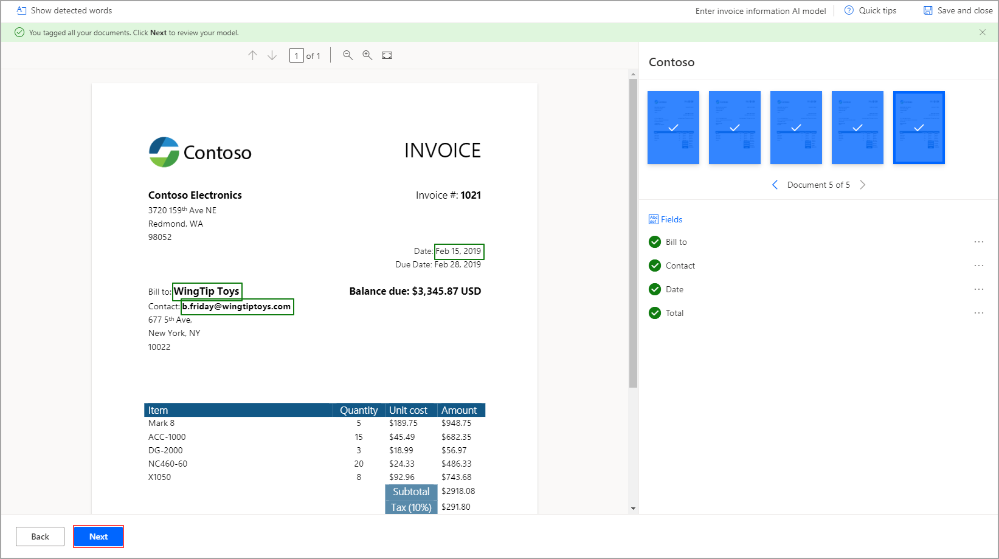
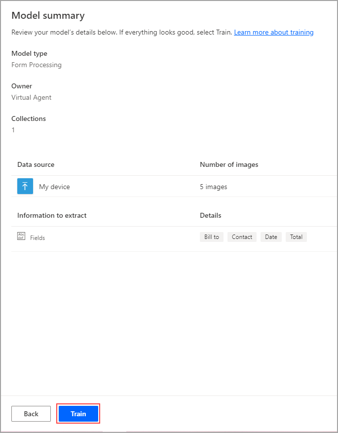
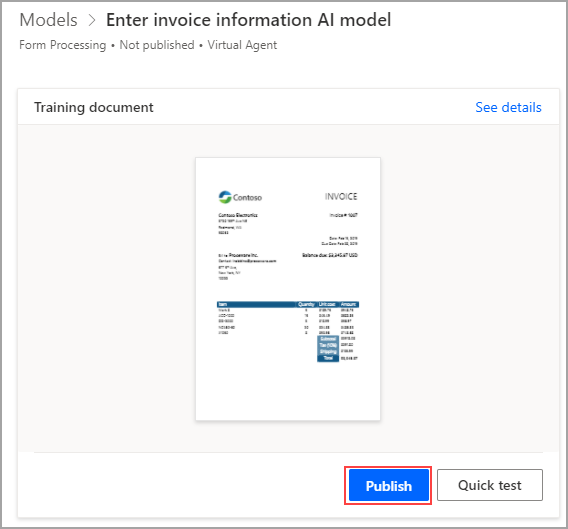

Once your collections are complete and all of your documents uploaded, select **Analyze** to prompt Power Automate to analyze your documents to identify their overall structure, detect form fields, and extract values.

> [!div class="mx-imgBorder"]
> 

> [!Note]
> Don't worry if the analysis takes a few minutes, that's completely normal as Power Automate works hard in the background.

Once the analysis is complete, your documents will appear organized by collection. In the document, use the mouse to select and drag around the values you wish to capture. Once you've made a selection, a pop-up will appear with the fields you added earlier. Select the field represented. You'll notice a green checkmark appear on the right panel as you locate and identify the various fields.

> [!div class="mx-imgBorder"]
> 

Once you've identified all of the necessary fields, you can select the next document. Any completed documents will turn blue with a white checkmark. The model may pick up on some fields automatically. Even if this occurs, it's important to look at each document and ensure that each field is correct. You can see which field is related to which value by hovering over the field name on the right. If a field is incorrect or not in the document, select the ellipses by the field name to reveal more actions.

> [!div class="mx-imgBorder"]
> 

You can use the magnifying glasses at the top to adjust the zoom if you're having difficulty selecting a value.

Once you've finished identifying the values for every field on every document, select **Next**.

> [!div class="mx-imgBorder"]
> 

Select **Train** to start training the model. This may take a few minutes.

> [!div class="mx-imgBorder"]
> 

Once done, select **Go to Details page** and select **Publish** on the following screen.

> [!div class="mx-imgBorder"]
> 

You can now use the model in Power Apps or Power Automate.
