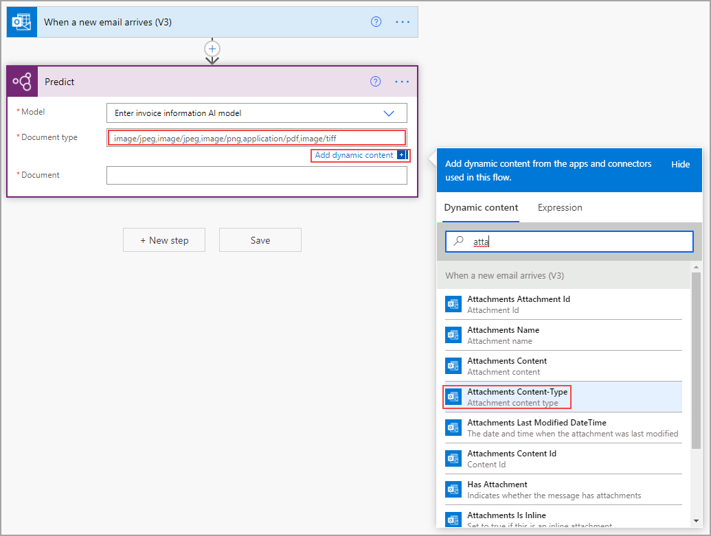
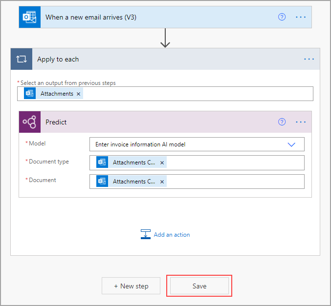
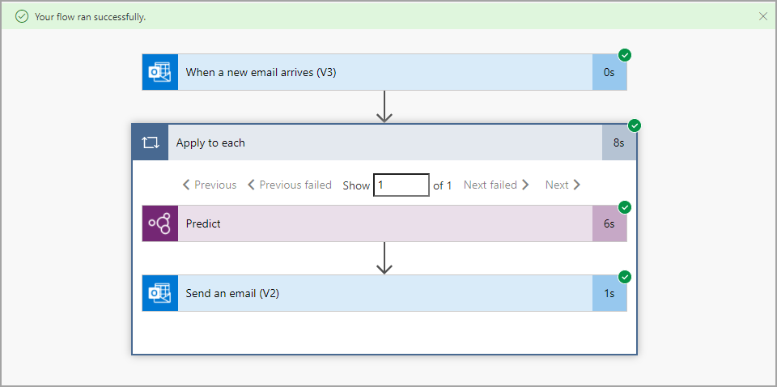

Now that you've created and customized your AI model, let's integrate it into a cloud flow. The flow in this example is a solution-aware cloud flow, meaning it's packaged in a solution. To locate it, select **Solutions** and the name of the solution (in this case, **Invoice processing solution**).

> [!div class="mx-imgBorder"]
> 

Select the flow in which you wish to use the AI model. If you're following from the previous models, the name of the flow is **Use Outlook email to trigger Desktop flows**. Select **Edit**.

> [!div class="mx-imgBorder"]
> 

For now, we'll delete the action **Run a flow built with Power Automate Desktop** by selecting the ellipses and then **Delete**. We're doing this so that we can test the AI model without constantly triggering the desktop flow.

> [!div class="mx-imgBorder"]
> 

After that action is deleted, select **New step** and search for and select **Predict** under AI Builder.

> [!div class="mx-imgBorder"]
> 

Select the model you would like to use, in this case, the Enter invoice information AI model. After your model is selected, more fields will appear. For the form processing model, a document is required. Since this flow is triggered by receiving an email with an attachment, we can specify that attachment with dynamic content. For the document type, search and select **Attachments Content-Type** in the dynamic content.

> [!div class="mx-imgBorder"]
> 

This will put your Predict action inside an Apply to each action. This is so the model will run for each attachment if there's more than one. You may need to open the Predict action again to specify the dynamic content **Attachment Content** for the document. Select **Save**.

> [!div class="mx-imgBorder"]
> 

While inside the Apply to Each, select **Add an action**. Search for and add the action **Send an email (V2)**. Use the dynamic content to set the To field to the email sender by searching "From."

> [!div class="mx-imgBorder"]
> 

Use **Thanks for sending the invoice** for the Subject. The body will be a mix of text and dynamic content from the AI model. The end result will look like the below. The model has both a display name and a value for each field. Select **Save**.

> [!div class="mx-imgBorder"]
> 

Select **Test** at the top-right of the screen and then select **Manually** and **Save & Test**.

> [!div class="mx-imgBorder"]
> 

Send yourself an email with an attachment that matches the layout of one of the collections in the model in either pdf or jpg file format and the subject "new invoice." The flow will appear with indications on each step to show you where your flow is in the process. When the testing is complete, you'll see the following to denote that your flow ran successfully.

> [!div class="mx-imgBorder"]
> 

The email will look like the image below.

> [!div class="mx-imgBorder"]
> 
