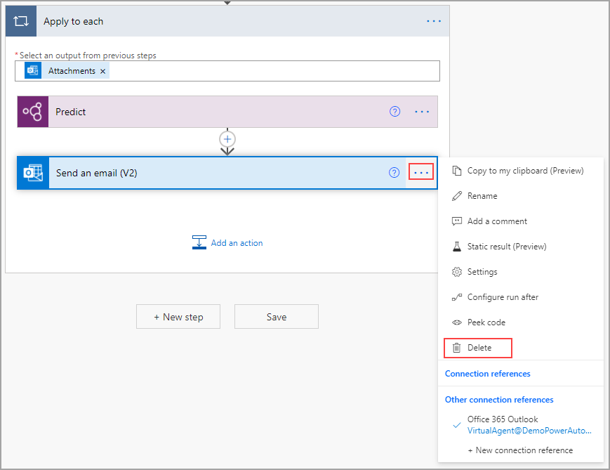

Since this requires working from an existing solution, we must first open the appropriate solution. Start in Power Automate and select **Solutions** and select the name of your solution (in this case **Invoice processing solution**).

> [!div class="mx-imgBorder"]
> 

Select the flow in which you wish to use the AI model. If you're following from the previous models, the name of the flow is "Use Outlook email to trigger Desktop flows". Select **Edit**.

> [!div class="mx-imgBorder"]
> 

For now, we'll delete the action "Send an email (V2)" by selecting the ellipses and then **Delete**. This step was primarily used to test the AI model and isn't needed for this portion, but feel free to leave it if you would like to use it as an example for your future solution.

> [!div class="mx-imgBorder"]
> 

Now that you are in the correct solution-aware cloud flow, you're ready to start posting in Teams with your flow.
