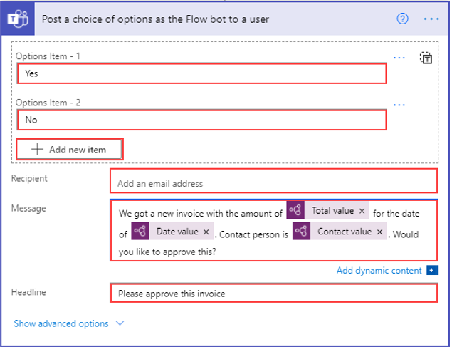
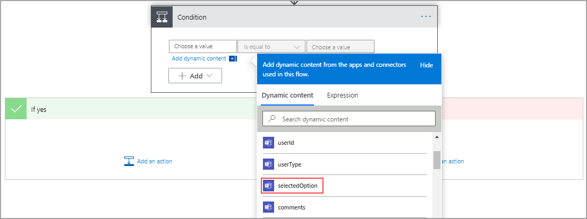

To add the actions that will post to Teams, ensure you are still inside the Apply to each and select **Add an action**. Search for and select **Post a choice of options as the Flow bot to a user**.

> [!div class="mx-imgBorder"]
> 

For the first Option, type "Yes" and select **Add new item** for another option, "No." Add your email address in the recipient line. You can change the recipient later to follow conditional logic or to someone other than yourself, but it's a good idea to put your own email for testing.

The Message should be a combination of text and dynamic content from the AI model. Follow the image below to craft the message. Remember to add dynamic content by pressing the dynamic content button when your cursor is in the correct place and selecting the desired content in the fly-out menu.

The Headline should read, "Please approve this invoice."

> [!div class="mx-imgBorder"]
> 

Now that you've posted in Teams, you want to act on the response. To do this, select **Add an action** inside the Apply to each. Search for and select **Condition**.

> [!div class="mx-imgBorder"]
> 

For the first value, choose **selectedOption** from the dynamic content menu.

> [!div class="mx-imgBorder"]
> 

Ensure the operator field is set to "is equal to" and type "Yes" for the second value.

Conditions are case-sensitive, so be sure that you type the same value for both the option and the condition.

> [!div class="mx-imgBorder"]
> 

Now you've connected to Teams for approval and set up the condition. The remaining step is to add the actions for approval and rejection.
