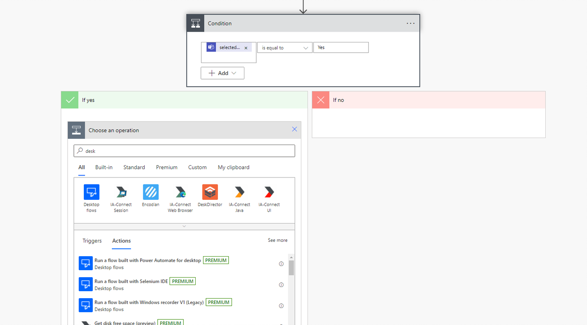
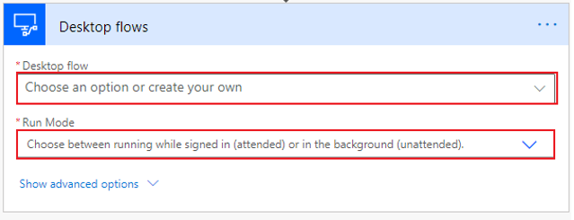

If an invoice is approved, the first step is to input the invoice into the legacy desktop application. To do this, select **Add an action** under the **If yes** branch and search for and select **Run a flow built with Power Automate Desktop**.

> [!div class="mx-imgBorder"]
> 

If you haven't already configured your gateway connection, use the dropdown under Gateway name to select the appropriate gateway.

> [!Note]
> If you don't see your gateway, you may need to delete this step and recreate it in order to refresh the list. If your gateway still does not appear, you may need to restart the gateway on your PC and retry.

The next two fields request your credentials to log into your computer. If you're unsure of what to put in the Domain and username field, you can open a Command Prompt window by opening Start, typing CMD and pressing enter. Once the command prompt opens, type "Set user" and press Enter.

Several lines of code will appear. Take the user domain and the username and separate them by a backward slash as seen below. Select **Create**.

> [!div class="mx-imgBorder"]
> 

Once you've connected to your desktop, Power Automate will prompt you for information specific to your desktop flow. Use the dropdown to select the name of your desired flow (in this case Invoicing) and choose Attended for your Run Mode.

> [!div class="mx-imgBorder"]
> 

Once you've chosen your desktop flow, any input variables you've defined in your flow will be requested. Notice that the Invoice flow below requests an Amount, a Contact email, and an Account name to feed into the Contoso Invoicing App. You can use the dynamic content from the AI model here. Don't forget that you can search through dynamic content to isolate the values you need.

> [!div class="mx-imgBorder"]
> 

Now your desktop flow will be able to use the values from the emailed and approved invoice to create the invoice in your desktop app. The only step remaining is to alert the sender of the approval or rejection.
