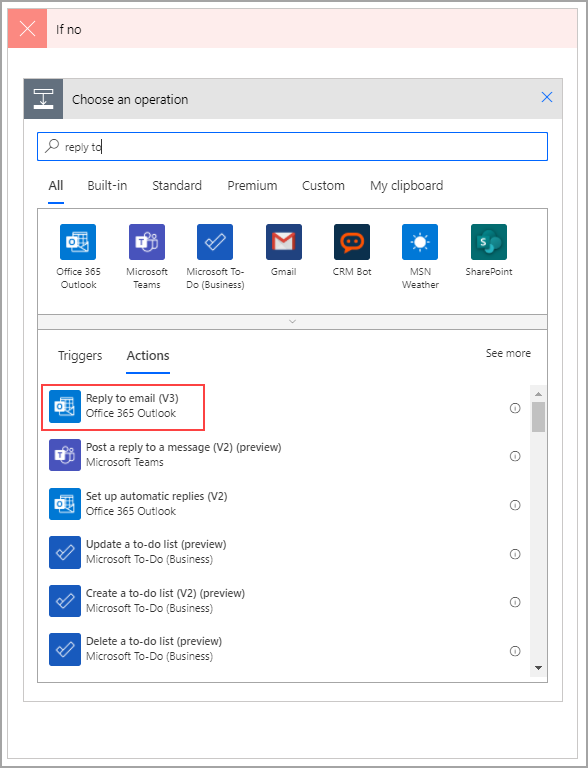

Now that you've gone through an approval and updated your legacy app if approved, you need to alert the sender of the invoice of the approval outcome. To begin, select **Add an action** under the **If yes** branch and search for and select **Reply to email (V3)**.

> [!div class="mx-imgBorder"]
> 

Find the Message ID of the original email in the dynamic content for the first field. The body will be a combination of text and dynamic content like the image below. Expand the fields by selecting **Show advanced options** and add **Your invoice is approved** to the subject.

> [!div class="mx-imgBorder"]
> 

Now you have the approval email and only need to add the rejection email. To do so, ensure you are under the If no branch and select **Add an action** and search for and select **Reply to email (V3)**.

> [!div class="mx-imgBorder"]
> 

Once again, find the Message ID of the original email in the dynamic content for the first field. The body will be a combination of text and dynamic content like the image below. Expand the fields by selecting **Show advanced options** and add **Your invoice is rejected** to the subject.

> [!div class="mx-imgBorder"]
> 

Select **Save**.
