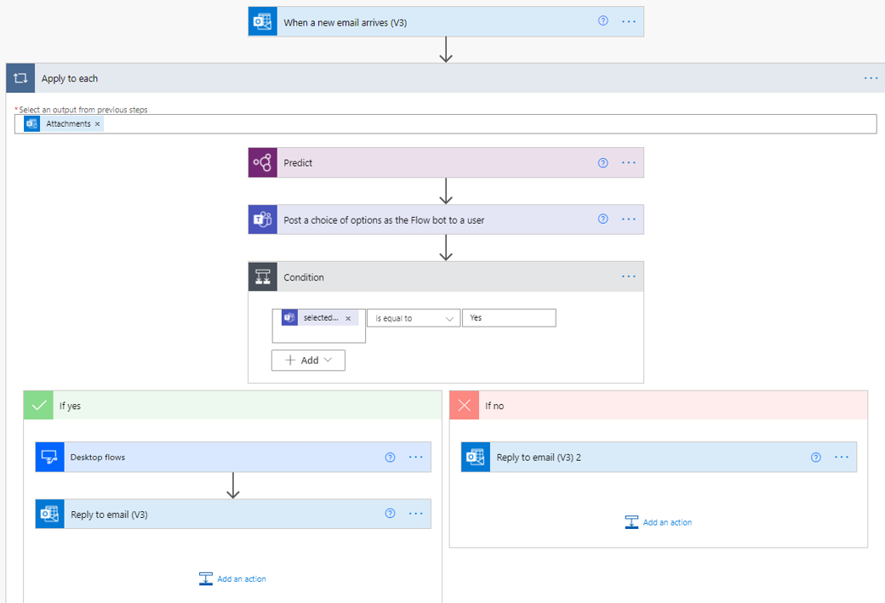
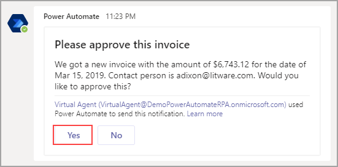

Your completed and saved flow should look like the image below.

> [!div class="mx-imgBorder"]
> 

In a separate tab, open the Teams app. In another tab, open the Outlook app. Now you only need to test and run your flow. Select **Test** at the top-right of the screen and then select **Manually** and **Save & Test**.

> [!div class="mx-imgBorder"]
> 

Open the Power Automate Desktop Application and send yourself an email with an attachment and the subject "new invoice". The flow will appear with indications on each step to show you where your flow is in the process.

Once the Teams message appears, select **Yes**.

> [!div class="mx-imgBorder"]
> 

Try not to interact with your mouse or keyboard while the flow continues running as it may interrupt the process with the desktop app. When the testing is complete, you'll see the following to denote that your flow ran successfully.

> [!div class="mx-imgBorder"]
> 

You should also have a new email to alert you of your approved invoice. Feel free to run the flow again and reject the invoice.

Now you have successfully built out a process that is triggered by receipt of an email and integrates Outlook, a custom AI model, an approval in Teams, and a desktop flow!
