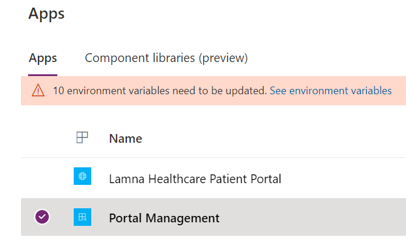
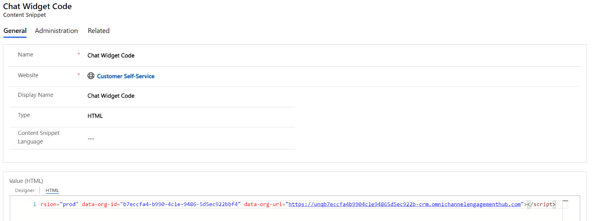
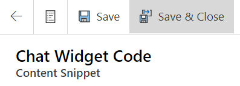

In this exercise, you'll embed the **Omnichannel Chat Widget** into the Power Apps Customer self-service portal using Portal Management configuration. In your environment, you created a Lamna Healthcare Company Portal using the **Customer self-service portal** template before deploying Microsoft Cloud for Healthcare. Now we'll configure the chat widget to show on the customer website.

**Customer self-service portal**: A customer self-service portal enables customers to access self-service knowledge, support resources, view the progress of their cases, and provide feedback.

**Portal Management**: Application to help you get started with the advanced portal configuration. In this walk-through, you'll learn how to configure Chat widget in **Portal Management** app.

1. In <https://make.powerapps.com/>, open the **Portal Management** app.

    1. > [!div class="mx-imgBorder"]
    > 

1. Select **Content Snippets** in the left navigation pane

    > [!div class="mx-imgBorder"]
    > 

1. In **Active Content Snippets**, type "**Chat**" in the **Search** box and press enter.

    > [!div class="mx-imgBorder"]
    > 

1. You'll see two **Chat Widget Code** records retrieved in the list. Select to open the Chat Widget Code record related to **Customer Self-service.**

    > [!div class="mx-imgBorder"]
    > 

1. In the **Chat Widget Code** record associated with Customer self-service, select **Value (HTML)** > **Html** Tab and then paste the **Chat Widget Code snippet** that you copied and stored in the previous task.

    > [!div class="mx-imgBorder"]
    > 

1. Select **Save and Close**.

    > [!div class="mx-imgBorder"]
    > 

1. Now open the other **Chat Widget Code** associated with **Healthcare Patient Portal**.

    > [!div class="mx-imgBorder"]
    > 

1. In the **Chat Widget Code** record associated with the Healthcare Patient Portal, paste in **Value** (HTML) the same **Chat Widget Code snippet** that you copied and stored previously and added to the customer self-service chat widget code. Replace any value that may have already populated the field.

    > [!div class="mx-imgBorder"]
    > 

1. Select **Save and Close**.

**Congratulations!** In this exercise, you have successfully updated the chat widget in the Power App Portal Content Snippets. With this configuration, the Health Bot will be visible on the Power Apps portal, for both the customer self-service template and the healthcare patient portal template.
