**Dynamics 365 Omnichannel** integration allows the patient to interact with **Azure Health Bot** using the Dynamics 365 chat widget to access the medical knowledge and your custom scenarios. It also allows the escalation of a bot conversation to a live agent to continue the interaction. When escalating a conversation, Dynamics passes along the conversation history and the context to the agent.

In this exercise, you'll do the following:

1. Design the below Health Bot Scenario called **MCH_PatientService**

    > [!div class="mx-imgBorder"]
    > [](../media/79-health-bot-scenario.png#lightbox)

    1. The **Intro** statement card triggers a welcome message to the customer.

    1. The **MedOrAgent** card prompts with the **Medication refill** or **Live Agent** action authored card.

    1. The **IsMedRefill** decision card checks the variable and submits a medication refill or starts live chat.

    1. The **Submit** card prompts an adaptive card message (Input text) with Name, Email, and Medication name.

    1. The **Live Chat** card communicates to the customer that they're being directed to a live agent.

    1. The **Confirmation** card repeats any information gathered from the submission and thanks the customer.

    1. The **Escalate** card triggers an **escalate to live agent** message on Dynamics 365 Omnichannel for Customer Service.

1. Design another Health Bot Scenario called **MCH_PatientServiceWelcome**. This scenario holds the starting statement that will allow the user to invoke the **MCH_PatientService** scenario.

1. Set the **Automatic Welcome Scenario** to be the MCH_PatientServiceWelcome custom scenario you create. This will begin the scenario when a user first interacts with the Health Bot.

## Task 1: Create the MCH_PatientService scenario

In this task, you'll create the **MCH_PatientService** bot scenario using the designer canvas.

Navigate back to the Azure Health Bot instance homepage where you set the bot settings. This is the portal management link you copied from the Azure portal.

> [!div class="mx-imgBorder"]
> [](../media/12-welcome.png#lightbox)

1. Select to expand the side navigation bar. Navigate to **Scenario** > **Manage.**

    > [!div class="mx-imgBorder"]
    > 

1. Select the **New** button on the top ribbon.

    > [!div class="mx-imgBorder"]
    > [](../media/81-select-new.png#lightbox)

1. Provide the following details for the new health bot scenario:

    1. **Name**: MCH_PatientService

    1. **Scenario ID**: MCH_PatientService

    > [!div class="mx-imgBorder"]
    > [](../media/82-new-scenario.png#lightbox)

1. Now let's design the scenario conversation. It should navigate you directly to the designer. If not, select the MCH_PatientService scenario in **Scenarios** > **Manage** to edit.

    > [!div class="mx-imgBorder"]
    > [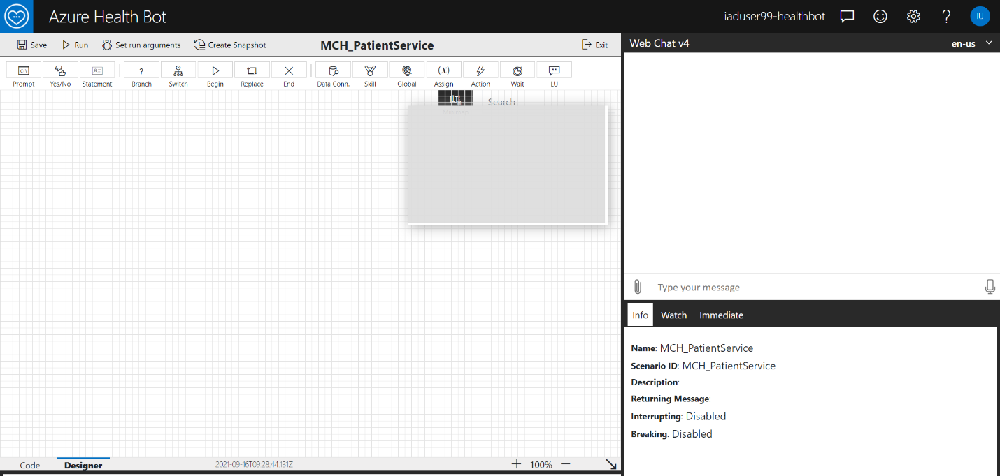](../media/83-manage-scenarios.png#lightbox)

### Step 1: Add bot introduction statement

1. Add a beginning statement to the scenario by selecting the **Statement** icon and dragging it onto the editor.

    > [!div class="mx-imgBorder"]
    > [](../media/84-prompt-statement.png#lightbox)

1. Enter the **Display Text**:

    *Hi there, I'm your Healthcare Assistant.*

1. Select the pencil next to Statement in the top bar and change the **Title** to **Intro**. Select **OK**.

    > [!div class="mx-imgBorder"]
    > [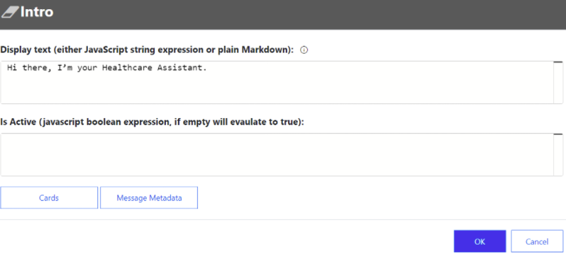](../media/85-introduction.png#lightbox)

1. Select **OK**. You'll see the Intro statement added to the designer canvas. Double-click to edit it.

    > [!div class="mx-imgBorder"]
    > 

### Step 2: Add statement for medication request or live agent

This section prompts two buttons, **Medication Refill** and **Live Agent**. When a user selects any one of the buttons, it sets the appropriate text to the variable **MedicationOrAgent**.

1. Select the **Prompt** icon and drag it down onto the canvas.

    > [!div class="mx-imgBorder"]
    > [](../media/84-prompt-statement.png#lightbox)

1. Enter the following details:

    1. **Display Text**: Would you like to request a medication refill or chat with a live agent?

    1. **Variable name:** MedicationOrAgent

    1. **Data type**: string

    1. Rename title to **MedOrAgent**.

1. Select the **Cards** button.

    > [!div class="mx-imgBorder"]
    > [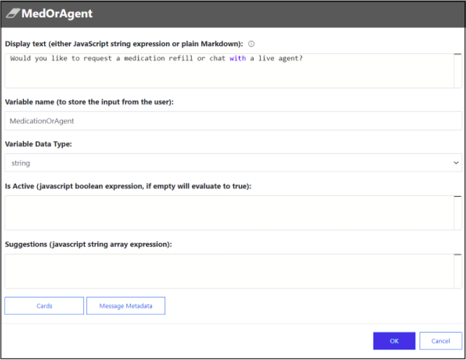](../media/87-medication-request.png#lightbox)

1. Select **Add Card**.

    > [!div class="mx-imgBorder"]
    > [](../media/88-add-card.png#lightbox)

1. Set **Card Type** to **HeroCard**. Leave the title blank as we already prompted with the display text.

1. Select the **Add Action** button twice to add two actions:

    1. For the first action, select the following values:

        1. **Action type**: imBack

        1. **Action value**: MedicationRefill

        1. **Action title**: "Medication Refill"

    1. For the second action, fill in the following values:

        1. **Action type**: imBack

        1. **Action value**: LiveAgent

        1. **Action title**: "Live Agent"

    > [!div class="mx-imgBorder"]
    > [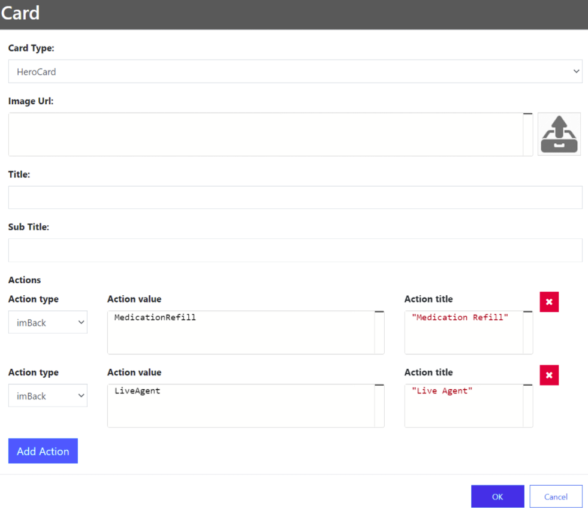](../media/89-add-action.png#lightbox)

1. Select **OK** three times to get back to designer.

    > [!div class="mx-imgBorder"]
    > [](../media/90-select-ok.png#lightbox)

    > [!div class="mx-imgBorder"]
    > [](../media/91-request-ok.png#lightbox)

1. Connect **Intro** and **MedOrAgent** boxes. Select the bottom circle on Intro and drag it to the top circle on the new prompt. An arrow automatically appears when you try to connect the Intro and MedOrAgent boxes.

    > [!div class="mx-imgBorder"]
    > [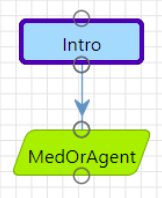](../media/92-connect-boxes.png#lightbox)

1. Select **Save**.

1. Select **Run** to see the output in the Web Chat on the right.

    > [!div class="mx-imgBorder"]
    > [](../media/94-run-button.png#lightbox)

    > [!div class="mx-imgBorder"]
    > [](../media/94-web-chat.png#lightbox)

### Step 3: Add MedicationOrAgent Decision Branch

This section checks whether the user has selected Medication Refill or Live Agent with the help of the variable MedicationOrAgent. It will redirect the message according to the selection.

1. Add a **Branch** to the designer canvas.

    > [!div class="mx-imgBorder"]
    > [](../media/95-branch.png#lightbox)

1. Enter the following expression in the **javascript Boolean expression** box:

    `scenario.MedicationOrAgent === "MedicationRefill"`

1. Rename to **IsMedRefill**. Select **OK**.

    > [!div class="mx-imgBorder"]
    > [](../media/96-medication-agent.png#lightbox)

1. Select and drag the bottom circle of the **MedOrAgent** prompt to the top circle of the **IsMedRefill** branch decision to connect them.

    > [!div class="mx-imgBorder"]
    > [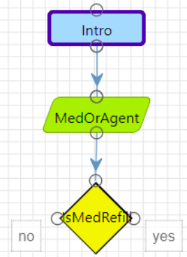](../media/97-medication-branch.png#lightbox)

### Step 4: Prompt user to enter data for medication refill option

1. Add a **Prompt** element. This will be used to display the Form data (using Adaptive Card) to capture Patient name, email, and phone to create an appointment.

    > [!div class="mx-imgBorder"]
    > [](../media/98-prompt.png#lightbox)

1. Add the following details:

    1. **Variable name**: formData

    1. **Variable Data Type**: Object

    1. **Title**: Submit

    1. Don't add display text since the adaptive card will display instead.

    > [!div class="mx-imgBorder"]
    > [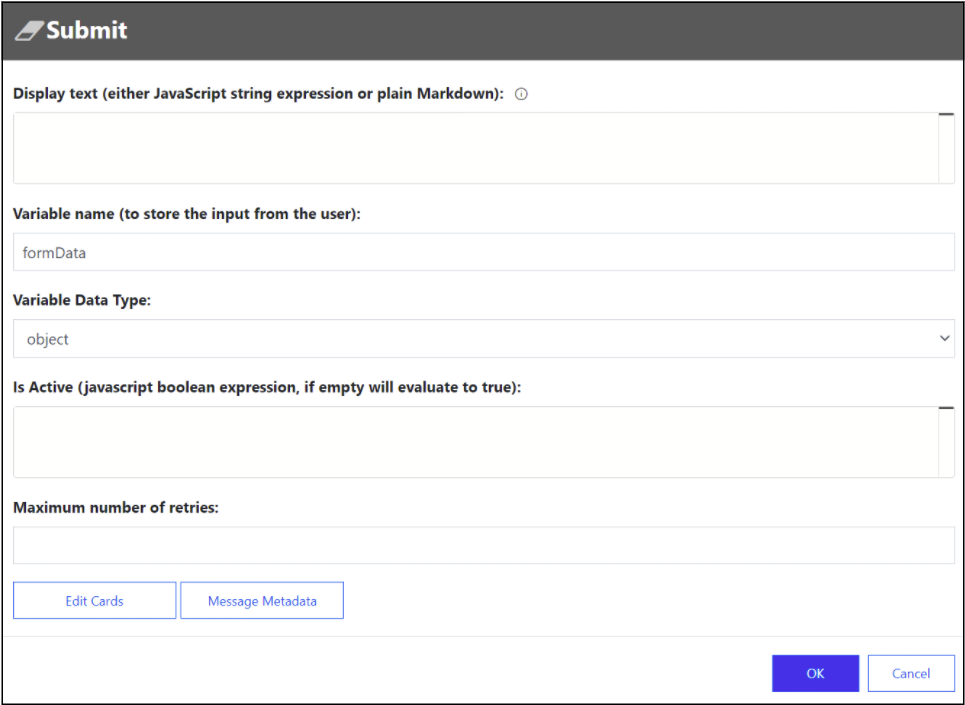](../media/98-submit.png#lightbox)

1. Select the **Cards** button > **Add Card** > **Adaptive Card**.

1. Refer to the lab resources file **AdaptiveCardForMedicationRefill.txt** and copy the JSON content and paste it in the JSON section of your card.

    > [!NOTE]
    > Visit the [Adaptive Card visualizer](https://adaptivecards.io/visualizer/?azure-portal=true) to test your own authored card.

    > [!div class="mx-imgBorder"]
    > [](../media/99-adaptive-card.png#lightbox)

1. Select **OK** three times to get back to the designer.

1. **Connect** the **Yes** condition of the **IsMedRefill** branch to the **Submit** prompt.

    > [!div class="mx-imgBorder"]
    > [](../media/100-connect-yes.png#lightbox)

1. **Save** and **run** your current scenario. If you don't save the scenario first, it won't run with updates since the last save. If you haven't saved at all, it won't recognize any conversation.

1. You should see the below adaptive card output in the Web Chat when running the conversation and selecting **Medication Refill** when prompted.

> [!div class="mx-imgBorder"]
> [](../media/101-medication-refill.png#lightbox)

### Step 5: Add a confirmation statement

1. Add a **Statement** element.

    > [!div class="mx-imgBorder"]
    > [](../media/98-prompt.png#lightbox)

1. Set **Display text** to the following:

    `scenario.formData.myName + " - Thanks for providing the information, we have created a Medication Request for you regarding the following medication: " + scenario.formData.myMedReq`

1. Rename the statement to **Confirmation**.

    > [!div class="mx-imgBorder"]
    > [](../media/102-confirmation.png#lightbox)

1. Connect the **Submit** element to the **Confirmation** element on the designer canvas.

    > [!div class="mx-imgBorder"]
    > [](../media/103-connect-submit.png#lightbox)

1. Select **Save** and **Run** to see your scenario in the web chat. Select **Refill Medication** in the authored card.

1. Fill in information for the request and select **Submit** to see the confirmation text.

    > [!div class="mx-imgBorder"]
    > [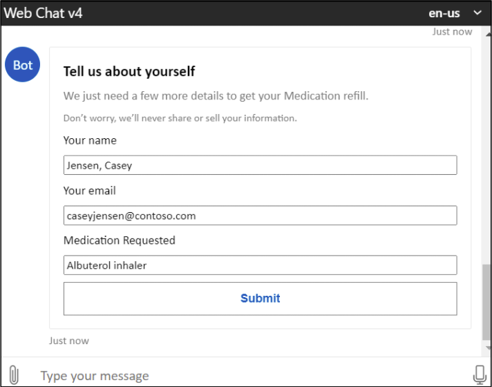](../media/104-webchat-scenario.png#lightbox)

    > [!div class="mx-imgBorder"]
    > [](../media/105-information-submit.png#lightbox)

### Step 6: Invoke live agent action

1. Add a **Statement** element to the canvas.

    > [!div class="mx-imgBorder"]
    > [](../media/84-prompt-statement.png#lightbox)

1. Enter **Display Text**: *Please wait, I am transferring your request to a live agent for further assistance.*

1. Rename the statement to **Live Chat**.

    > [!div class="mx-imgBorder"]
    > [](../media/106-statement-rename.png#lightbox)

1. Select **OK** to return to the designer page.

1. **Connect** the **No** decision of the **IsMedRefill** branch to the **Live Chat** statement.

    > [!div class="mx-imgBorder"]
    > [](../media/107-connect-no.png#lightbox)

### Step 7: Add action to invoke escalation

1. Add an **Action** element to the canvas, used to trigger an escalation to Omnichannel Live Agent.

    > [!div class="mx-imgBorder"]
    > [](../media/108-action-element.png#lightbox)

1. Add the following code to the action, which will trigger the live agent chat:

    ```json
    session.sendChannelData('Escalating...', {
      "tags": JSON.stringify({type: "Escalate", context: {"EscalateToAgent": 1}})
    });
    ```

1. Name the action **Escalate**. Select **OK** to return to the designer page.

    > [!div class="mx-imgBorder"]
    > [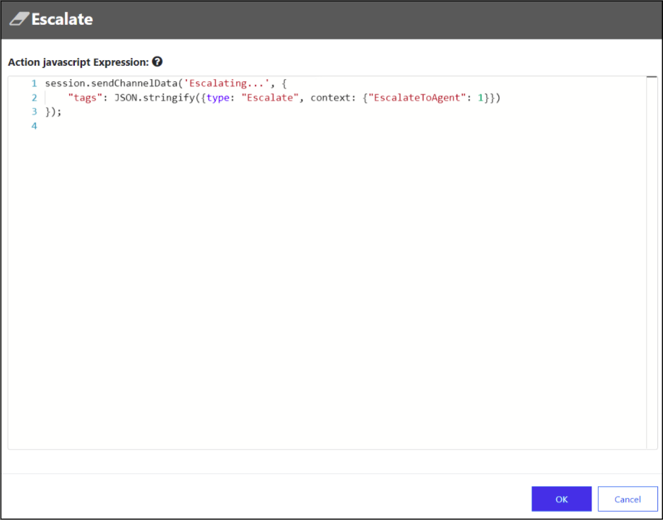](../media/109-escalate-agent.png#lightbox)

1. **Connect** the **Live Chat** statement to the new **Escalate** action.

    > [!div class="mx-imgBorder"]
    > [](../media/110-connect-live-chat.png#lightbox)

1. You've completed the final connection! Here is your full scenario:

    > [!div class="mx-imgBorder"]
    > [](../media/111-connection-complete.png#lightbox)

1. **Save** and **Run** your scenario to see the full scenario output.

1. Select **Live Agent** in the authored card to show the escalation action.

    > [!div class="mx-imgBorder"]
    > [](../media/112-live-agent.png#lightbox)

1. **Exit** the MCH_PatientService scenario editor. Make sure you save before confirming to exit.

    > [!div class="mx-imgBorder"]
    > [](../media/113-scenario-editor.png#lightbox)

**Congratulations**! You created a custom scenario to allow the patient to refill a medication or escalate to a live agent.

## Task 2: Create MCH_PatientServiceWelcome scenario

In this task, we'll create another bot scenario called **MCH_PatientServiceWelcome** to invoke the **MCH_PatientService** scenario.

1. On the Azure Health Bot scenarios page, select **New** to create another new scenario

    > [!div class="mx-imgBorder"]
    > [](../media/114-scenario-management.png#lightbox)

1. Provide the following details for the new scenario:

    1. **Name**: MCH_PatientServiceWelcome

    1. **Scenario ID**: MCH_PatientServiceWelcome

1. Select **Create**.

    > [!div class="mx-imgBorder"]
    > [](../media/115-create-new-scenario.png#lightbox)

1. On the scenario editor designer, add a **Statement** element.

    > [!div class="mx-imgBorder"]
    > [](../media/84-prompt-statement.png#lightbox)

1. Rename the statement **Welcome**. Don't add any Display text as we'll show it in the card instead.

    > [!div class="mx-imgBorder"]
    > [](../media/116-statement-intro.png#lightbox)

1. Select **Cards.**

    > [!div class="mx-imgBorder"]
    > [](../media/117-select-card.png#lightbox)

1. Select **Add Card**.

    > [!div class="mx-imgBorder"]
    > [](../media/118-add-card.png#lightbox)

1. Choose **HeroCard**

1. Set **Title** to **Welcome to Lamna Healthcare Patient Service Portal**.

    > [!div class="mx-imgBorder"]
    > [](../media/119-title-card.png#lightbox)

1. Select **Add Action** and provide the following details:

    1. **Action type**: imBack

    1. **Action value**: "begin MCH_PatientService"

    1. **Action title**: "Lamna Healthcare Support"

    > [!div class="mx-imgBorder"]
    > [](../media/120-add-action.png#lightbox)

1. Select **OK** three times and view your completed scenario. This will be used to kick off the conversation and allow the other MCH_PatientService scenario to be invoked through the authored card.

    > [!div class="mx-imgBorder"]
    > [](../media/121-scenario-introduction.png#lightbox)

1. **Save** and **Run** to test your bot scenario **MCH_PatientServiceWelcome** in the Web Chat.

    > [!div class="mx-imgBorder"]
    > [](../media/122-test-welcome.png#lightbox)

1. **Exit** the scenario designer.

**Congratulations**! You created a welcome scenario that will kick off the MCH_PatientService scenario.

## Task 3: Configure welcome scenario to be automatic

In this task, we'll set the **MCH_PatientServiceWelcome** to be the **Automatic Welcome Scenario** in settings. This will always trigger the scenario when a user starts a conversion with the **Health Bot** from the portal.

1. Navigate to **Configuration** > **Conversation**.

    > [!div class="mx-imgBorder"]
    > [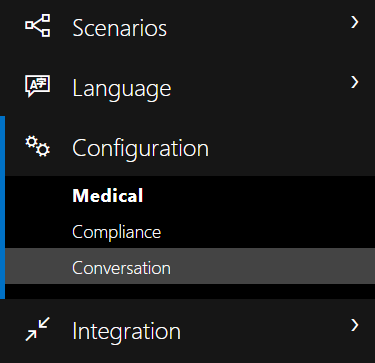](../media/123-configuration-conversation.png#lightbox)

1. In the Interactions tab, scroll down to the **Automatic Welcome** section.

    > [!div class="mx-imgBorder"]
    > [](../media/124-automatic-welcome.png#lightbox)

1. In the **Automatic welcome scenario** dropdown, select the **MCH_ PatientServiceWelcome** scenario.

    > [!div class="mx-imgBorder"]
    > [](../media/125-automatic-message.png#lightbox)

**Congratulations!** You have successfully set the MCH_PatientServiceWelcome scenario as the default scenario that kicks off when a user interacts with the Health Bot.

## Task 4: Test health bot escalation from Power Apps Portal to Dynamics 365 Omnichannel

In this task, you'll test the escalation experience from Power Apps portal to a live agent in Omnichannel.

1. Navigate to [Power Apps](https://make.powerapps.com/?azure-portal=true) and select to open **Lamna Healthcare Patient Portal**.

    > [!div class="mx-imgBorder"]
    > [](../media/126-test-escalation.png#lightbox)

1. You should see the Azure Health Bot **Let's Chat** button in the lower right-hand corner of the screen. This means the chat widget was successfully embedded into the Customer Self-service portal.

    > [!div class="mx-imgBorder"]
    > [](../media/127-lets-chat.png#lightbox)

1. When you select the chat widget, the bot will trigger the welcome scenario message we created and set as the default welcome message, **MCH_PatientServiceWelcome**.

    > [!div class="mx-imgBorder"]
    > [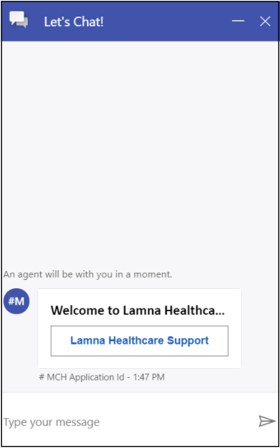](../media/128-chat-widget.png#lightbox)

1. Navigate back to Power Apps and open **Customer Service Workspace.**

    > [!div class="mx-imgBorder"]
    > [](../media/129-customer-service-workspace.png#lightbox)

    > [!NOTE]
    > Escalation into the Customer Service workspace will work only when you see that the presence status is enabled. There should be a splash loading screen that goes through multiple steps and then displays the status indicator as **available** once it's loaded. Status is enabled when it shows a checkmark in a green circle.

    > [!div class="mx-imgBorder"]
    > [](../media/130-presence-status.png#lightbox)

    The splash screen looks like the following screenshot. Refresh the page if you don't see the splash screen.

    > [!div class="mx-imgBorder"]
    > [](../media/131-splash-screen.png#lightbox)

1. In the Health Bot dialog in the Patient Portal, select **Lamna Healthcare Support** button, then the **Live Agent** button to witness the escalation into Omnichannel to chat with a live agent (your user!)

    > [!div class="mx-imgBorder"]
    > [](../media/132-live-agent.png#lightbox)

1. Navigate back to Omnichannel for Customer Service. Your user, as the **Live Agent**, should receive an incoming notification with **Accept** and **Reject** options for the chat.

1. Select **Accept** to connect and chat with the customer, or in this case, the patient.

    > [!div class="mx-imgBorder"]
    > 

1. As soon as a Live Chat Agent accepts the incoming chat notification, Omnichannel for Customer Service opens a **Live Chat Widget** where the agent can see the entire bot conversation with the user and continue to chat with them.

    > [!div class="mx-imgBorder"]
    > [](../media/135-live-chat-widget.png#lightbox)

**Congratulations!** You've successfully tested the escalation scenario from the patient using a Health Bot in the Power Apps Portal to a Live Agent in Omnichannel for Customer Service.
