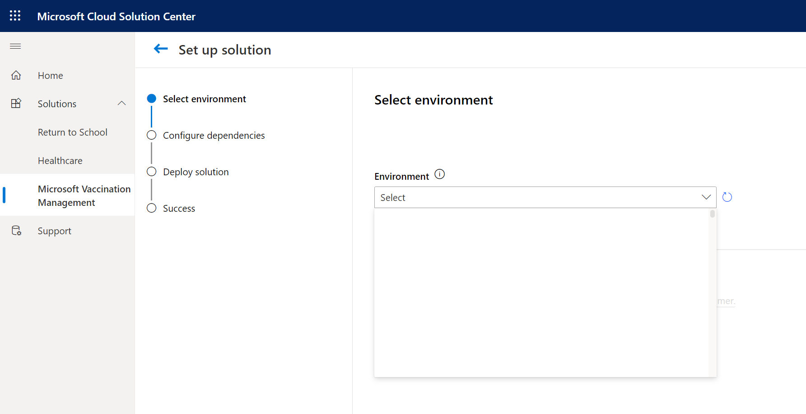
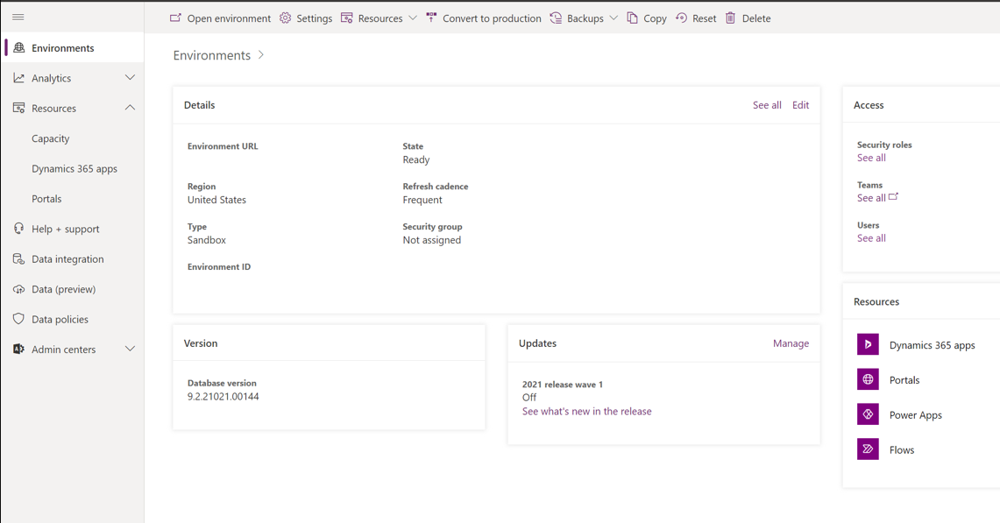

Now that we understand what licenses are required to get started, we'll move to understand how to deploy Microsoft Vaccination Management (MVM).

Dynamics components-based installations can be now deployed through a new portal-based experience known as the Microsoft Cloud Solutions Center. It guides customers and partners through the deployment of capabilities for comprehensive Industry clouds such as MVM. The Microsoft Cloud Solutions Center is an orchestrator that simplifies the whole deployment process by checking licensing requirements and dependencies. It also brings in a unified deployment and configuration experience across multiple applications.

## Prerequisites

There are a couple of prerequisites before you begin deployment using the Microsoft Cloud Solutions Center:

- Enterprise required licenses for base platform dependencies.

- The user logging into the Solution Center should have either a Power Platform or Dynamics 365 administrator role to deploy MVM.

- User should also have the required licenses for MVM and its dependencies.

- Follow the Allow-listing process for MVM.

## Deployment

The first step to deployment is to prepare the environment.

You need an environment with Dataverse, so when you create a new environment in Power Platform Admin Center, you have to select 'Create a database' for this environment. Then you install dependencies as required.

1. Create a new environment and install dependencies.

    > [!div class="mx-imgBorder"]
    > 

    - Power Apps - No additional dependencies

    - Power Portals - Starter Portal

    - Power BI (optional) - No additional dependencies

    Once your environment is prepped up with a database and dependencies, move to the next step to select the required Healthcare solutions to install. You can either choose one or many capabilities in one go, select **Add**, and kick off the installation process.

1. Select solutions.

    > [!div class="mx-imgBorder"]
    > 

1. Select environment. You'll be prompted with the Org picker dropdown that has a list of all orgs on your tenant. If you've created your environment and you're not seeing your org in the list, give it a few minutes before you retry, and it should reflect there.

    > [!div class="mx-imgBorder"]
    > 

1. Configure dependencies.

    > [!div class="mx-imgBorder"]
    > 

    When you select an environment to install, the Solution Center runs a dependency check in the background to make sure you have all that you need to get the solution working. For example, here you see that the org doesn't have the Dynamics Marketing and Power Apps Portal dependencies pre-installed before they kicked off the installation process. So they see this error and need to fix it before they can continue.

1. Install vaccination solutions.

    > [!div class="mx-imgBorder"]
    > 

    Once the dependency checkpoint is crossed, the installation process kicks in and you'll see a progress status indicating the components that are getting deployed. Once ready you should receive a confirmation status from Solution Center indicating the success or failure of the deployment.

1. Track solution status.

    > [!div class="mx-imgBorder"]
    > 

    You can also track the solution status in Power Platform Admin Center under Dynamics 365 apps section.

1. Complete post-deployment configuration.

    > [!div class="mx-imgBorder"]
    > 

    Once the installation is complete, you can begin the post-deployment solution configurations in Solution Center.
