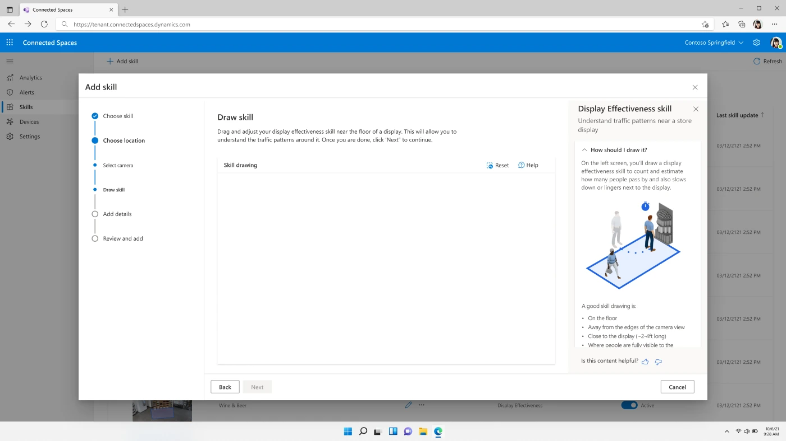
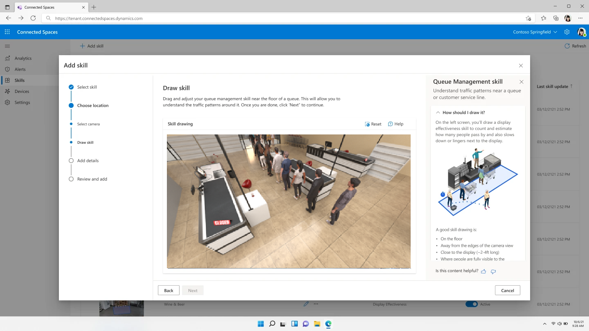
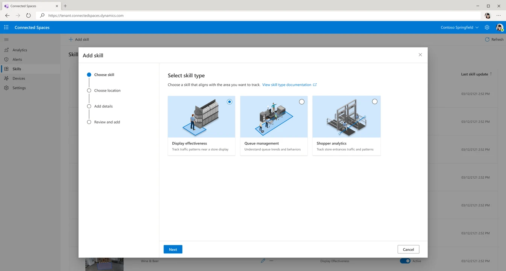
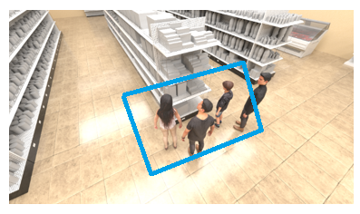
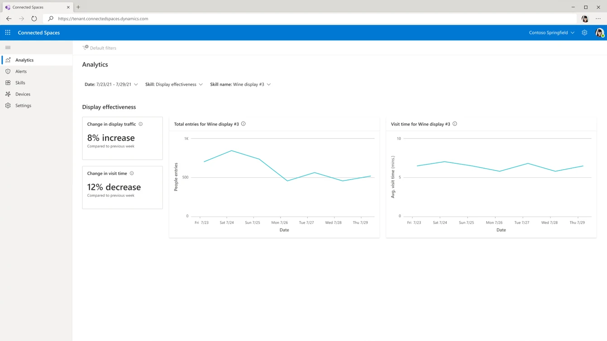

Understanding customer behavior and traffic patterns allows retail stores to better plan and serve those customers. As part of Microsoft Cloud for Retail, Dynamics 365 Connected Spaces Preview offers pre-built skills to generate actionable insights from this information.

At the core of this solution is [Responsible AI](https://www.microsoft.com/ai/responsible-ai?activetab=pivot1%3aprimaryr6&azure-portal=true). These scenarios are powered by computer vision technology for people counting and dwell time measurement without individual shoppers being identified or having their facial characteristics analyzed.

**Shopper analytics** - use cameras pointed at entry and exit locations, receive counts and trends for traffic in the store, and how they change by the hour and by day. You can also identify the busiest day of the week and use that to plan shifts.

> [!div class="mx-imgBorder"]
> 

**Display effectiveness** - measure the effectiveness of displays (end caps in your store) to get an understanding of how many people walked past the display, and how many have actively engaged with it. Use this data to do A/B testing to determine the best locations to put your promotional content or to understand how the display is doing.

> [!div class="mx-imgBorder"]
> 

**Queue management** - measure the customer wait time experienced in queues, use the data to plan to open more queues, and achieve a better understanding of business lost due to queue abandonment.

> [!div class="mx-imgBorder"]
> 

## Get started

Dynamics 365 Connected Spaces works with the cameras you're already using and avoids the added expense of new hardware. With a simple set-up experience, add existing hardware and unlock new data with a turnkey software as a service (SaaS) application. Following deployment, turn on AI-powered models, known as skills, to help understand specific scenarios such as customer behavior at a promotional display, traffic patterns, and insights unique to your space.

In general, to set up you'll follow these steps:

1. Set up the account

1. Set up your store and configure your gateway

1. Add skills

1. Add devices

> [!div class="mx-imgBorder"]
> 

> [!div class="mx-imgBorder"]
> 

Skills can be configured for each camera view. Depending on the selected skill, there are good, and bad, options for configuring. For example, when drawing the area for an end cap, make sure the foot pattern extends at least three feet (1 meter) from the display. This will properly evaluate the traffic for more accurate insights. You're trying to gather information about the traffic patterns, so focus on the areas of traffic.

The following image shows an example of a good drawing.

The following image shows an example of a bad drawing.

You can review several more examples of good, and bad, configuration for each of the skills in [Add skills to collect data in Dynamics 365 Connected Spaces Preview](/dynamics365/connected-spaces/cameras-add-skills/?azure-portal=true).

## Analytics

Once configured, you see quick results from the data collected. With this intelligence, employees and other stakeholders can review and act upon the information.

Evaluate shopper traffic and recognize patterns for better staffing.

> [!div class="mx-imgBorder"]
> 

Review effectiveness of your end cap displays.

> [!div class="mx-imgBorder"]
> 

Measure customer wait-time in queues and open more cash registers as needed for better efficiency.

> [!div class="mx-imgBorder"]
> 

## Acting on insights

Dynamics 365 Connected Spaces Preview comes with built-in alerts for each scenario, enabling managers and employees to respond to important interactions with ease. Triggered by real-time activity, it sends alerts to Microsoft Outlook or Microsoft Teams when it meets a threshold such as maximum wait time, maximum store occupancy, maximum display dwell time, and more.

The data from Dynamics 365 Connected Spaces Preview is stored in Microsoft Dataverse, part of the Power Platform. With the Power Platform, you can further enable your frontline workers with Power Apps that they carry in their pocket on mobile devices. The apps can offer floor managers the ability to reassign staff in real time to address a higher traffic point, and frontline workers can receive push notifications of this staffing change. You can also create automation with Power Automate using the data.

When used as part of the Microsoft Cloud for Retail, Dynamics 365 Connected Spaces Preview brings physical location insights as part of a holistic retail solution.
