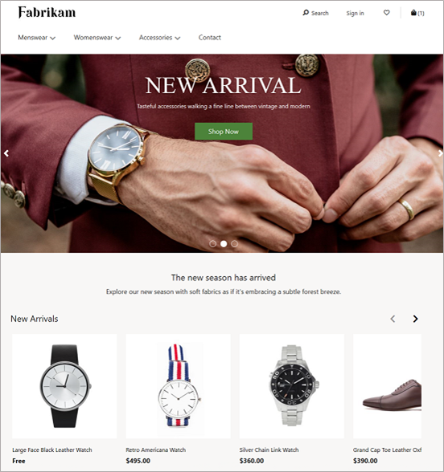
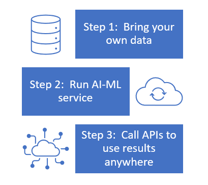

A key goal of Microsoft Cloud for Retail is to elevate the shopping experience. Using Intelligent Recommendations, you can enable real-time personalization. As shoppers navigate your site or app, Intelligent Recommendations automates the offering of targeted products. Intelligent Recommendations provides businesses with a toolkit of relevant scenarios, including:

**New** - Returns a list of the newest products that have been recently added to channels and catalogs. You can highlight a specific subset of products by using various time-based or time plus popularity-based metrics to surface new or trending items.

**Popular** - Returns a list of products that are ranked by the highest number of sales. You can tailor a Popular chart to focus on basic consumption, overall popularity, or revenue. Intelligent Recommendations supports metrics such as sales figures, usage counts, game play counts, time spent with content, and more.

**Trending** - Returns a list of the highest performing products for a given period, ranked by highest number of sales. Trending lists in Intelligent Recommendations enable browsing a content catalog using algorithmic charts sorted by information such as total sales, sum of clicks, release date, or a combination of different metrics. You can further scope trending lists to specific time windows and aggregations to surface the most popular or best-selling products to users.

**Frequently bought together** - Returns a list of products that are commonly purchased together (complementary) with the contents of the consumer's current cart. Frequently bought together is an up-sell scenario based on items already placed in the shopping cart. This scenario is often called a "candy rack experience." This scenario learns from other, previously purchased (completed) baskets, and returns complementary products based on what's currently in a user's cart. This scenario can be different from item-to-item relationships, because it can analyze the entire basket as an entity with meaning.

**People also like** - Returns products for a given seed product based on consumer purchase patterns. Can be changed based on consumer action (purchase, views). One of the most effective recommendations channels is the People also like (or buy) list, most commonly found on a Product details page. People also like is based on explicit signals (transactional, recently viewed) and creates a strong relationship between items using information about other users' consumption.

**Picks for you** - Returns a personalized list of products based on purchase patterns of the signed-in user. For an anonymous guest user, this list will be collapsed. The User picks scenario is a style of personalized recommendations that focuses on capturing the user's tastes, or preferences, and positions a user in unique locations in the item space. This scenario creates highly personalized recommendations in the context of a large catalog of items. The distance between a user and a particular item decides its strength of relationship. Vectors that are closer together represent a stronger connection.

**Shop similar looks** - Returns a list of products with visually similar images. For some items, visual similarity might supply an added point of view rather than a collaborative filtering solution. Suppose a consumer is looking for a similar floral shirt pattern as one they've seen in the store. With Shop similar looks, Intelligent Recommendations can use content images to detect products with similar visual attributes that deliver a different item-to-item experience to the user.

**Shop similar by description** - Returns a list of products with textually similar content descriptions. Sometimes, content images can look the same (such as a bottle of wine), and comparison by visual similarity isn't applicable. When there's a rich, textual description of a product, a textual similarity can be generated. In this case, Intelligent Recommendations can train a neural network to understand the written text used for item descriptions. For these customers, the models supply relevant recommendations by understanding and interpreting text as an alternative similarity space.

## Get started

Intelligent Recommendations is an extensible and scalable headless Microsoft Azure service that's easy to onboard and start using with zero-code integration. In the simplest of terms, you'll need to bring your data, run the AI-ML service against your data, then call APIs to use your data anywhere.

### Bring your own data

Intelligent Recommendations doesn't have a prerequisite license. You can connect it to your company's Data Lake Storage account. Intelligent Recommendations doesn't store or process customer data outside the region you deploy the service instance in.

Your data may include a catalog, or user interactions, for example. Your catalog might contain general information about items, content, and other generic services Intelligent Recommendations will recommend. User interactions could include interactions between users and items that Intelligent Recommendations models learn from and use to predict future interactions. Examples of user interactions include click streams, purchases, downloads, likes, and views.

### Run AI-ML service

After data is structured and shared, and the Intelligent Recommendations service instance is initiated, the "cooking" process begins. Data is processed and modeled according to business needs and scenarios. You can monitor progress by examining the output logs to make sure everything runs smoothly.

With an extensible architecture, businesses have the power to introduce more business logic and manage multiple instances of recommendations models. These multiple instances are useful for experimentation or for creating use cases with different signals.

### Call APIs to use the results anywhere

The solution integrates well on omnichannel platforms, using a simple recommendations API to create extensible, customizable experiences.

This solution provides real-time filtering and refreshed ordering of item results, and personalization of any list.

In addition to using Intelligent Recommendations, you can also add real-time personalization by using Azure Cognitive Search and Dynamics 365 Marketing to complement the recommendations as you personalize the shopping journey for a consumer across all their touch points and engagements.

For more information about setting up Intelligent Recommendations, go to [Quick start guide: Set up and run Intelligent Recommendations with sample data.](/industry/retail/intelligent-recommendations/quickstart/?azure-portal=true)
