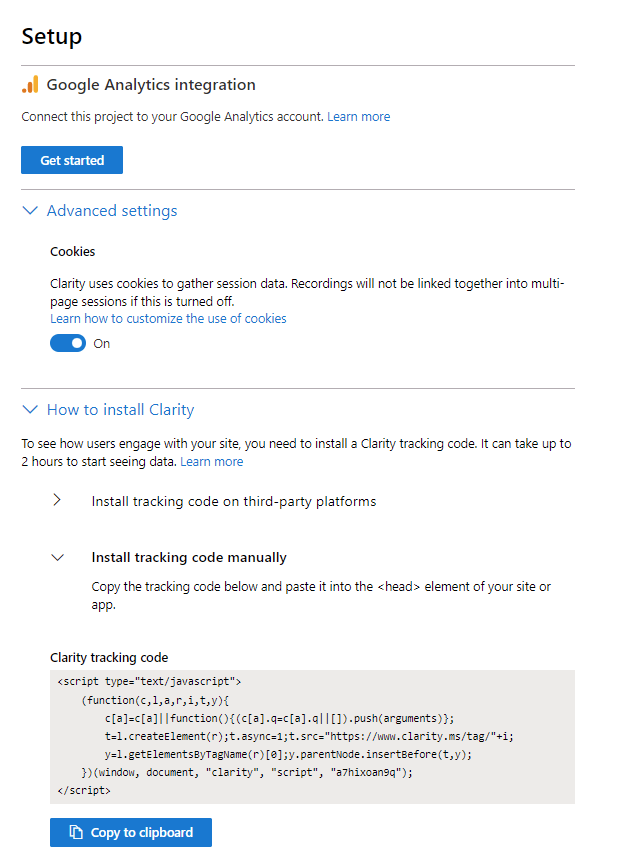

Clarity is a free behavioral analysis tool that helps you understand how users interact with your retail site. Armed with this information you can make informed decisions about changes to your website to better serve your clients. Clarity supports practically any site in any modern browser using a provided code snippet. For detailed steps, see [Set up Clarity manually](/clarity/clarity-setup/?azure-portal=true).

The unique features of Clarity that help you understand user behavior include:

- Watch how users interact with your site with session recordings.

- Heat maps allow evaluation of user engagement.

- Simple and easy customization makes Clarity best for your site.

- Clarity won't get in the way of your site's performance.

- Data is analyzed and ready to view in near real time, so you don't have to wait.

- There are absolutely no limits on the number of sites per account. Clarity can scale to support even the largest websites.

- Clarity process more than 1 petabyte of data from over 100 million users per month. Also, there are no traffic limits on these sites.

- Deep AI and machine learning algorithms power insights to help you analyze user behavior efficiently.

Clarity provides heatmaps, session recordings and machine learning insights based on the user behavior of your defined projects.

## Heatmaps

Each website has elements to encourage engagement with visitors. The heatmap shows you where site visitors are actually spending their clicks, and sometimes it's not the path we expected. Clarity tracks all visitor clicks and scrolls on mobile, desktop, and tablet and automatically generates a heat map. This data helps you identify the most engaged areas and figure out gaps. For example, you can identify if users aren't scrolling down to see valuable information on pages.

> [!div class="mx-imgBorder"]
> 

## Session recordings

Session recordings give a masked view of the user's exact experience. You can see the order in which they navigated or completed tasks. Recordings allow you to analyze user behavior throughout a session. You can replay user actions to understand user perspective, traffic source, session timing, and so on. You can group user sessions through filters and segments.

> [!div class="mx-imgBorder"]
> 

## Machine learning insights

Clarity Insights are a set of Machine Learning (ML) based filters and recommendations on what content should be most important for you. The dashboard is helpful for designers, product managers, marketers, and web developers. Through the dashboard, you can understand the users without analyzing the ocean of data from user interactions. The dashboard shares important demographic information about site visitors. You can learn more about the location of your users, how long they spend on your site, and if they're efficiently navigating your site.

> [!div class="mx-imgBorder"]
> 

## Product information filters

The Product information filters are useful for retail sites to let you filter data from product sessions that matched with the corresponding criteria. This includes criteria about Product Name, Price, Brand, Availability, Average Rating, and Number of Ratings.

For more about how product information can be analyzed, see [E-Commerce Insights Products](/clarity/e-commerce-insights/?azure-portal=true#products).

Now that you've learned some of the basics, let's see a quick demo of Clarity in action.

> [!VIDEO https://www.microsoft.com/videoplayer/embed/RWVmnA]

## Manage Clarity projects

Clarity allows you to have as many projects as you need, and you manage them from a central location. Once you've created a project, you're the Administrator and only administrators can modify project settings. Once you've selected the project you want to work on, you'll be able to manage settings like name and category, as well as the team, setup, masking and IP blocking.

To support team collaboration, you can invite other users to be members of the project. The following shows how you can manage the project's team members.

### Review information for setup

On the project setup, you can get the code snippet that needs to be on your site. You can also configure settings like Google Analytics integration and use of cookies. Integrating your Clarity project with Google Analytics allows Clarity to link session playbacks with your Google Analytics dashboard. Once you identify the sessions you need more information on, jump to Google Analytics Dashboard to debug and understand user pain points.

### Review and edit masking options

Clarity masks all sensitive content on your website by default. The sensitive content includes all input box content, numbers, and email addresses. Clarity doesn't capture masked content. You can modify the configuration to choose what Clarity will track by either masking or unmasking it.

