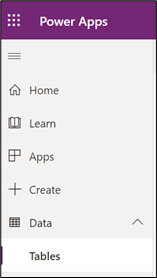

Power Query is a data transformation and data preparation engine. Power Query comes with a graphical interface for getting data from sources and Power Query Editor for applying transformations. Because the engine is available in many products and services, the destination where the data will be stored depends on where Power Query was used. By using Power Query, you can perform the extract, transform, and load (ETL) processing of data.

> [!div class="mx-imgBorder"]
> 

The Power Query user experience is provided through the Power Query Editor user interface. The goal of this interface is to help you apply the transformations that you need by interacting with a user-friendly set of ribbons, menus, buttons, and other interactive components. Power Query can connect to many different data sources so that you can work with the data you need.

In this exercise, you will be playing the role of a business analyst and will learn how to do the following:

- Use Power Query options to quickly import a small subset of data into Dataverse.

- Create Microsoft Excel templates.

## Task 1: Get Data in Power Apps

In this task, you will discover the Power Query options that are available to help you get small amounts of data into Dataverse.

1.  Go to [Power Apps](https://make.powerapps.com/?azure-portal=true). We recommend that you are in **Incognito** or **InPrivate** mode.

1.  Sign in by using the credentials that are supplied in the training for your user.

1.  Select the correct environment from the **Environment** dropdown menu in the upper-right corner.

	> [!div class="mx-imgBorder"]
	> 

1.  Expand **Data** on the left navigation bar and then select **Tables**.

	> [!div class="mx-imgBorder"]
	> 

1.  On the top menu bar, select the arrow next to **Data** and then select **Get data** to open Power Query.

	> [!div class="mx-imgBorder"]
	> 

1.  Browse through the various Power Query options that are available to help you import data into Dataverse. Power Query offers numerous data connectors, which are separated into multiple categories. These connectors range from data sources such as .txt, .csv, and Excel files, to databases such as Microsoft SQL Server and popular software as a service (SaaS) services such as Microsoft Dynamics 365.

    Go to [this article](/power-query/best-practices/?azure-portal=true) to learn more about best practices when working with Power Query to get data into Dataverse.

	> [!div class="mx-imgBorder"]
	> 

Congratulations, you have successfully navigated to Power Query from within Power Apps and have reviewed the available options to help you quickly import data into Dataverse.

## Task 2: Import data from Excel 

In this task, you will import data into Dataverse from an Excel file by using the UI within Microsoft Vaccine Management. This process is another option that you can use to import data into Dataverse.

1.  Go to [Power Apps](https://make.powerapps.com/?azure-portal=true). We recommend that you are in **Incognito** or **InPrivate** mode.

1.  Sign in by using the credentials that are supplied in the training for your user.

1.  Select the correct environment from the **Environment** dropdown menu in the upper-right corner.

	> [!div class="mx-imgBorder"]
	> 

1.  Select **Apps** on the left navigation bar.

1.  Find the **Vaccination management** app and select the app name.

	> [!div class="mx-imgBorder"]
	>  

1.  In the lower-left corner, change the selected module to **Reference data**.

	> [!div class="mx-imgBorder"]
	> 

1.  With **Phases** highlighted on the left site map, go to the top menu and select the **Import from Excel** button. This method will import data from an Excel workbook directly to the highlighted table in the Vaccine Site Management app. If you select the arrow next to the button, notice that you can also import CSV and XML files to quickly create new records.

	> [!div class="mx-imgBorder"]
	> 

	> [!div class="mx-imgBorder"]
	> 

Congratulations, you have learned how to use the **Import from Excel** feature to quickly import data into Dataverse.

