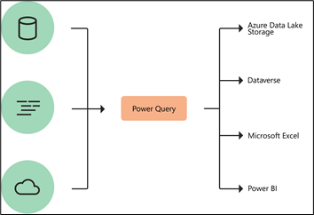
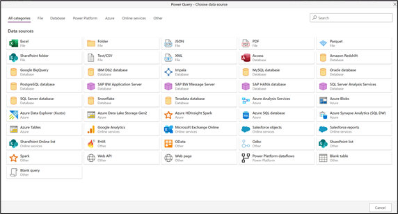
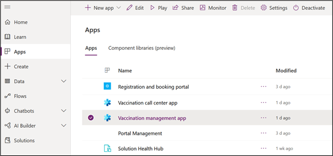

Power Query is a data transformation and data preparation engine. Power Query comes with a graphical interface for getting data from sources and a Power Query Editor for applying transformations. Because the engine is available in many products and services, the destination where the data will be stored depends on where Power Query was used. Using Power Query, you can perform the extract, transform, and load (ETL) processing of data.

> [!div class="mx-imgBorder"]
> 

The Power Query user experience is provided through the Power Query Editor user interface. The goal of this interface is to help you apply the transformations you need simply by interacting with a user-friendly set of ribbons, menus, buttons, and other interactive components. Power Query can connect to many different data sources so you can work with the data you need.

In this exercise, you will be playing the role of a Business Analyst and learn how to do the following:

1.  Use Power Query options to quickly import a small subset of data into Dataverse.

1.  Learn how to create Excel templates.

## Task 1: Navigate to Get Data in Power Apps

In this task, you will get to know the Power Query options available to get small amounts of data into Dataverse.

1.  Navigate to [Power Apps](https://make.powerapps.com/?azure-portal=true) (recommend Incognito or InPrivate session).

1.  Log in using the credentials supplied in the training for your user.

1.  Select the correct environment from the upper right **Environment** drop-down.

	> [!div class="mx-imgBorder"]
	> 

1.  Expand **Data** on the left navigation bar and select **Tables.**

	> [!div class="mx-imgBorder"]
	> 

1.  On the top menu bar, click the down arrow next to **Data**, and then click Get Data to open Power Query.

	> [!div class="mx-imgBorder"]
	> 

1.  Browse through the various Power Query options available to import data into Dataverse. Power Query offers a wide number of data connectors, which are broken down into multiple categories. These connectors range from data sources such as TXT, CSV, and Excel files, to databases such as Microsoft SQL Server, and popular SaaS services such as Microsoft Dynamics 365.

    Reference [this article](/power-query/best-practices/?azure-portal=true) to learn more about best practices when working with Power Query to get data into Dataverse.

	> [!div class="mx-imgBorder"]
	> 

    **Congratulations!** You have navigated to Power Query from within Power Apps and reviewed the options available to quickly import data into Dataverse.

## Task 2: Importing data from Excel 

In this task, we will walk through the steps to import data into Dataverse from an Excel file using the UI within Microsoft Vaccine Management. This is another option to import data into Dataverse.

1.  Navigate to [Power Apps](https://make.powerapps.com/?azure-portal=true) (recommend Incognito or InPrivate session).

1.  Log in using the credentials supplied in the training for your user.

1.  Select the correct environment from the upper right **Environment** drop-down.

	> [!div class="mx-imgBorder"]
	> 

1.  Select **Apps** on the left navigation bar.

1.  Find the **Vaccination management app** and click on the app name.

	> [!div class="mx-imgBorder"]
	>  

1.  In the bottom left-hand corner, change the selected module to Reference Data.

	> [!div class="mx-imgBorder"]
	> 

1.  With Phases highlighted on the left site map, go to the top menu, and click the **Import from Excel** button. This method will import data from an Excel workbook directly to the highlighted table in the Vaccine Site Management App. If you click the down arrow next to the button, you will see that you can also import CSV and XML files to quickly create new records.

	> [!div class="mx-imgBorder"]
	> 

	> [!div class="mx-imgBorder"]
	> 

**Congratulations!** You have learned how to use the Import from Excel feature to quickly import data into Dataverse.

