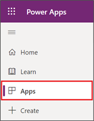
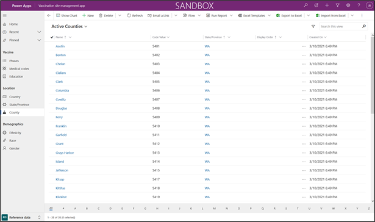

The Vaccination Site Management App is a model-driven Power App that allows a Location/Site manager to setup the reference data which is required to initially set up and begin using Microsoft Vaccine Management apps like the Vaccination Site Management app, Frontline Worker App and the Registration and Booking Portal.

In this exercise, you will be playing the role of a Business Analyst and learn how to do the following:

- Create a new Medical Code to track additional vaccine details.
- Use Power Query functionality in Power Apps to quickly import new Location records into Dataverse.

## Task 1: Create a new Medical Code record

In this task, we will begin by quickly creating a new Medical Code CVX record that will be used later for creating a new Vaccine Type in the next exercise. A medical code represents a custom entity value that is usually supplied by providing a reference to one or more terminologies, but it may also be defined by the provision of text. CVX codes indicate the product used in a vaccination. They are maintained by the Centers for Disease Control and Prevention, Immunization Information System Support Branch (IISSB) for use in HL7 data transmission. Provide the vaccination's CVX code. For Ex: 210 for Covid-19 Vaccine

1.  Navigate to [Power Apps](https://make.powerapps.com/?azure-portal=true) (recommend Incognito or InPrivate session).

1.  Log in using the credentials supplied in the training for your user.

1.  Select the correct environment from the upper right **Environment** drop down.

	> [!div class="mx-imgBorder"]
	> 

1.  Select **Apps** on the left navigation bar.

	> [!div class="mx-imgBorder"]
	> 

1.  Find the **Vaccination site management app** and click on the app name. 

	> [!div class="mx-imgBorder"]
	> 
	
1.  On the left site map, select **Medical Codes** and then click **+ New** to create a new record.

	> [!div class="mx-imgBorder"]
	> 

	> [!div class="mx-imgBorder"]
	> 

1.  Create a new Medical Code record by entering the following information:

	- **Name**: 210
	
	- **Text**: 210
	
	- **Type**: Immunization Reason Code (This may be near the bottom of the list.)
	
	- **Code**: CVX

	> [!div class="mx-imgBorder"]
	> 

1.  Click **Save & Close** to save the record and return to the Active State/Province view.

	> [!div class="mx-imgBorder"]
	> 

**Congratulations!** You have created a new Medical Code record in the Vaccination Site Management app.

## Task 2: Import a list of counties and create them as records

In this task, we will use the Import data feature in Power Apps to quickly import the remaining Washington County records into Dataverse.

1.  While in the Vaccination Site Management app, click County under the Location section on the left site map.

	> [!div class="mx-imgBorder"]
	> 

1.  Go to the top menu and click the down arrow next to **Import from Excel** button and then select **Import from CSV**.

	> [!div class="mx-imgBorder"]
	> 

	> [!div class="mx-imgBorder"]
	> 

1.  Click **Browse** to upload **Washington Counties.csv** file provided to you by your lab instructor, then click **Next**.

	> [!div class="mx-imgBorder"]
	> 

1.  Keep all the defaults and click **Review Mapping**.

	> [!div class="mx-imgBorder"]
	> 

1.  Review the Map Attributes to ensure the automated mappings are accurate and then click **Finish Import.**

	> [!div class="mx-imgBorder"]
	> 

1.  You can track the progress of your import by clicking the **Track Progress** button. This will bring up a dialog window that will navigate you to your

	> [!div class="mx-imgBorder"]
	> 

	> [!div class="mx-imgBorder"]
	> 

	> [!div class="mx-imgBorder"]
	> 

1.  Navigate back to County on the left-hand site map and your will now see the new Counties that have been created.

	> [!div class="mx-imgBorder"]
	> 

**Congratulations!** You used the Import data feature in Power Apps to quickly import new County records into the Vaccination Site Management app for the state of California.

