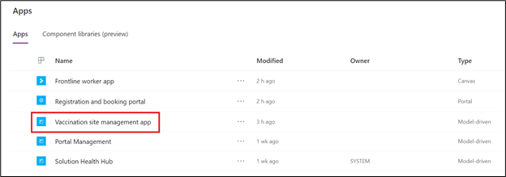
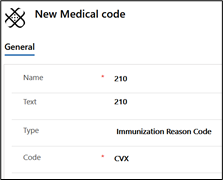
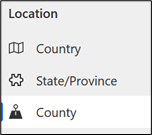
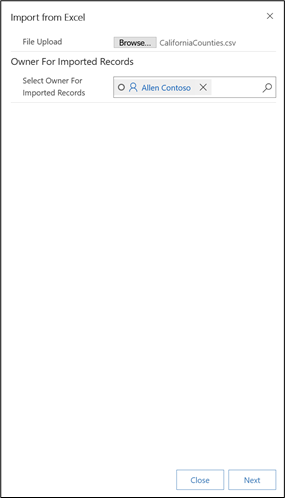
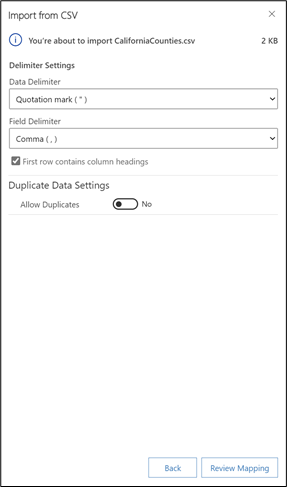

**Vaccination Site Management** is a model-driven app from Power Apps that allows a location/site manager to set up the reference data that is required to initially set up and begin using Microsoft Vaccine Management apps like **Vaccination Site Management**, **Frontline worker**, and **Registration and booking portal**.

In this exercise, you will be playing the role of a business analyst and will learn how to complete the following tasks:

- Create a new medical code to track more vaccine details.
- Use Power Query functionality in Power Apps to quickly import new location records into Dataverse.

## Task 1: Create a new medical code record

In this task, you will begin by creating a new medical code CVX record that will be used for creating a new vaccine type in the next exercise. A medical code represents a custom entity value that is supplied by providing a reference to one or more terminologies, but it might also be defined by the provision of text. CVX codes indicate the product that is used in a vaccination. They are maintained by the Immunization Information System Support Branch (IISSB) of the Centers for Disease Control and Prevention (CDC) for use in HL7 data transmission. 

Follow these steps to provide the vaccination's CVX code (for example, 210 for the Covid-19 vaccine):

1.  Go to [Power Apps](https://make.powerapps.com/?azure-portal=true). We recommend that you're in **Incognito** or **InPrivate** mode.

1.  Sign in by using the credentials that are supplied in the training for your user.

1.  Select the correct environment from the **Environment** dropdown menu in the upper-right corner.

	> [!div class="mx-imgBorder"]
	> 

1.  Select **Apps** on the left navigation bar.

	> [!div class="mx-imgBorder"]
	> 

1.  Find and select **Vaccination site management app**. 

	> [!div class="mx-imgBorder"]
	> 
	
1.  On the left site map, select **Medical codes** and then select **+ New** to create a new record.

	> [!div class="mx-imgBorder"]
	> 

	> [!div class="mx-imgBorder"]
	> 

1.  Create a new medical code record by entering the following information:

	- **Name** - 210
	
	- **Text** - 210
	
	- **Type** - Immunization Reason Code (This might be near the bottom of the list.)
	
	- **Code** - CVX

	> [!div class="mx-imgBorder"]
	> 

1.  Select **Save & Close** to save the record and return to the **Active State/Province** view.

	> [!div class="mx-imgBorder"]
	> 

Congratulations, you have successfully created a new medical code record in the **Vaccination Site Management** app.

## Task 2: Import a list of counties and create them as records

In this task, you will use the **Import data** feature in Power Apps to quickly import the remaining Washington County records into Dataverse.

1.  While in the **Vaccination Site Management** app, select **County** under the **Location** section on the left site map.

	> [!div class="mx-imgBorder"]
	> 

1.  Go to the top menu and select the arrow next to the **Import from Excel** button. Select **Import from CSV**.

	> [!div class="mx-imgBorder"]
	> 

	> [!div class="mx-imgBorder"]
	> 

1.  Select **Browse** to upload the **Washington Counties.csv** file that was provided to you by your lab instructor. Select **Next**.

	> [!div class="mx-imgBorder"]
	> 

1.  Keep all defaults and select **Review Mapping**.

	> [!div class="mx-imgBorder"]
	> 

1.  Review the **Map Attributes** section to ensure that the automated mappings are accurate and then select **Finish Import**.

	> [!div class="mx-imgBorder"]
	> 

1.  You can track the progress of your import by selecting the **Track Progress** button, which will bring up a dialog window that will direct you to your imports.

	> [!div class="mx-imgBorder"]
	> 

	> [!div class="mx-imgBorder"]
	> 

	> [!div class="mx-imgBorder"]
	> 

1.  Select **County** on the left site map, and the new counties that you created will display.

	> [!div class="mx-imgBorder"]
	> 

Congratulations, you have successfully used the **Import data** feature in Power Apps to quickly import new county records into the **Vaccination Site Management** app for the state of California.
