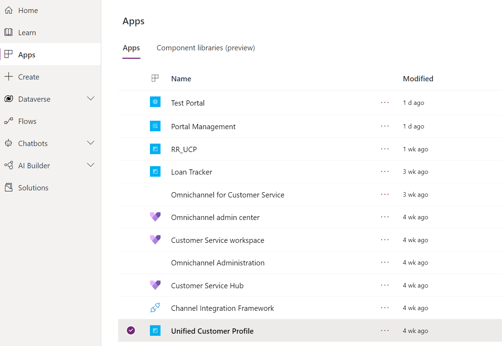
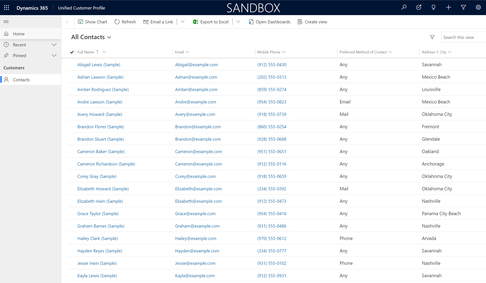
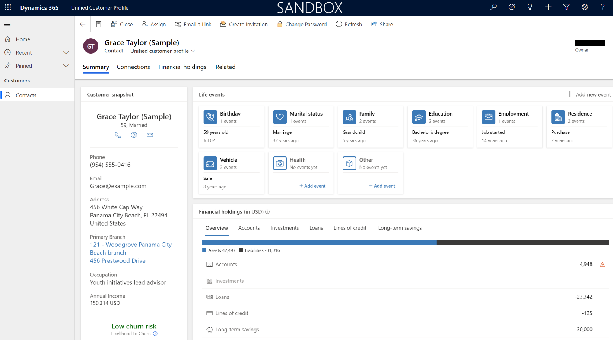
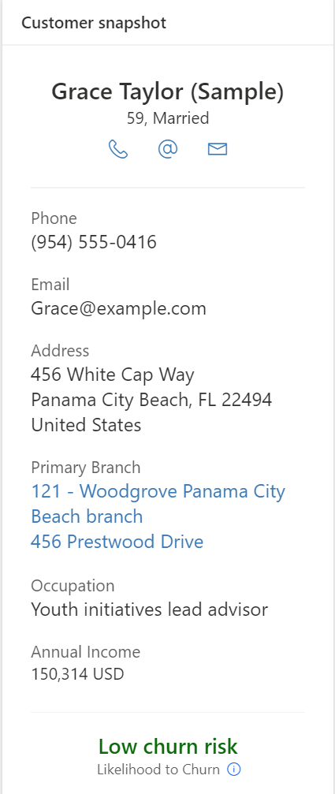
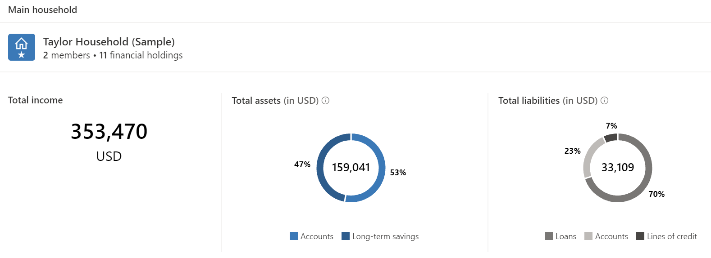

In this exercise, you will launch the Unified customer profile application and then navigate through the tabs and controls to learn about each component and how it connects to the data model.

1.  Go to [Microsoft Power Apps](http://make.powerapps.com/?azure-portal=true) in an In-Private or Incognito window.

1.  Select the proper **Environment** in the upper right.

	> [!div class="mx-imgBorder"]
	> 

1.  In Power Apps, select **Apps** in the left site map. Select and open **Unified customer profile**.

	> [!div class="mx-imgBorder"]
	> 

1.  The app should launch in a new tab and the **Contacts** view will open, showing a list of all contacts.

	> [!div class="mx-imgBorder"]
	> 

1.  Select **Grace Taylor (Sample)** to open the record in the application and launch the **Unified customer profile** form for the customer.

	> [!div class="mx-imgBorder"]
	> 

Now that the Unified customer profile form has loaded, you can explore its individual tabs and controls.

## Task 1: Explore the Summary tab

The **Summary** tab consists of the following Power Apps component framework controls that are componentized to provide the flexibility for you to choose and customize the views that you want to develop.

-   Customer snapshot
	
-   Life events
		
-   Financial holdings
	
-   Main household
		
-   Cards

1.  Examine the **Customer Snapshot** control. The customer snapshot shows personal information (for example, name, demographics, and branch information) and the preferred channel of communication. 

	> [!NOTE]
	> You can enrich the Customer snapshot area with customer intelligence-driven information like churn score. This information is enabled through the Customer Intelligence add-in for Unified customer profile, which will be covered in another lab. 
	
	The following screenshot shows the information that shows up on the control and the Dataverse table columns that it's derived from.

	> [!div class="mx-imgBorder"]
	> 

	| Customer snapshot field                                 | Table column mapping                                             |
	|---------------------------------------------------------|------------------------------------------------------------------|
	|     Grace Taylor(Sample)                              |     Contact.fullname                                             |
	|     59,Married                                          |     Contact.Birthdate,   Contact.familystatuscode                |
	|     Symbols for preferred symbols of communication    |     Contact.preferredcontactmethodcode                           |
	|     Phone                                               |     Contact.telephone1                                           |
	|     Email                                               |     Contact.emailaddress1                                        |
	|     Address                                             |     Contact.address1_composite                                   |
	|     Primary Branch                                    |     Contact.msfsi_branch                                         |
	|     Occupation                                          |     Contact.jobtitle                                             |
	|     Annual Income                                     |     Contact.annualincome                                         |

1.  Examine the **Life events** control. It provides insight into the customer and their family's past and future milestones. It can help identify upcoming opportunities, devise personalized offers, and provide a consistent engagement experience. Each category in the **Life events** area, such as **Marital status**, can include multiple life event entries.

	The following screenshot shows the information that shows up on the control and the Dataverse table columns that it's derived from.

	> [!div class="mx-imgBorder"]
	> 

	| Life event           | Table column mapping                                                                                                                         |
	|----------------------|----------------------------------------------------------------------------------------------------------------------------------------------|
	|     Family           |     msfsi_lifemoment.msfsi_lifemomentcategory (Only the **Birthday** category will map to the **Contact.birthdate** field)                |
	|     2   events       |     Number of life event records in that life event category                                                                            |
	|     Grandchild       |     msfsi_lifemoment.msfsi_lifemomenttype                                                                                                    |
	|     5   years ago    |     Time elapsed since the last event in that life event category                                                                           |

1.  Examine the **Financial holdings** control. It provides an at-a-glance view of the customer's relationship with the bank, showing wallet share, assets, and liabilities, and other aspects of the customer's holdings with the bank. The **Overview** tab in the **Financial holdings** area provides high-level information on the customer's financial holdings. The default selection is an overview of the customer's assets and liabilities, including relevant alert indicators to the right of the area.

    The following screenshot shows the information that shows up on the control and the Dataverse table columns that it's derived from.

	> [!div class="mx-imgBorder"]
	> 

	| Financial holdings field   | Table column mapping                                                                                                                                                      |
	|----------------------------|---------------------------------------------------------------------------------------------------------------------------------------------------------------------------|
	|     Assets   (bar)         |     Sum of   positive balance amounts                                                                                                                                     |
	|     Liabilities   (bar)    |     Sum of   negative balance amounts                                                                                                                                     |
	|     Accounts               |     FH_accounts    [sum of balances by type of account; in the summary view, this sum is based on balance_default (that is, in the bank’s default currency)]                     |
	|     Investments            |     FH_investments     [sum of balances by type of investment; in the summary view, this sum is based on balance_default (that is, in the bank’s default currency)]            |
	|     Loans                  |     FH_loans     [sum of balances by type of loan; in the summary view, this sum is based on balance_default (that is, in the bank’s default currency)]                        |
	|     Lines   of credit      |     FH_linesofcredit     [sum of balances by type of line of credit; in the summary view, this sum is based on balance_default (that is, in the bank’s default currency)]      |
	|     Long-term   savings    |     FH_longtermsavings     [sum of balances by type of line of credit; in the summary view, this sum is based on balance_default (that is, in the bank’s default currency)]    |

1.  Examine the **Household** control.

    The following screenshot shows the information that shows up on the control and the Dataverse table columns that it's derived from.

	> [!div class="mx-imgBorder"]
	> 

	| Household field                     | Table column mapping                                                                                                   |
	|-------------------------------------|------------------------------------------------------------------------------------------------------------------------|
	|     Taylor   Household(Sample)      |     Group.msfsi_Name                                                                                                   |
	|     2   members                     |     Count of   GroupMember.id                                                                                          |
	|     11   financial holdings         |     Count of   GroupFinancialHolding.id (connected to that Group)                                                      |
	|     Total income                    |                                                                                                                        |
	|     Total   assets (in USD)         |     Sum of   positive balances for FinancialHolding.balance_default retrieved by relevant   GroupFinancialHolding    |
	|     Total   liabilities (in USD)    |     Sum of   negative balances for FinancialHolding.balance_default retrieved by relevant   GroupFinancialHolding    |
                                 

1.  Examine the **Cards** control. It shows the credit and debit cards that are held by the customer. You can enrich this control with insights such as alerts on expiring cards and cards that are pending activation.

    The following screenshot shows the information that shows up on the control and the Dataverse table columns that it's derived from.

	> [!div class="mx-imgBorder"]
	> 
	
	| Card field                  | Table column mapping                               |
	|-----------------------------|----------------------------------------------------|
	|     Mastercard              |     msfsi_fi_card.msfsi_cardnetwork                |
	|     Debit                   |     msfsi_fi_card.msfsi_cardtype                   |
	|     Sapphire                |     msfsi_fi_card.msfsi_productname                |
	|     ****   **** ****6785    |     msfsi_fi_card.msfsi_cardnumber                 |
	|     Not   Active            |     msfsi_fi_card.status                           |
	|     Apr   28, 2023          |     msfsi_fi_card.msfsi_expirydate                 |

Congratulations, you have explored the Unified customer profile app and its featured data within a customer record.

