In this exercise, you will customize the Unified customer profile application in the following ways: 

- Use the Unified customer profile application as a base and then edit it to add a new control to it.

- Edit the Unified customer profile controls such as **Life event type** to add a new life event type.

## Task 1: Add new controls to Unified customer profile

In this task, you will create a new solution and then customize the Unified customer profile application to add new controls.

1.  Go to [Power Apps](http://make.powerapps.com/?azure-portal=true) in an In-Private or Incognito window.

1.  Select the proper **Environment** in the upper right.

	> [!div class="mx-imgBorder"]
	> 

1.  In Power Apps, select **Solutions** in the left site map. Select **+ New solution** and then set the following values.

	> [!div class="mx-imgBorder"]
	> [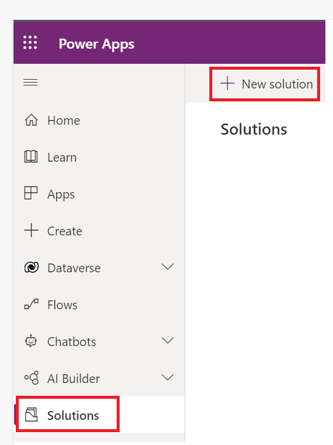](../media/new-solution.png#lightbox)

1.  Create a new solution with the properties that are shown in the following screenshot. When you're finished, select **Create**.

	> [!div class="mx-imgBorder"]
	> [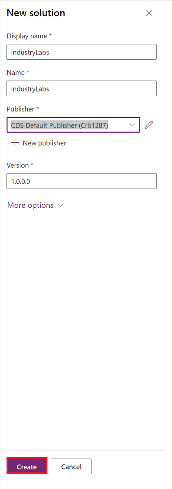](../media/solution.png#lightbox)

1.  After you've created the solution, select the solution name in the **Display name** column to begin adding components.

	> [!div class="mx-imgBorder"]
	> 

1.  In the solution explorer, select **Add existing > App > Model-driven app**.

	> [!div class="mx-imgBorder"]
	> [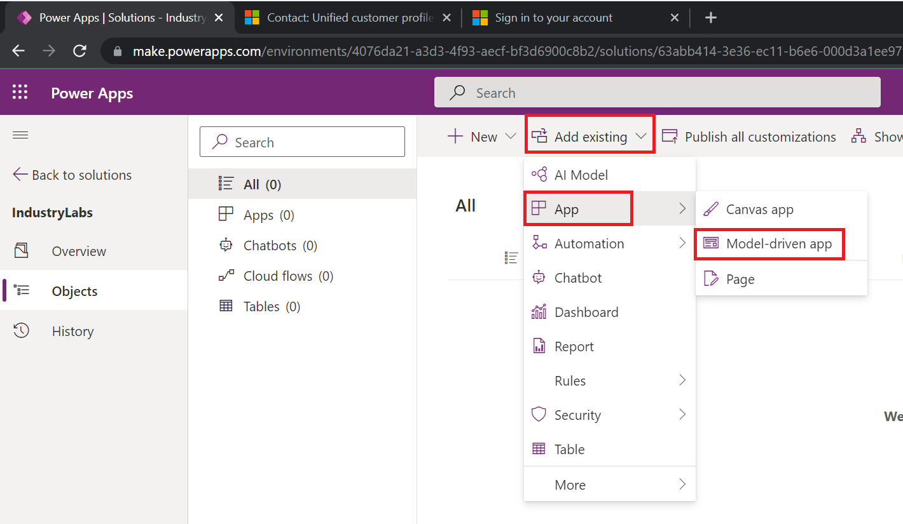](../media/add-model-driven-app.png#lightbox)

1.  Select **Unified Customer Profile** from the list and then select **Add**. 

	> [!div class="mx-imgBorder"]
	> [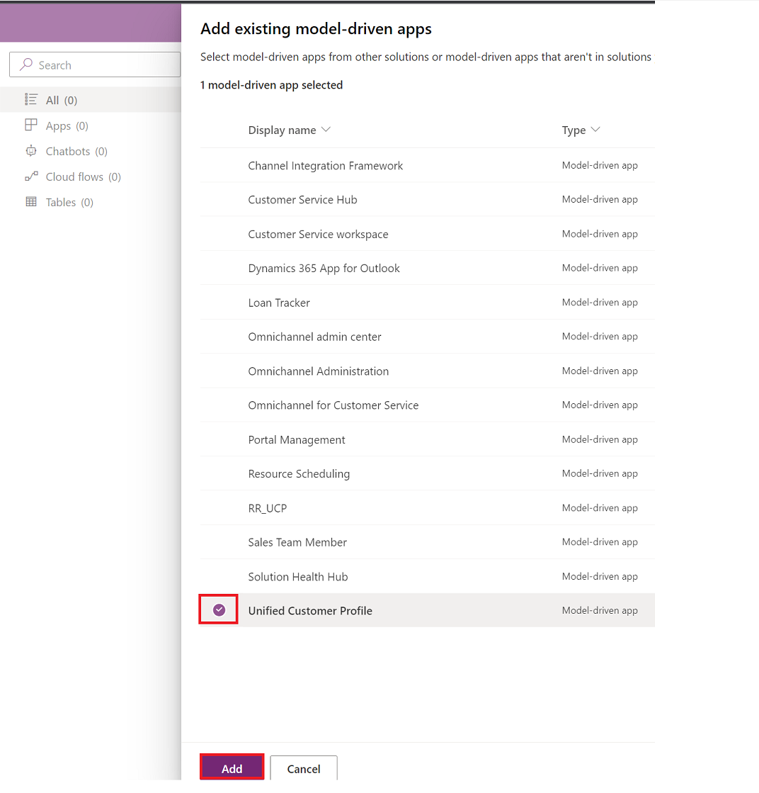](../media/unified-customer-profile-application.png#lightbox)

1.  Select **Unified Customer Profile** to edit the application.

	> [!div class="mx-imgBorder"]
	> 

    The application editor will open in another tab.

1. Select the **Forms** dropdown menu and then select the edit icon for **Unified customer profile**.

	> [!div class="mx-imgBorder"]
	> 

1. The form designer for Unified customer profile will open. Select the **Switch to classic** menu item to launch the classic form designer.

	> [!div class="mx-imgBorder"]
	> 

1. In the form designer, select the **Summary** tab.

	> [!div class="mx-imgBorder"]
	> [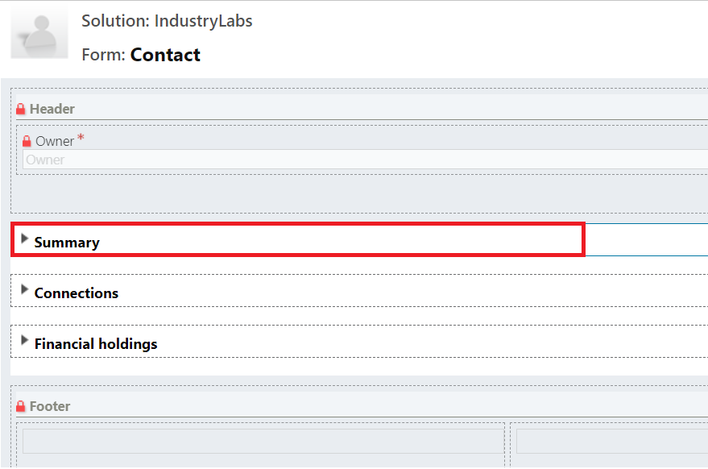](../media/summary.png#lightbox)

1. Select **Insert > One Column**.

	> [!div class="mx-imgBorder"]
	> [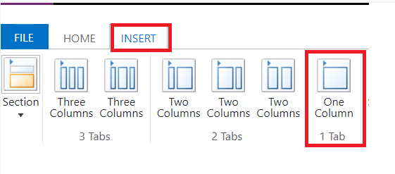](../media/insert-column.png#lightbox)

   A new tab will be added to the form under **Summary**.

	> [!div class="mx-imgBorder"]
	> [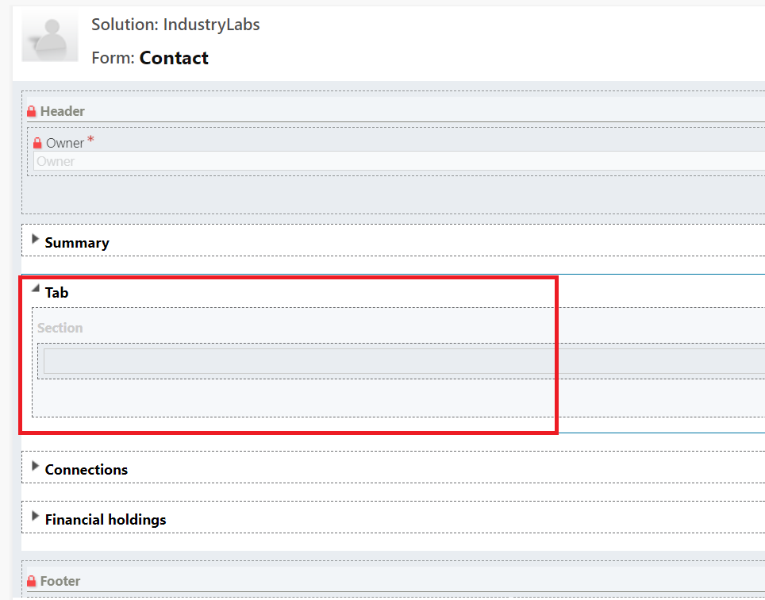](../media/new-tab.png#lightbox)

1. After the tab has been added, clear the **Only show unused fields** checkbox.

	> [!div class="mx-imgBorder"]
	> [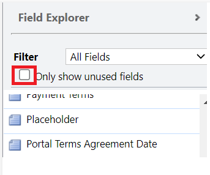](../media/checkbox.png#lightbox)

1. In the fields list, look for the **Placeholder** field. Drag and drop the field to the newly added tab.

	> [!div class="mx-imgBorder"]
	> [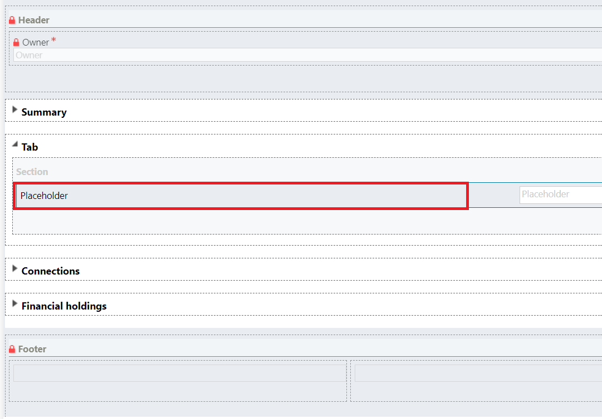](../media/placeholder.png#lightbox)

1. Double-click the **Placeholder** field on the form to open the **Field Properties** dialog. Select the **Controls** tab.

	> [!div class="mx-imgBorder"]
	> [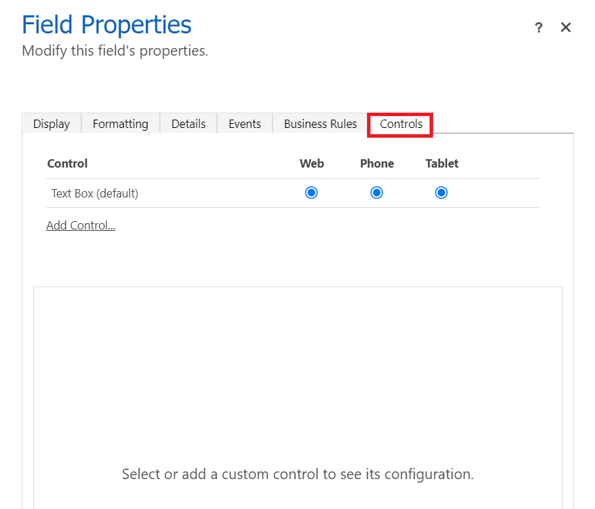](../media/controls.png#lightbox)

1. Select **Add Control** and then find **CustomerSummaryControl** in the list.

	> [!div class="mx-imgBorder"]
	> [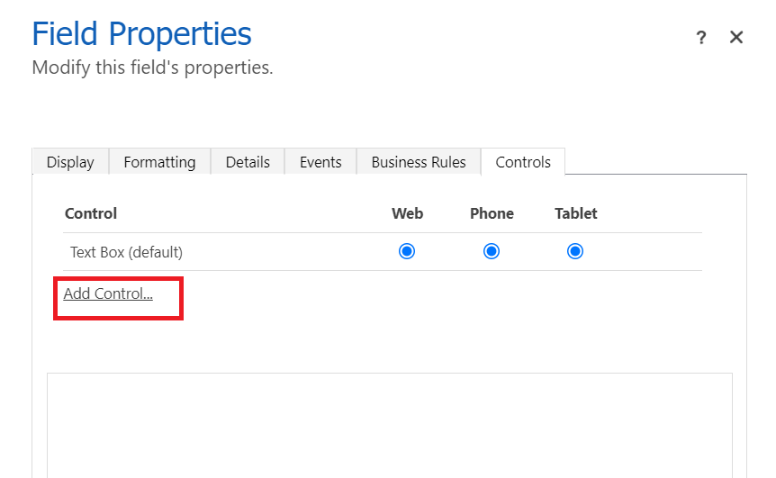](../media/add-control.png#lightbox)

1. Select **CustomerSummaryControl** and then select **Add**.

	> [!div class="mx-imgBorder"]
	> 

1. After the control has been added, you can edit its properties individually. First, select the edit icon for the **Contact** property.

	> [!div class="mx-imgBorder"]
	> 

1. In the dialog that opens, set the **Bind to a value on a field** property to **contactid(SingleLine.Text)** and then select **OK**.

	> [!div class="mx-imgBorder"]
	> 

1. Select the edit icon next to the **Component** property.

	> [!div class="mx-imgBorder"]
	> [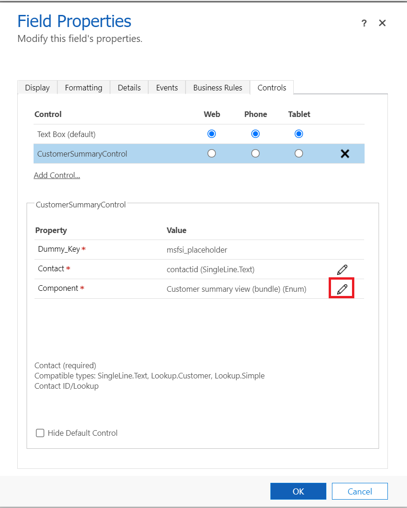](../media/edit-component.png#lightbox)

1. Set the **Bind to static options** value to **Life events** and then select **OK**.

	> [!div class="mx-imgBorder"]
	> [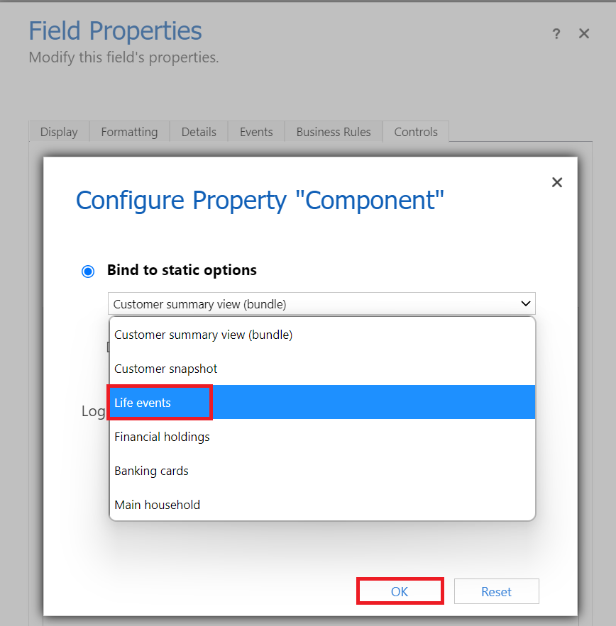](../media/bind-static.png#lightbox)

1. The **Field Properties** dialog should now look similar to the following screenshot. Select **OK**.

	> [!div class="mx-imgBorder"]
	> 

1. For **CustomerSummaryControl**, set the **Web**, **Phone**, and **Tablet** options to true and then select **OK**.

	> [!div class="mx-imgBorder"]
	> 

1. Now that the form is ready, select the **Home** menu on the ribbon and then select **Save > Publish**.

	> [!div class="mx-imgBorder"]
	> [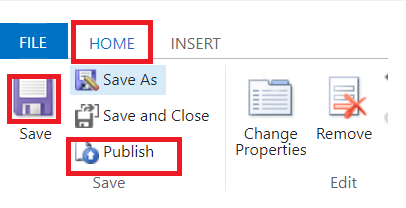](../media/publish.png#lightbox)

1. Close the tab, which will close the classic editor.

1. Return to the modern editor and select the newly created tab in the **Tree view**. Ensure that the values in the **Properties** pane are set as shown in the following screenshot.

	> [!div class="mx-imgBorder"]
	> 

1. **Save** and **Publish** the changes.

1. Launch **Unified customer profile** again from any contact record. The new tab should display along with the **Life events** control.

	> [!div class="mx-imgBorder"]
	> 

## Task 2: Add a new life event type

In this task, you will extend the data model to add a new life event type to the Life event table. Then, you will observe how the changes show in Unified customer profile.

1.  In Power Apps, select **Dataverse > Tables** in the left site map. Set the search dropdown menu to **Managed** and then search for **life event**.

	> [!div class="mx-imgBorder"]
	> 

1.  In the search results, select the **Life event** table.

	> [!div class="mx-imgBorder"]
	> 

1.  In the **Columns** tab, select **Life event type** to edit it. Select **Edit choice** to add the new life event type.

	> [!div class="mx-imgBorder"]
	> [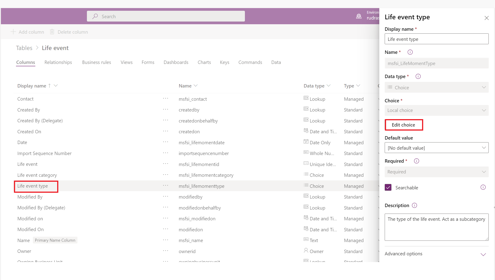](../media/edit-choice.png#lightbox)

1.  In the choice edit dialog, select **Add new item**.

	> [!div class="mx-imgBorder"]
	> [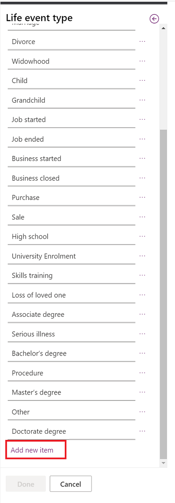](../media/add-new-item.png#lightbox)

1. Enter **University Enrollment** in the new item row.

1.  Select the ellipsis (**...**) next to the newly created row and then select the **View more** option.

	> [!div class="mx-imgBorder"]
	> 

1.  The option set details will open. Copy the **Value** field and then save it for the next steps.

    Your environment's value might differ from the value that's shown in the following image.

	> [!div class="mx-imgBorder"]
	> 

1.  Select **Save** and then select **Done**.

	> [!div class="mx-imgBorder"]
	> [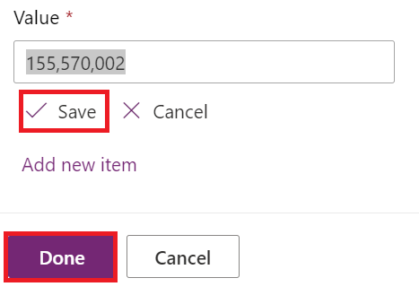](../media/save-done.png#lightbox)

1.  Select **Done** on the table edit dialog as well.

	> [!div class="mx-imgBorder"]
	> [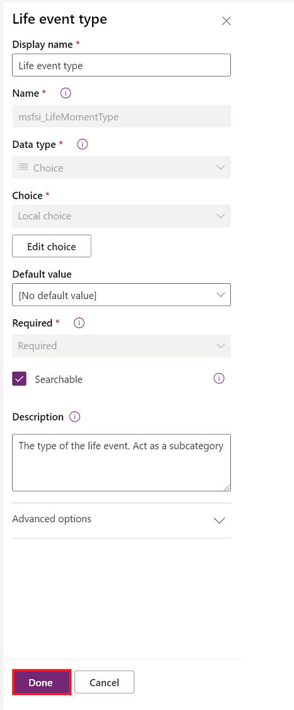](../media/table-edit-done.png#lightbox)

1. Select **Save Table**.

	> [!div class="mx-imgBorder"]
	> [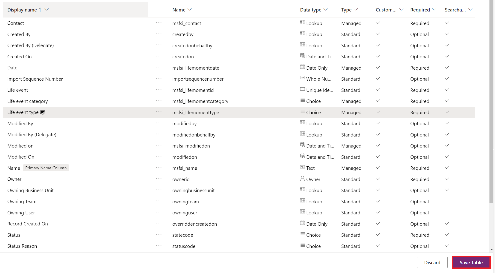](../media/save-table.png#lightbox)

   The edit table view should now close.

1. Search for the **Life event type config** table.

	> [!div class="mx-imgBorder"]
	> 

1. Select the **Life event type config** table from the search results, which will show details of the table. Select **Data** to load the data for the table.

	> [!div class="mx-imgBorder"]
	> [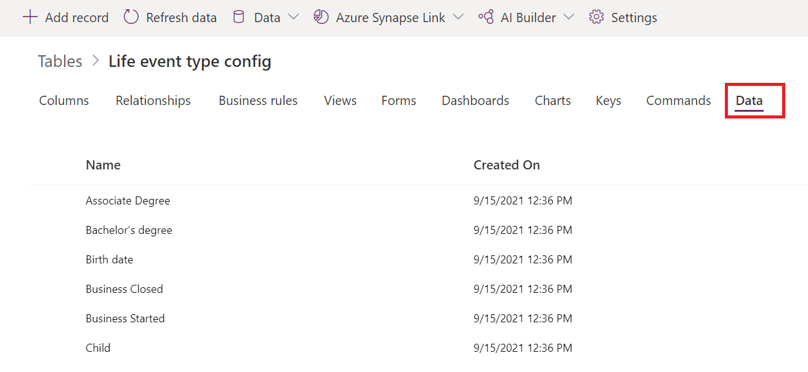](../media/data.png#lightbox)

1. Select **+ Add record**.

	> [!div class="mx-imgBorder"]
	> [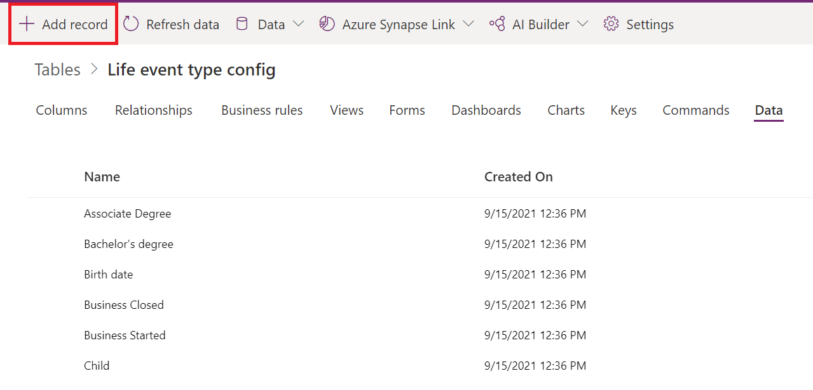](../media/add-record.png#lightbox)

1. A new tab will open. Set the following values to create a **New Life event type config**. Select **Save**.

	- **Name** - University Enrollment
	
	- **Type code** - Enter the value that you copied from the **Value** field in a previous step
	
	- **Display order** - 1

	> [!div class="mx-imgBorder"]
	> [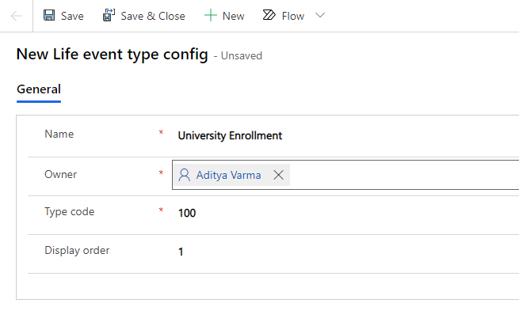](../media/life-event-details.png#lightbox)

1. After you save the record, select the **Related** tab and then select **Category types relations**.

	> [!div class="mx-imgBorder"]
	> [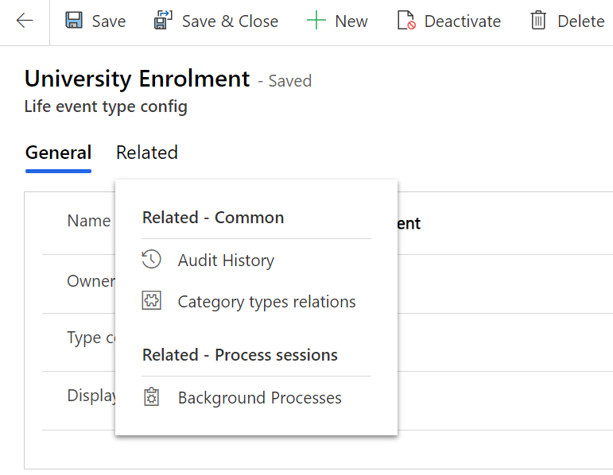](../media/category-types.png#lightbox)

1. In the **Category types relations** tab, select **+ New Category types relations** to create a new record.

	> [!div class="mx-imgBorder"]
	> [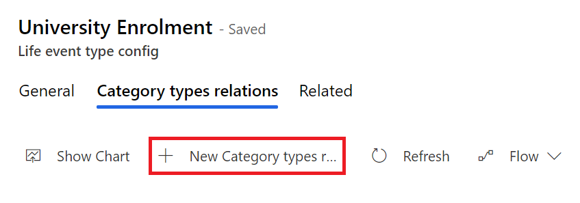](../media/new-category-types-relations.png#lightbox)

1. Set the following values to create a new **Category types relations** record and then select **Save**.

	- **Name** - University Enrollment Category Types Relations

	- **Lifemomentcategory configurations** - Select the **Education** record

	- **Life event type configurations** - Select the **University Enrollment** record

	> [!div class="mx-imgBorder"]
	> 

   The life event configurations are now complete.

1. Launch the Unified customer profile application and then select **Add new event**.

	> [!div class="mx-imgBorder"]
	> 

   The new life event type of **University Enrollment** will now show in the **Education** category.

	> [!div class="mx-imgBorder"]
	> [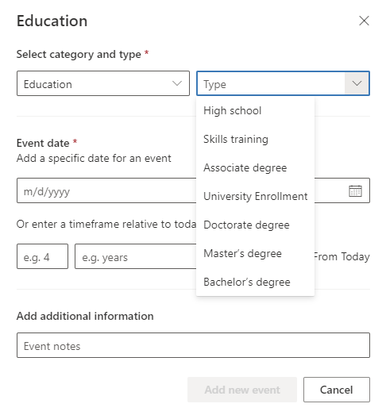](../media/education-university-enrollment.png#lightbox)

Congratulations, you have extended the Unified customer profile application to edit controls on the view and add new life event configurations.
