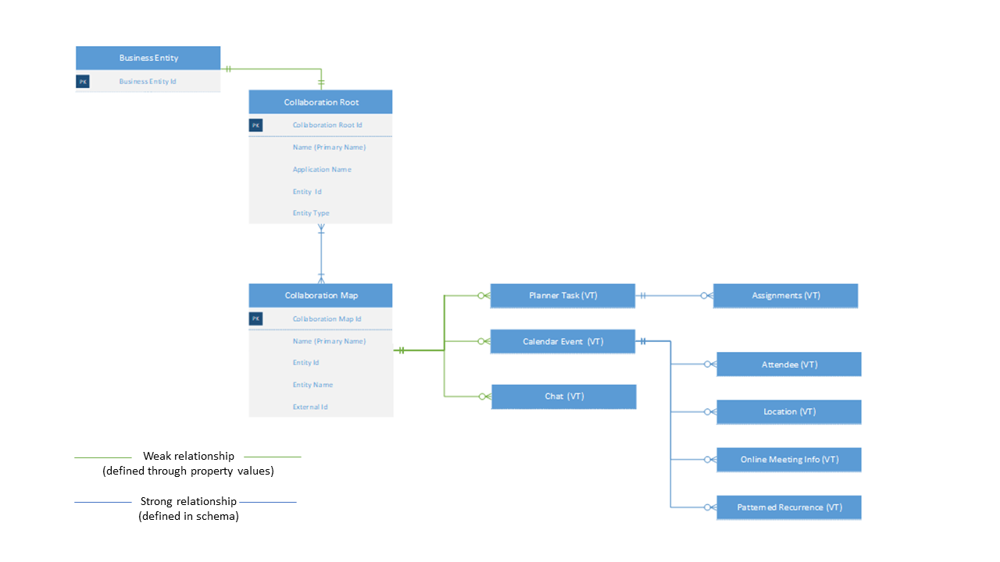
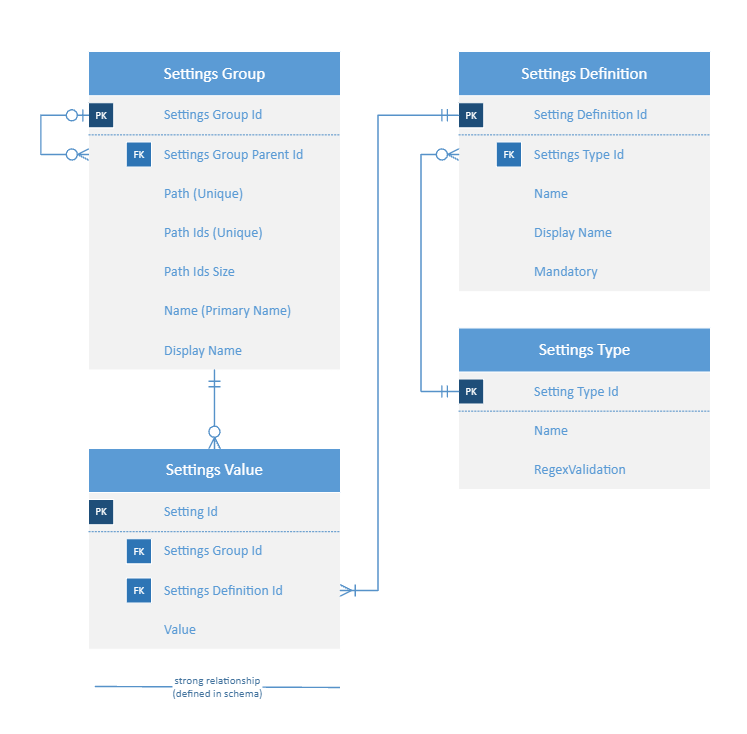

In this exercise, you'll learn about the core Collaboration Toolkit data tables that power Collaboration Manager for Loans.

## Task 1: Navigate Collaboration Toolkit tables and relationships

In this task, you'll explore the main tables that power the Collaboration Toolkit and how they augment business entities like loan applications.

### Collaboration Toolkit definitions

The Collaboration Toolkit contains the following components 

- **Collaboration Root** - The parent record that maintains the linkage between all collaboration activities and a Business Entity.
- **Collaboration Map** - A many-to-many table that relates a Microsoft 365 collaborative activity to a Collaboration Root. Currently, the Collaboration Map entity merely holds pointers to records in Microsoft Graph.
- **Business Entity** (for example, loan application) - The core business entity that is being collaborated on. In Collaboration Manager for Loans, this business entity is the loan application.

### Collaboration Toolkit relationship diagram

The following diagram illustrates the relationships in the Collaboration Toolkit.

> [!div class="mx-imgBorder"]
> 

## Task 2: Navigate Collaboration Toolkit settings and relationships

In this task, you'll explore the main tables that are related to Collaboration Toolkit settings. The settings tables allow you to define how Microsoft 365 services (such as Planner, Outlook, Bookings, and so on) map to business entities within Microsoft Dataverse. All settings tables are solution-aware objects, so they can be packaged within a solution and participate in solution import and export.

### Collaboration Toolkit settings definitions

The following list defines the settings that are found within the Collaboration Toolkit:

- **Settings Group** - The parent record that maintains the logical grouping of settings values that pertain to a specific business entity. For example, a single **Settings Group** record exists that represents all settings for the group.
- **Settings Value** - The value of a settings definition. You can export these values across environments to ensure that all environments use the same configuration.
- **Settings Definition** - Defines the types of settings that a maker can populate. The toolkit comes with two settings out of the box.
  - **Group ID** - The ID of the Microsoft Azure Active Directory (Azure AD) security group that is used to create new Microsoft Planner boards.
  - **Bookings Business ID** - The alias of the Bookings Business calendar. This setting is used to allow users to create new bookings with customers.
- **Settings Type** - A table that defines regex validation for settings values.

### Collaboration Toolkit settings relationship diagram

The following diagram illustrates the settings relationships in the Collaboration Toolkit.

> [!div class="mx-imgBorder"]
> 
