In this exercise, you will configure the settings for Collaboration Manager for Loans so that it correctly works with Microsoft 365 services like Teams, Bookings, and Planner. In this case, we will examine how you can bind Collaboration Manager to a new Microsoft Teams team and Bookings business for a bank branch that would like to use the product.

At the end, you'll then learn how you can take a model-driven app like Collaboration Manager for Loans and embed it in Teams as both a teams tab and as a personal app.

## Task 1: Create a new Microsoft Teams team

1. Open **Microsoft Teams** and navigate to **Teams** in the left app bar.

1. Select **Join or create a team** so that we can create a new branch that will be leveraging Collaboration Manager for Loans.

    > [!div class="mx-imgBorder"]
    > [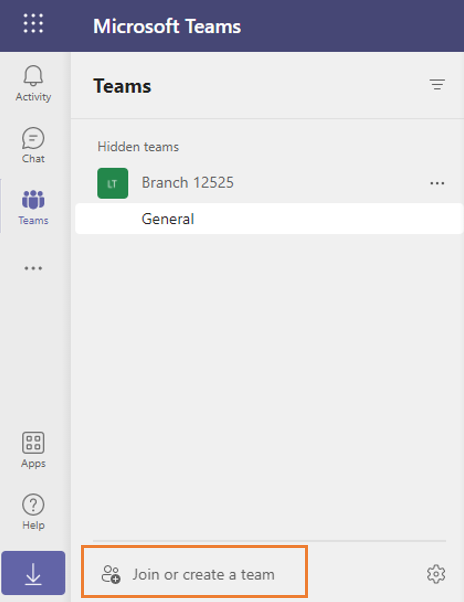](../media/join.png#lightbox)

1. Select **Create team** to open the new team creation modal.

    > [!div class="mx-imgBorder"]
    > 

1. Select **From scratch** to create a brand new Teams team.

    > [!div class="mx-imgBorder"]
    > [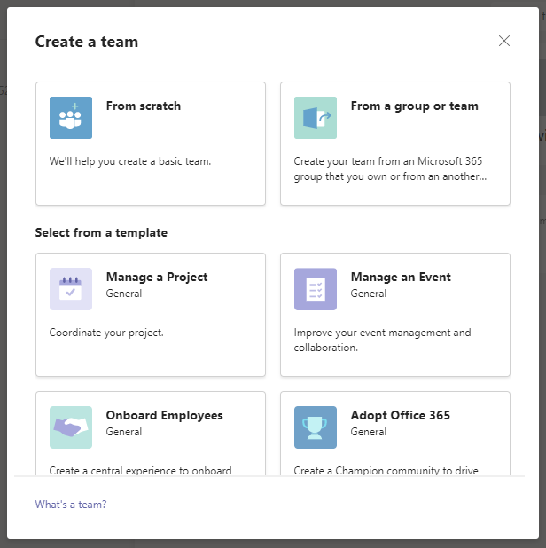](../media/scratch.png#lightbox)

1. Since this team will only be accessible to users that belong to this branch, make the new team **Private**.

    > [!div class="mx-imgBorder"]
    > 

1. Provide the name and description of your brand new Branch before finally selecting **Create**.

    > [!div class="mx-imgBorder"]
    > 

## Task 2: Retrieve the internal ID of the new Teams team

1. Now that we have a new Microsoft Teams team, we'll want to record its ID so that we can use it later. To get the ID, start by finding your new team in your list of teams.

1. Select the ellipsis (...) button

1. Select **Get link to team**.

    > [!div class="mx-imgBorder"]
    > 

1. Record the value of **groupId** from within the URL somewhere safe. You will use this value in a future step while defining the settings of your solution.

    `https://teams.microsoft.com/l/team/19%3akk_TuKhjXu92yJvg4TZ10S6rouLSCgvHIb5NOOTfRjg1%40thread.tacv2/conversations?groupId=`**4310f270-1aa5-4089-99f3-47eb3b4d69ad**`&tenantId=b699419b-e0df-47e3-9909-24076fdcf68b`

## Task 3: Create a new Bookings business for the branch

1. To use the virtual visit features within Collaboration Manager for Loans, we must also provide a Bookings business. To create a new Bookings business, start by going to [https://office.com/apps](https://office.com/apps/?azure-portal=true).

1. Select **Bookings** within the list of apps.

    > [!div class="mx-imgBorder"]
    > 

1. If this is your first time using Bookings, you may be prompted with a **Get it now** button, select that to continue. If you already have a Bookings business and need to create an additional one, select the chevron next to your currently active Bookings business and select **New**.

    > [!div class="mx-imgBorder"]
    > [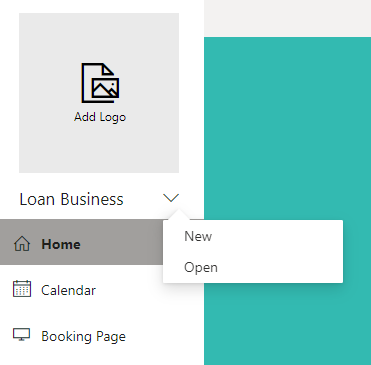](../media/new-booking.png#lightbox)

1. Provide the name and type of your business before selecting **Continue**.

    > [!div class="mx-imgBorder"]
    > [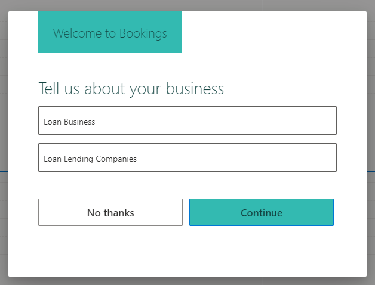](../media/welcome.png#lightbox)

1. You may now provide additional details for your Bookings business by configuring the **Booking page**, **Staff**, **Services**, and **Business Information** pages by selecting them in the left navigation.

## Task 4: Retrieve the alias of the new Bookings business

1. To get the alias of your new Bookings business, we'll need to reopen the current Bookings business so that we can retrieve the value from the URL; begin by selecting the chevron and selecting **Open**.

    > [!div class="mx-imgBorder"]
    > [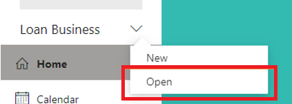](../media/open.png#lightbox)

1. Once the dialog appears, re-select your new Bookings business.

    > [!div class="mx-imgBorder"]
    > 

1. This will reopen the Bookings business and cause the URL of the page to change. Copy the value of the calendar parameter in the URL. It should look like an email address. Record this value somewhere safe so that we can use it in a future step.

    > [!div class="mx-imgBorder"]
    > 

## Task 5: Provide the settings to Collaboration Manager for Loans

1. Now that we have both the Group ID and the Bookings business ID, we can set them as values within the Collaboration Toolkit settings. To begin, open up [https://make.powerapps.com/](https://make.powerapps.com/?azure-portal=true).

1. Ensure you are in the correct environment by using the environment picker in the top right.

1. Navigate to the **Solutions** page in the left navigation.

1. Select **New solution** so that we can provide a home for all of our settings values.

    > [!div class="mx-imgBorder"]
    > 

1. Provide the name and publisher of your new solution. Since this solution is merely holding the values of Collaboration Manager, we can call it "Collaboration Manager Settings."

    > [!div class="mx-imgBorder"]
    > 

1. Once you have created your solution, navigate into it by selecting it in the list of solutions.

    > [!div class="mx-imgBorder"]
    > [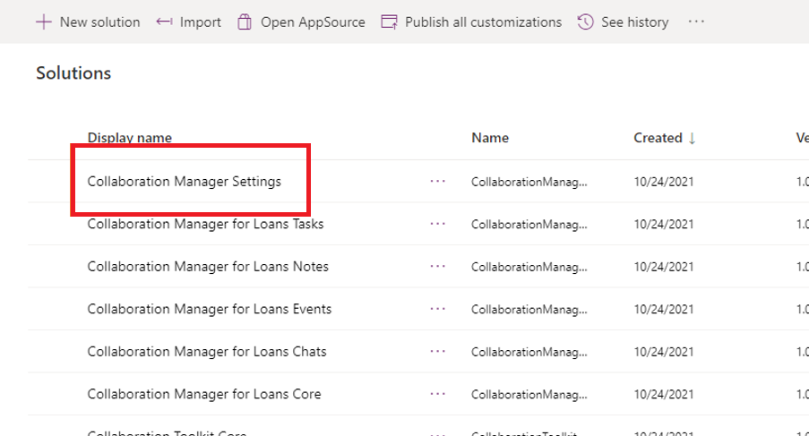](../media/solutions.png#lightbox)

1. Provide the first settings value by selecting **New** > **More** > **Other** > **Settings Value** from within the solution explorer.

    > [!div class="mx-imgBorder"]
    > [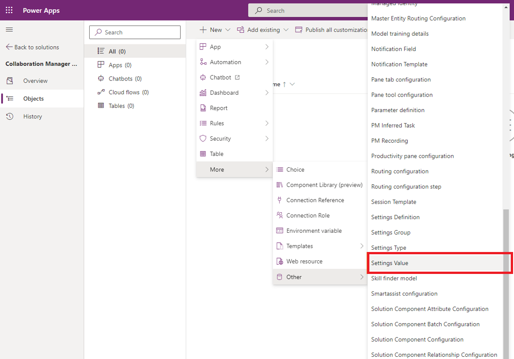](../media/settings-value.png#lightbox)

1. For our first settings value, we will provide the value of our teams group. Paste the value you retrieved from step 10 in the **Value** field. Set **Settings Group ID** to "Collaboration Manager for Loans" and **Settings Definition ID** to "Group ID."

    > [!div class="mx-imgBorder"]
    > 

1. Select **Save & Close** once you're finished.

1. Repeat step 25 to create a new settings value.

1. Now populate the new settings value with the Bookings business ID you retrieved on step 11. Set **Settings Group ID** to "Collaboration Manager for Loans" and **Settings Definition ID** to "Bookings Business ID".

    > [!div class="mx-imgBorder"]
    > [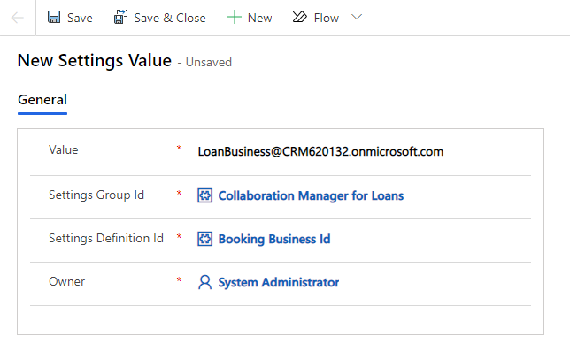](../media/new-settings-value-2.png#lightbox)

1. Select **Save & Close** once you're finished. You've now successfully defined the settings for Collaboration Manager for Loans.

## Task 6: Adding the app to the Microsoft Teams channel

1. Now that the settings are defined, we can now add the app to Microsoft Teams. To begin, navigate to [teams.microsoft.com](https://teams.microsoft.com/?azure-portal=true) using your lab credentials.

1. Once you are there, find the team you created in Task 1 above.

1. In the general channel for the team, select **+** and note the **Add a tab** dialog show up.

    > [!div class="mx-imgBorder"]
    > [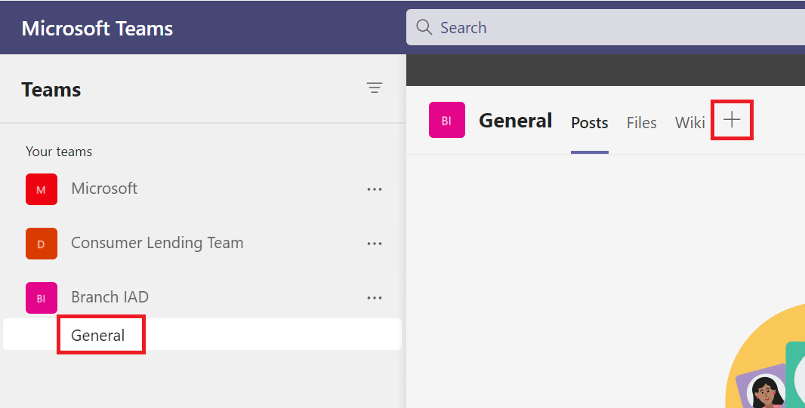](../media/add-tab.png#lightbox)

1. In the **Add a tab** dialog, search for **Power Apps** and select the **Power Apps** icon that appears in the search results.

    > [!div class="mx-imgBorder"]
    > 

1. This will open the **Power Apps** add in. Select **Add** to open the app selection wizard.

    > [!div class="mx-imgBorder"]
    > [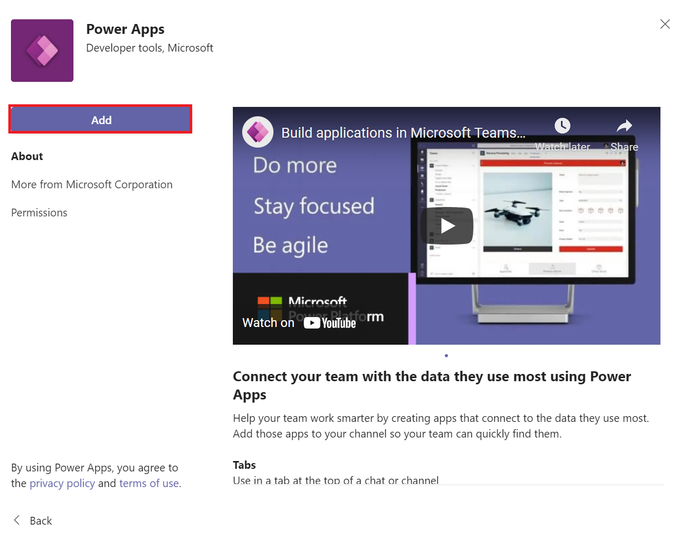](../media/add-in.png#lightbox)

1. In the app selection wizard, set the search option to **Model driven apps**.

    > [!div class="mx-imgBorder"]
    > 

1. Now search for **Collaboration Manager** and select the app that corresponds to your dedicated environment. For example, if you are working with environment 100, you would select the app with environment FSIInADay_100 against its name.

1. Select the Collaboration Manager app and select **Save**.

    > [!div class="mx-imgBorder"]
    > [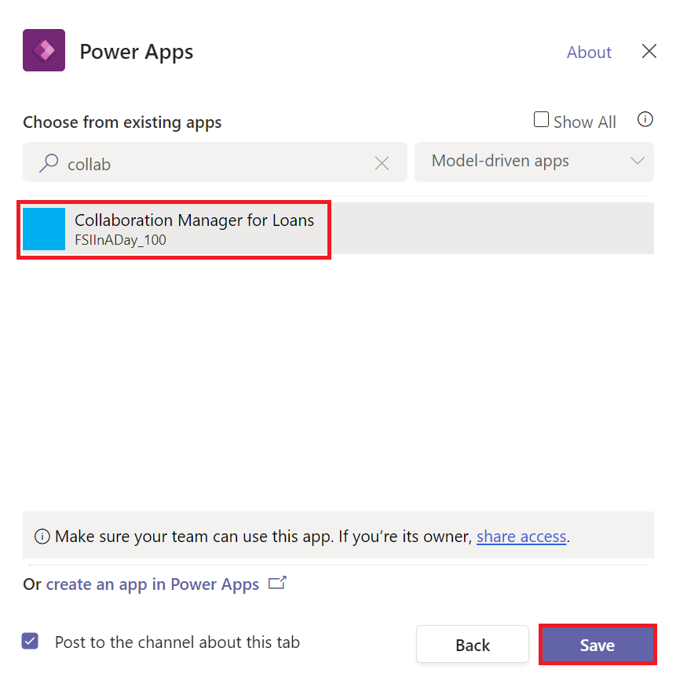](../media/collaboration.png#lightbox)

1. Notice the app appears as a pinned tab in your channel.

    > [!div class="mx-imgBorder"]
    > 
