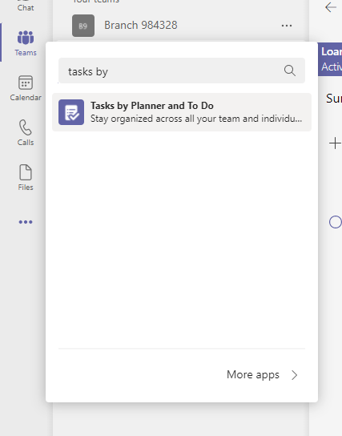
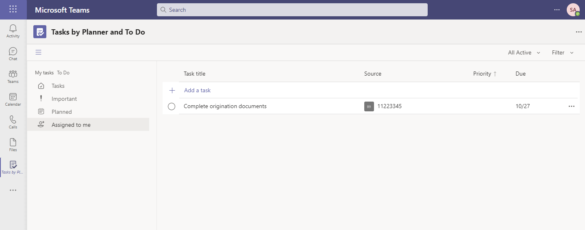
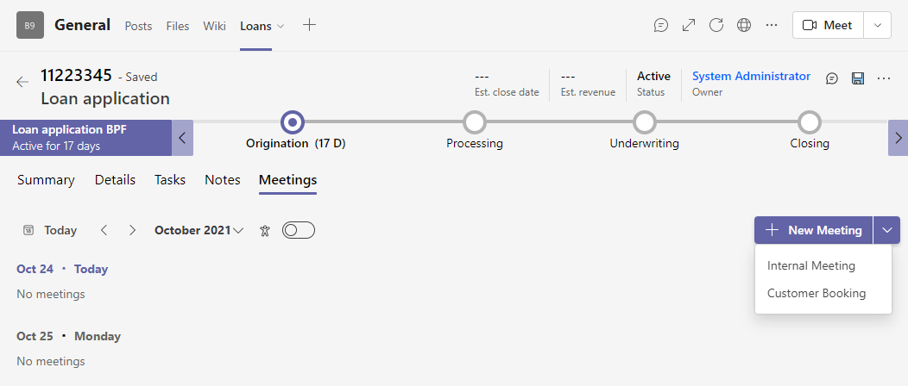
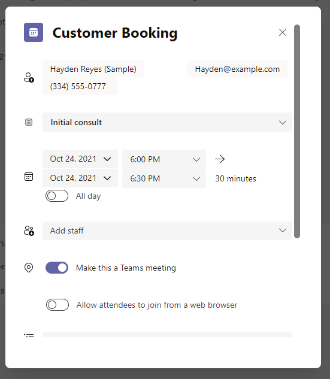
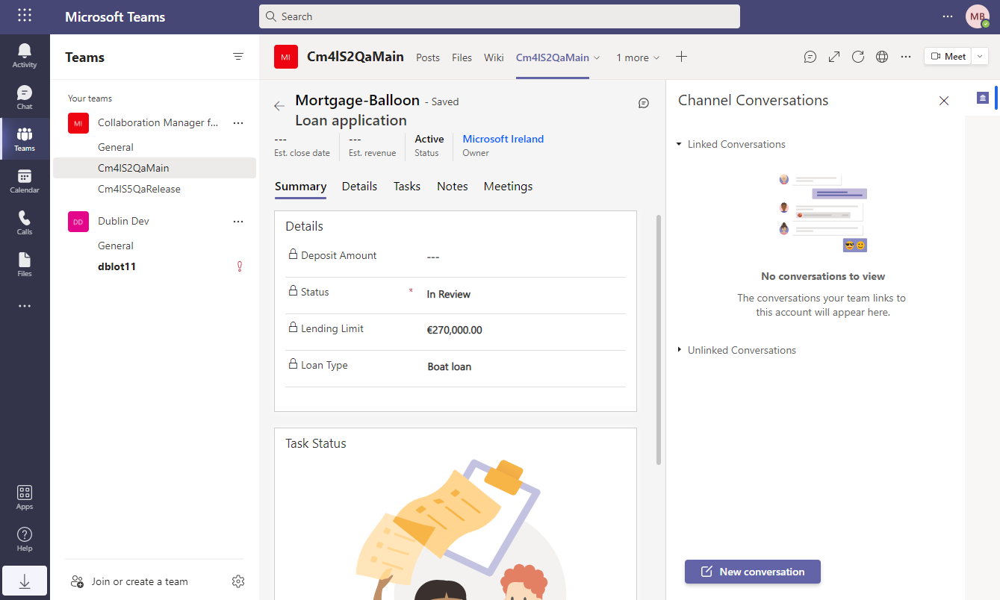

In this exercise, you'll navigate Collaboration Manager for Loans and explore the collaborative features that it provides. In this case, you'll examine the home loan for Hayden Reyes to determine how a loan team could collaborate to ensure completion of the loan.

1. Open the Teams channel that you pinned your app to in the previous exercise. A dashboard page will open, showing graphs of the relevant data along with a list of loans that are currently active.
    > [!div class="mx-imgBorder"]
    > 

1. To view the status of a loan, select its name from the list of loans. For this exercise, select **11223345** to view the loan for Hayden Reyes.

   You will be directed to the **Summary** tab, where you can review the relevant information about the loan application.

    > [!div class="mx-imgBorder"]
    > 

1. For more information about the loan, select the **Details** tab.

    > [!NOTE]
    > As part of the fourth exercise, you'll learn how to bring the rich controls from the Loan Tracker app into Collaboration Manager for Loans so that you can have a more holistic picture of the loan application.

## Task 1: Create tasks in Collaboration Manager for Loans

The first tab that you'll explore that provides collaboration is the **Tasks** tab. Selecting this tab will reveal an empty page where users can add the relevant tasks that they need to complete.

   > [!div class="mx-imgBorder"]
   > 

1. To create a new task for the team, select **Add a task**.

1. On the resulting dialog, provide specifics about the task and then assign it to the relevant people on the team. When you're done, select **Save**.

    > [!div class="mx-imgBorder"]
    > 

   The newly created task should now appear in the tasks list.

    > [!div class="mx-imgBorder"]
    > 

1. Because all tasks are supported by Microsoft Planner, you can use the Tasks app within Microsoft Teams to view all tasks that are assigned to you. To get started, select the ellipsis (**...**) menu in the left app bar and then search for and select **Tasks by Planner and To Do**.

    > [!div class="mx-imgBorder"]
    > 

1. When the **Tasks by Planner and To Do** app opens, all tasks that were created in Collaboration Manager for Loans will appear within the **Assigned to me** section of the app.

    > [!div class="mx-imgBorder"]
    > 

1. From within the **Tasks by Planner and To Do** app, you can view the details of a task, add attachments, and mark them as complete.

    > [!NOTE]
    > With Microsoft Power Automate, you can automatically create new tasks to ensure that loan teams always know what they need to do next.

## Task 2: Create notes in Collaboration Manager for Loans

To create notes in Collaboration Manager for Loans, follow these steps:

1. From within Collaboration Manager for Loans, select the **Notes** tab, which will direct you to an empty screen where you can provide relevant information.

    > [!div class="mx-imgBorder"]
    > 

1. To add a new note, select **New note**.

1. Provide details about the loan. The following screenshot shows an example of providing notes about the previous meeting with the customer.

    > [!div class="mx-imgBorder"]
    > 

1. When you're finished entering the notes, select **Save**.

## Task 3: Create meetings in Collaboration Manager for Loans

Follow these steps to create meetings in Collaboration Manager for Loans:

1. To schedule internal and external meetings about the loan, select the **Meetings** tab for a loan record.

    > [!div class="mx-imgBorder"]
    > 

1. To schedule an internal meeting with the rest of the loan team, select the arrow next to **New Meeting** and then select **Internal Meeting**.

    > [!div class="mx-imgBorder"]
    > 

1. Within the **New Meeting** dialog, provide the relevant information about the sync.

    > [!div class="mx-imgBorder"]
    > 

1. Scroll to the bottom of the dialog and select **Save** when you're finished. The meeting will now appear in the list of meetings.

    > [!div class="mx-imgBorder"]
    > 

1. To schedule an external meeting with the customer, select the arrow next to the **New Meeting** button and then select **Customer Booking**.

1. In the **Customer Booking** dialog, the relevant customer is already prepopulated by using the information in the loan application. You can provide more information about the meeting before selecting **Save**. You can add more booking types by adding more services within your Bookings business.

    > [!div class="mx-imgBorder"]
    > 

1. When you're finished, both meetings should appear in your meeting list. After the meeting has started, you can join it by selecting the **Join** button, which will open the meeting directly within Microsoft Teams.

    > [!div class="mx-imgBorder"]
    > 

1. Because all meetings are backed by Outlook, you can navigate to Bookings or your Outlook Calendar to view all meetings in a single calendar.

    > [!div class="mx-imgBorder"]
    > 

## Task 4: Create chats in Collaboration Manager for Loans

To create chats in Collaboration Manager for Loans, use the following procedure.

> [!NOTE]
> The following functionality only works from within a Teams channel.

1. To view the linked chats for a particular loan, select the chat icon in the header of the loan. This action will open the **Channel Conversations** panel.

    > [!div class="mx-imgBorder"]
    > 

1. To create a new conversation in the channel, select **New conversation**.

1. Provide a name for the conversation and then select the check mark icon.

    > [!div class="mx-imgBorder"]
    > 

1. After the conversation has been created, you can provide replies by typing in the chat pane that appears on the right.

1. You can also view and reply to chats from within the **Posts** tab for the Teams channel.
