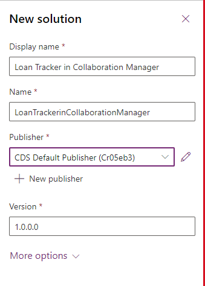
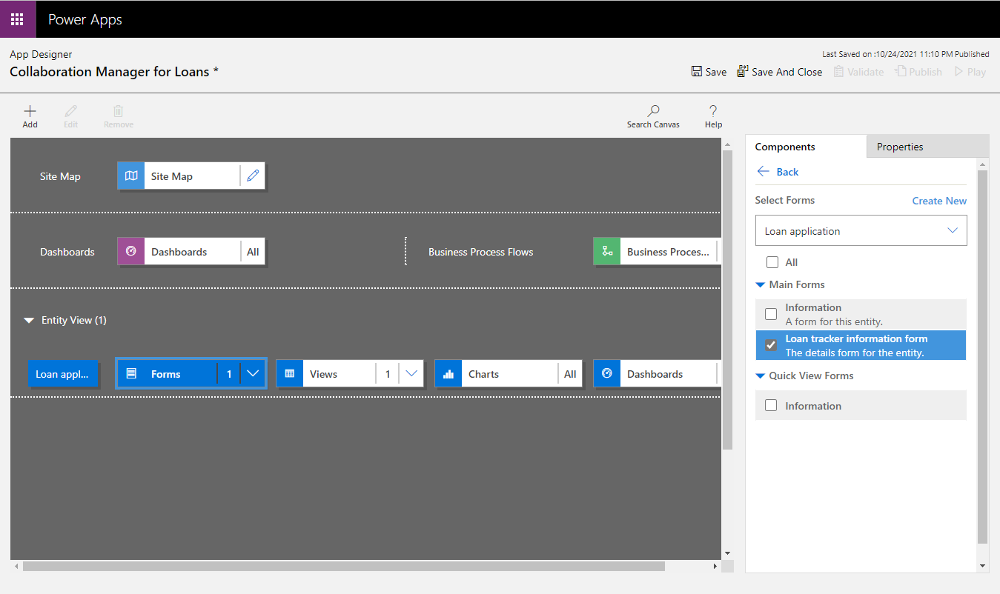
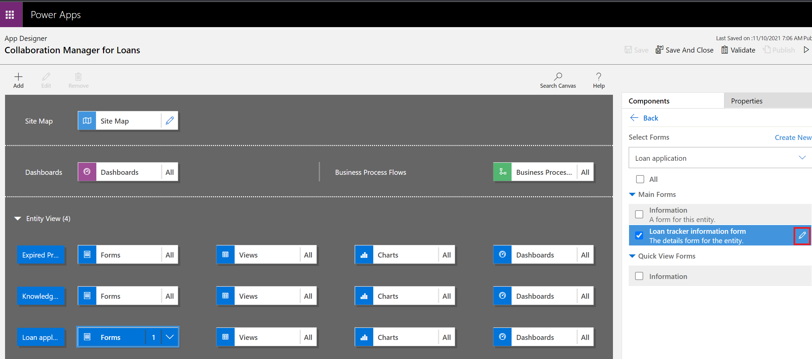
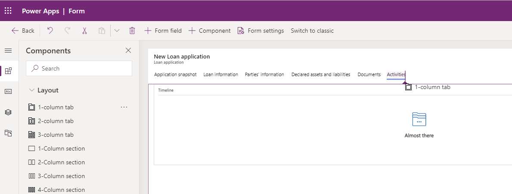
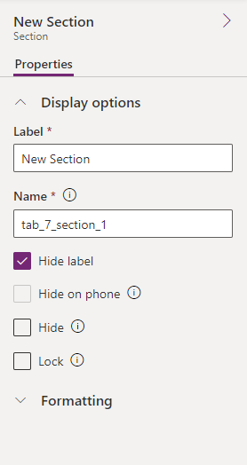
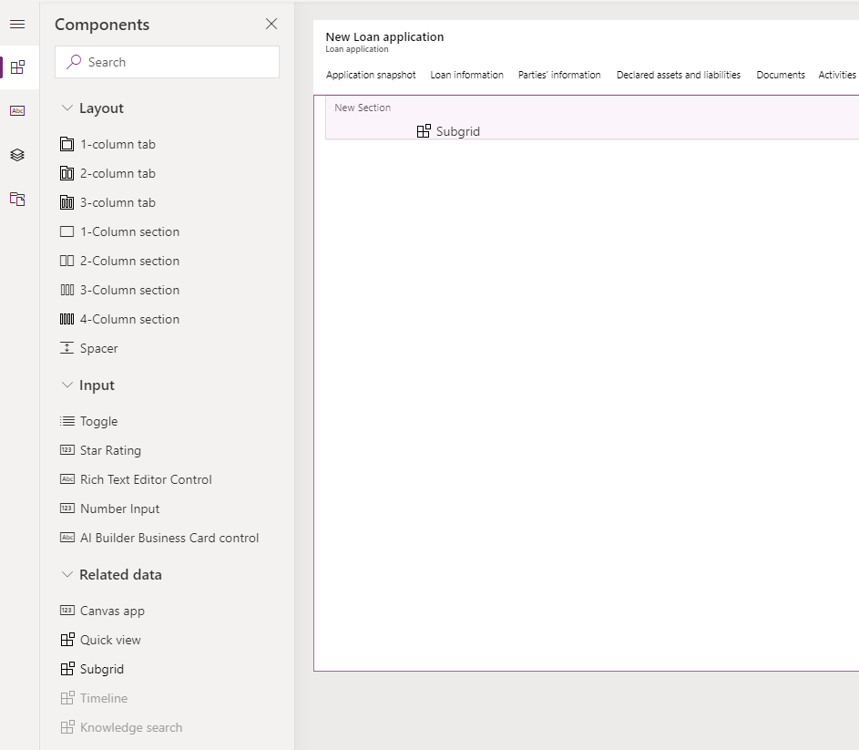
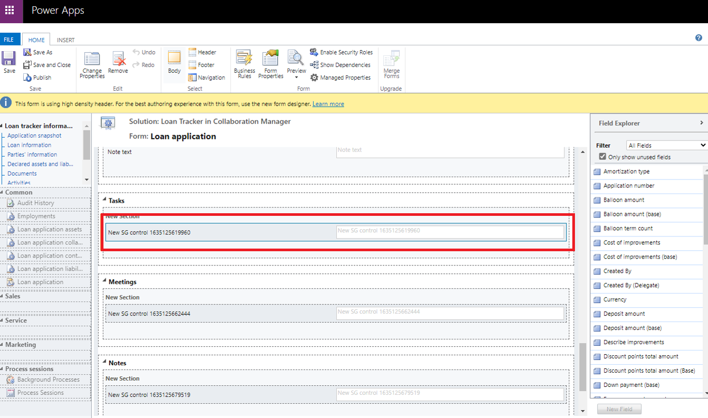
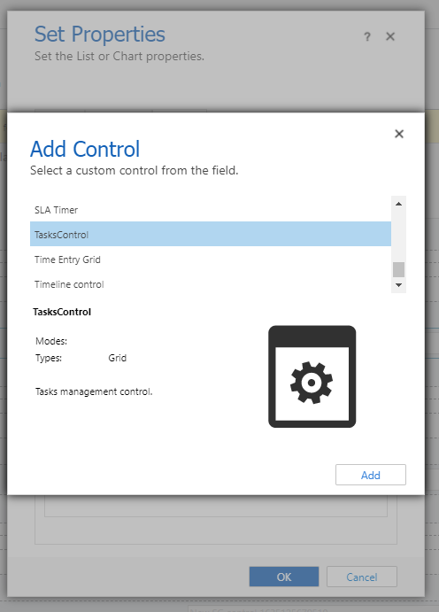
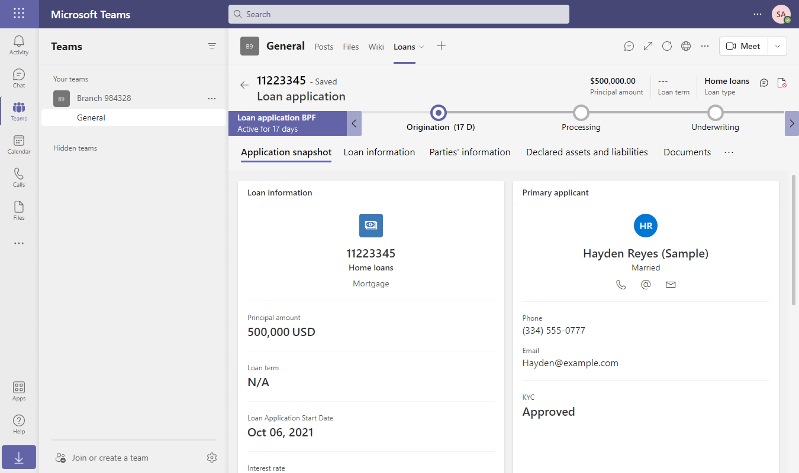

In this exercise, you'll embed the Loan Application form from the Loan Tracker app so that your users can have access to even more information within Collaboration Manager for Loans. All the apps in the Microsoft Cloud for Financial Services use the same data model, which allows you to mix-and-match the experiences for the various apps.

## Task 1: Replace default form within Collaboration Manager

1. Before beginning to create your customizations, we first need to create a solution to house all the changes. Begin by first navigating to [https://make.powerapps.com](https://make.powerapps.com/?azure-portal=true) and select **Solutions** in the left navigation.

1. Select **New solution** to create a new solution.

1. Provide information for the required fields and then select **save**.

    > [!div class="mx-imgBorder"]
    > 

1. Open the solution you created.

    > [!div class="mx-imgBorder"]
    > 

1. Since we want to show the Loan Tracker form instead of the default Collaboration Manager form, we want to update the app module so that it shows a different Loan Application form. Start by selecting **Add existing** > **App** > **Model-driven app** so that we can start making those changes.

    > [!div class="mx-imgBorder"]
    > 

1. Select **Collaboration Manager for Loans** and then select **Add** to bring the app into your solution.

    > [!div class="mx-imgBorder"]
    > 

1. Once the app is in your solution, select it to open it in the classic app designer.

1. Select the **Form** card for the **Loan application** entity within the app designer.

1. In the property pane on the right, clear **Information** and select **Loan tracker information form** instead.

    > [!div class="mx-imgBorder"]
    > 

1. Select **Save**.

1. Select **Publish**. If you played the app at this point within Microsoft Teams, the components from Loan Tracker will be present, but the collaborative features like tasks, meetings, and notes wouldn't be present.

## Task 2: Adding Collaboration Toolkit experiences in the Loan tracker form

1. We now want to edit the **Loan tracker information form** so that it includes the tasks, meetings, and notes tabs. To begin, select the edit icon next to the **Loan tracker information** **form**

    > [!div class="mx-imgBorder"]
    > 

1. It will open the **Loan tracker information form** in the form designer.

1. Once you're in the form designer, drag in a **1-column tab** from the **Components** drawer to the left of the **Activities** tab.

    > [!div class="mx-imgBorder"]
    > 

1. After dragging in the tab, rename the tab to "Tasks" in the property pane.

1. Also select **Expand first component to full tab** in the property pane.

    > [!div class="mx-imgBorder"]
    > 

1. Now select the section within your new tab so that you can select **Hide label** within the property pane.

    > [!div class="mx-imgBorder"]
    > 

1. Finally, drag-and-drop a **Subgrid** control from the **Components** drawer into your section.

    > [!div class="mx-imgBorder"]
    > 

1. For tasks, set the values to **All Tasks** from the **Tasks (Regarding)** table.

    > [!div class="mx-imgBorder"]
    > 

1. Repeat steps 18-23 for the Meetings and Notes tab.

    > [!div class="mx-imgBorder"]
    > 

    For meetings, set the subgrid to **All Appointments** within the **Appointments (Regarding)** table.

    > [!div class="mx-imgBorder"]
    > 

    For notes, set the subgrid to **All Activities** within the **Activities (Regarding)** table.

    > [!div class="mx-imgBorder"]
    > 

1. We now need to configure the custom controls for our subgrids within the classic form designer. Select **Save** and then select **Switch to classic**.

    > [!div class="mx-imgBorder"]
    > 

1. Scroll down in the classic form designer until you find the **Tasks** tab. Double-select the subgrid to open its property dialog.

    > [!div class="mx-imgBorder"]
    > 

1. While in the property dialog, select the **Controls** tab to view all custom controls assigned to it.

    > [!div class="mx-imgBorder"]
    > 

1. Select **Add Control...**

1. For the tasks tab, select **TasksControl** and then **Add**.

    > [!div class="mx-imgBorder"]
    > 

1. Finally, check the **Web**, **Phone**, and **Tablet** radio buttons for the **TasksControl** to ensure that it shows across all form factors.

    > [!div class="mx-imgBorder"]
    > 

1. Repeat steps 26-30 for the meetings and notes tabs. For meetings, use the **EventsControl** and for notes, use the **NotesControl**.

1. Select **Save**.

1. Select **Publish**.

1. You can now open Collaboration Manager for Loans in the Teams. You should see all of the tabs from Loan Tracker *and* the collaborative tabs from Collaboration Toolkit.

    > [!div class="mx-imgBorder"]
    > 
