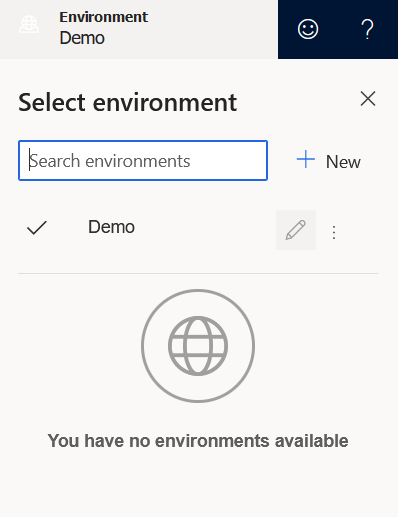
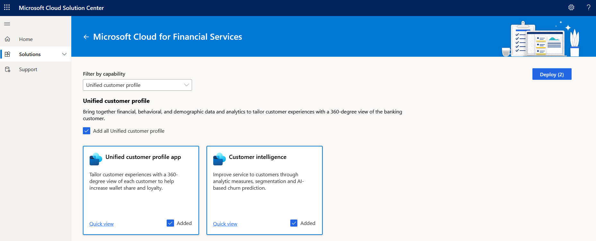
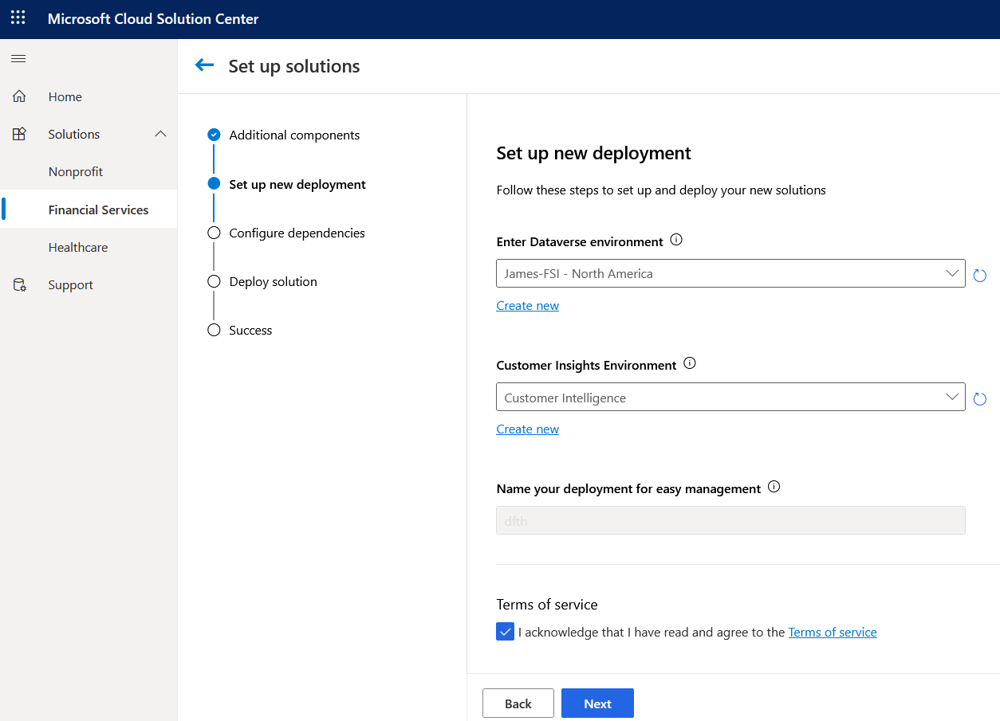
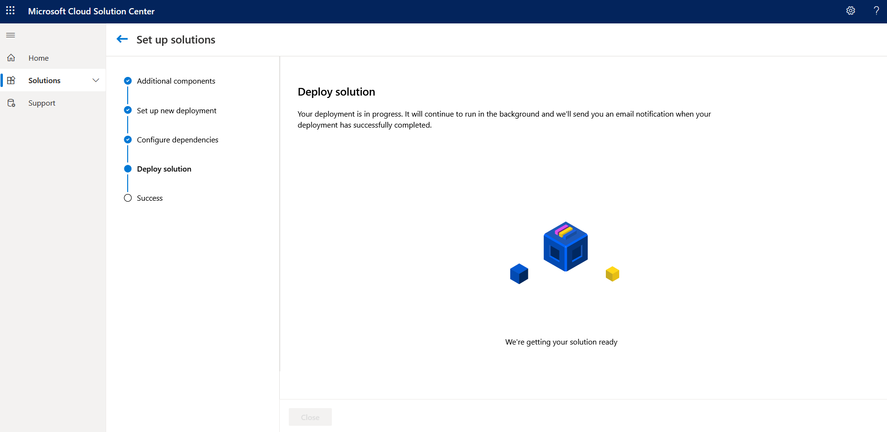
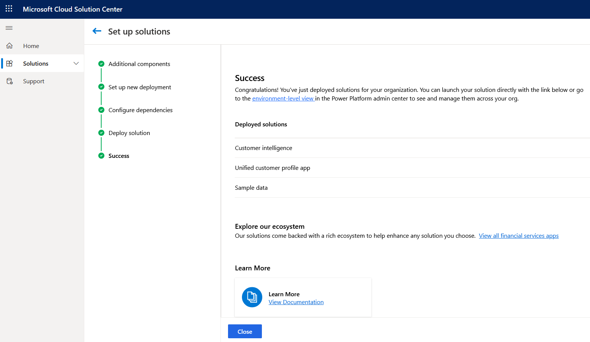

In this exercise, you'll explore the Customer Intelligence components of the Microsoft Cloud for Financial Services, create a Customer Insights instance, and deploy the Customer Intelligence capability from Microsoft Solution Center.

[Dynamics 365 Customer Insights](https://dynamics.microsoft.com/ai/customer-insights/?azure-portal=true) is a part of Microsoft's customer data platform (CDP) that helps deliver personalized customer experiences. The platform's capabilities provide insights into who your customers are and how they engage with your platform. Unify customer data across multiple sources to get a single view of customers.

- [Audience insights](/dynamics365/customer-insights/audience-insights/overview/?azure-portal=true) helps you transform your business into a customer-centric organization. Marketing, sales, and service professionals have the insights they need to personalize experiences. Connect data from transactional, behavioral, and observational sources to create a 360-degree customer view. See results faster with a CDP designed to deliver insights that can be acted upon.

[Engagement insights (preview)](/dynamics365/customer-insights/engagement-insights/?azure-portal=true) enables you to understand interactively, how your customers are using your services and products--both individually and holistically--on websites, mobile apps, and connected products. Combine behavioral analytics with transactional, demographic, survey, and other data types from Microsoft Dynamics 365 Customer Insights. Maintain full control over your customer data to ensure the highest level of data governance and compliance

## Task 1: Create a Dynamics 365 Customer Insights instance

In this task, you'll create a new Customer Insights sandbox environment. To set **Customer intelligence** up correctly, you must first create a Customer Insights sandbox environment and connect it to your Dataverse environment with no Data Sources specified. Once connected, you'll go through [Solution Center](https://solutions.microsoft.com/?azure-portal=true) and deploy **Customer intelligence** from **Unified customer profile**, specifying the Customer Insights environment that you create in this task.

1. Using an In-Private or Incognito window, navigate to [Power Apps](https://make.powerapps.com/?azure-portal=true).

1. Select the correct environment from the upper right **Environment** drop down.
    > [!div class="mx-imgBorder"]
    > 

1. Open a new tab in your internet browser and navigate to [Customer Insights](https://home.ci.ai.dynamics.com/?azure-portal=true).

1. Select **Audience insights** as your focus and then choose **Business accounts (B-to-C)** as your business.

    > [!div class="mx-imgBorder"]
    > 

    > [!div class="mx-imgBorder"]
    > 

    > [!div class="mx-imgBorder"]
    > 

1. Go to the environment picker and select **New**.

    > [!div class="mx-imgBorder"]
    > 

1. Fill out the following information and then select **Next**:

    1. **Name**: Customer Intelligence

    1. **Choose your business**: Individual consumers (B-to-C)

    1. **Type**: Sandbox

    1. **Region**: West US

    > [!Note]
    > Region selection will defer depending on the region where your instance was created.

    > [!div class="mx-imgBorder"]
    > 

1. Save output data to **Customer Insights storage**.

    > [!div class="mx-imgBorder"]
    > 

1. Input the **URL** for your environment, check the **Configure Data sharing with Microsoft Dataverse** checkbox and select **Next**.

    > [!div class="mx-imgBorder"]
    > 

1. Review your selections and select **Create**.

    > [!div class="mx-imgBorder"]
    > 

1. Open a new tab in your internet browser, navigate to Microsoft Cloud Solution Center, and select the **Microsoft Cloud for Financial Services**. Then select **Unified customer profile**.

    > [!div class="mx-imgBorder"]
    > 

1. In **Unified customer profile**, select **Add all Unified customer profile** and select **Deploy**.

    > [!div class="mx-imgBorder"]
    > 

1. Select **Sample data** and select **Next**.

    > [!div class="mx-imgBorder"]
    > 

1. Find your Dataverse environment in the first drop-down list, then select your Customer Insights deployment in the second drop-down list. Name your deployment, agree to the terms of service, and select **Next**.

    > [!div class="mx-imgBorder"]
    > 

1. Confirm everything looks correct and select **Deploy**.

    > [!div class="mx-imgBorder"]
    > 

1. Your deployment will now begin. When it completes, you'll see a confirmation.

    > [!div class="mx-imgBorder"]
    > 

    > [!div class="mx-imgBorder"]
    > 

**Congratulations!** You've deployed Dynamics 365 Customer Insights.
