In this exercise, you'll build a data pipeline in Microsoft Azure Data Factory. In Data Factory, you'll ingest sample data from Dataverse into Microsoft Azure Data Lake Storage, which is a set of capabilities that is dedicated to big data analytics. To complete this exercise, you'll need a Microsoft Azure subscription with administrator privileges. For more information, see [Introduction to Azure Data Lake Storage Gen2](/azure/storage/blobs/data-lake-storage-introduction/?azure-portal=true).

## Task 1: Create a resource group in Azure

In this task, you'll create a resource group to house your other Azure components. For more information, see [Manage Azure Resource Manager resource groups by using the Azure portal](/azure/azure-resource-manager/management/manage-resource-groups-portal/?azure-portal=true).

1. Use an In-private or Incognito window and go to the [Microsoft Azure portal](https://portal.azure.com/?azure-portal=true).

1. In the search box, search for and select **Resource groups**.

    > [!div class="mx-imgBorder"]
    > 

1. Select **Create** to create a new resource group.

    > [!div class="mx-imgBorder"]
    > 

1. Name the new resource group **fsiResourceGroup**, select the appropriate **Region**, select **Review + create**, and then select **Create**.

    > [!div class="mx-imgBorder"]
    > [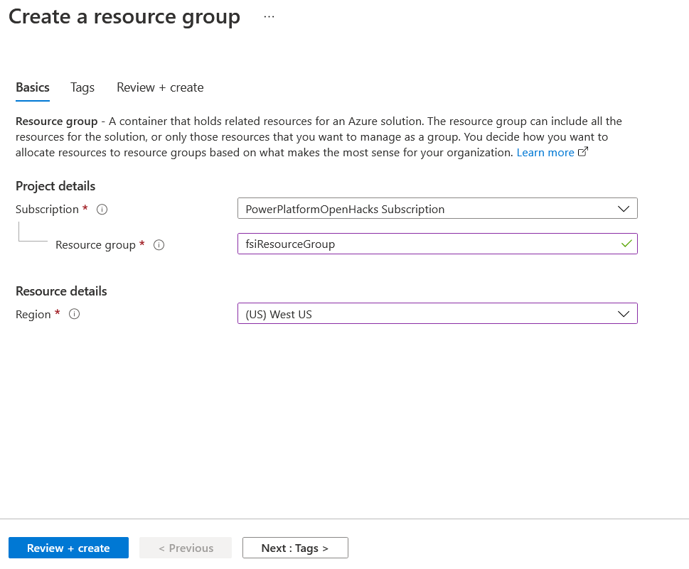](../media/review-create.png#lightbox)

    > [!div class="mx-imgBorder"]
    > 

1. After the resource group has been created, go to **Access control (IAM)** and select **Add role assignment**.

    > [!div class="mx-imgBorder"]
    > 

1. Select **Owner** and then select **Next**.

    > [!div class="mx-imgBorder"]
    > 

1. Select the **+ Select members** option, search for and select your user, and then select the **Select** button.

    > [!div class="mx-imgBorder"]
    > 

    > [!div class="mx-imgBorder"]
    > 

1. Select **Review + assign** to assign the role.

    > [!div class="mx-imgBorder"]
    > 

Congratulations, you've created a resource group in Azure.

## Task 2: Create an Azure storage account

In this task, you'll create a storage account within the resource group that you created in the previous task. An Azure storage account contains all your Azure storage data objects and provides a unique namespace for your Azure storage data. For more information, see [Azure storage documentation](/azure/storage/blobs/data-lake-storage-introduction/?azure-portal=true).

1. Go to the **Resource group** that you created in the previous task.

1. Select **Create**.

    > [!div class="mx-imgBorder"]
    > 

1. Scroll down the page to **Storage account** and then select **Create**.

    > [!div class="mx-imgBorder"]
    > 

1. Select the resource group (**fsiResourceGroup**) that you created in the previous task.

    > [!div class="mx-imgBorder"]
    > 

1. Scroll down to **Instance details** and enter the following information. Then, select **Review + create > Create**.

    - **Storage account name** - fsistorageacct

    - **Region** - The same region that you selected for your resource group

    - **Performance** - Default

    - **Redundancy** - Default

    > [!div class="mx-imgBorder"]
    > 

    > [!div class="mx-imgBorder"]
    > [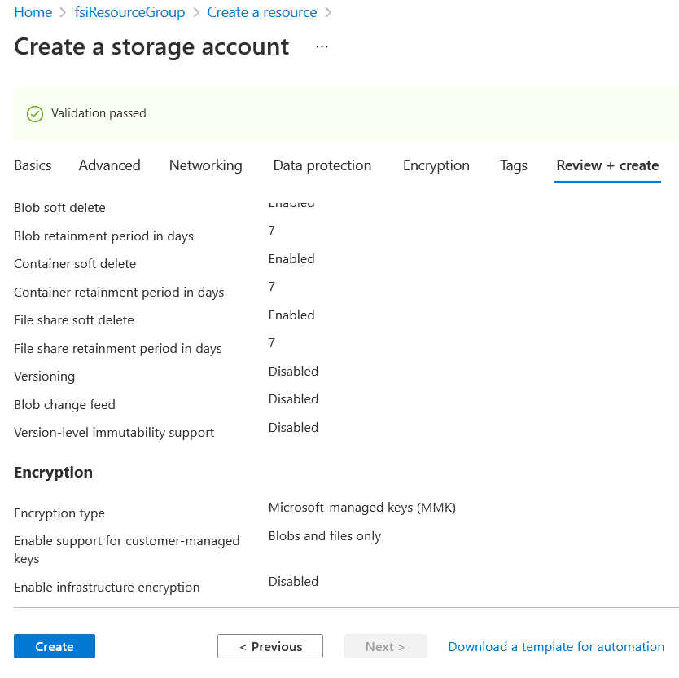](../media/storage-validation.png#lightbox)

1. After the storage account has been created, go to **Access Control (IAM)** and select **Add role assignment**.

    > [!div class="mx-imgBorder"]
    > 

1. **Search** for and select **Storage Blob Data Contributor**.

    > [!div class="mx-imgBorder"]
    > 

1. Select **Members** and then select the **+ Select members** option. Find your user and then select the **Select** button.

    > [!div class="mx-imgBorder"]
    > 

    > [!div class="mx-imgBorder"]
    > 

1. Select **Review + assign** to assign the role.

    > [!div class="mx-imgBorder"]
    > 

1. Return to **Access Control (IAM)** and select **Add role assignment** again.

    > [!div class="mx-imgBorder"]
    > 

1. Select **Owner** and then select **Next**.

    > [!div class="mx-imgBorder"]
    > [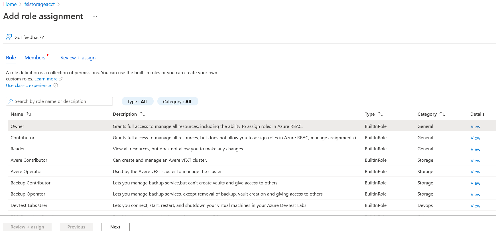](../media/owner-role.png#lightbox)

1. Select the **+ Select members** option. Find your user and then select the **Select** button.

    > [!div class="mx-imgBorder"]
    > 

    > [!div class="mx-imgBorder"]
    > 

1. Select **Review + assign** to assign the role.

    > [!div class="mx-imgBorder"]
    > [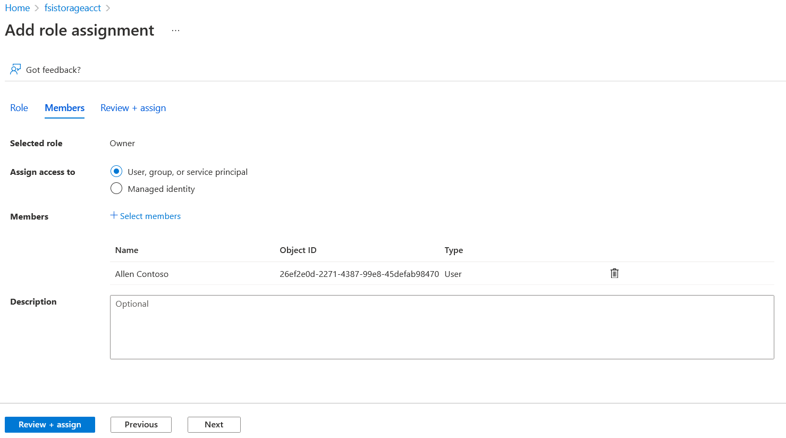](../media/assign.png#lightbox)

1. Return to **Access Control (IAM)** and select **Add role assignment** one more time.

    > [!div class="mx-imgBorder"]
    > 

1. **Search** for and select **Storage Blob Data Contributor**. Select **Next**.

    > [!div class="mx-imgBorder"]
    > 

1. Select **Members** and then select **+ Select members**. Search for and select **Dynamics 365 AI for Customer Insights**.

    > [!div class="mx-imgBorder"]
    > 

    > [!div class="mx-imgBorder"]
    > 

1. Select **Review + assign** to assign the role.

    > [!div class="mx-imgBorder"]
    > 

Congratulations, you've created a storage account in your Azure resource group.

## Task 3: Create a staging Azure container for Customer Insights

In this task, you'll create an Azure container from the storage account that you created in the previous task. You'll use this Azure container as a staging area for data that will be ingested by Customer Insights. For more information, see [Azure Container Instances documentation](/azure/container-instances/?azure-portal=true).

> [!IMPORTANT]
> To download the JSON files that you'll use to transform the data for Customer Insights, go to [create-azure-components-json.zip](https://github.com/MicrosoftDocs/mslearn-developer-tools-power-platform/blob/master/financial-services-industry/create-azure-components-json.zip/?azure-portal=true). In the GitHub page that appears, select the **Download** button.

1. In the storage account that you created in the previous task, select **Containers**.

    > [!div class="mx-imgBorder"]
    > 

1. Select **+ Container**, fill out the following information, and then select **Create**.

    - **Name** - fsicistagingcontainer

    - **Public access level** - Container

    > [!div class="mx-imgBorder"]
    > 

1. Open the newly created container and then select **Manage ACL**.

    > [!div class="mx-imgBorder"]
    > 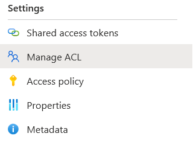

1. Under **Access permissions**, select **Add principal**. Search for and select **Dynamics 365 AI for Customer Insights**. Select the **Read**, **Write**, and **Execute** permission checkboxes and then select **Save**.

    > [!div class="mx-imgBorder"]
    > [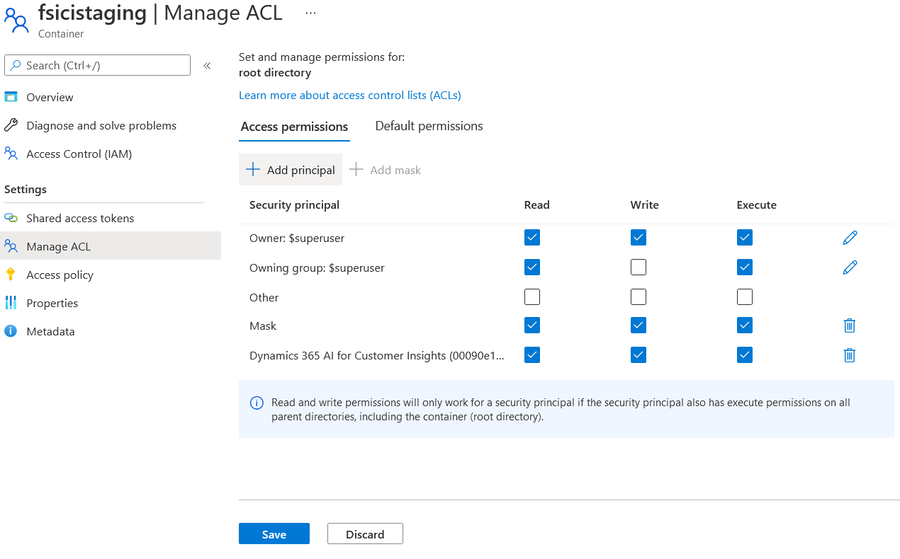](../media/add-principal.png#lightbox)

1. Follow the same steps under **Default permissions** tab for **Dynamics 365 AI for Customer Insights** .

    > [!div class="mx-imgBorder"]
    > 

1. Go to **Overview** and select **Add Directory**.

    > [!div class="mx-imgBorder"]
    > 

1. Enter **Corpus** in the **Name** field and then select **Save**.

    > [!div class="mx-imgBorder"]
    > 

1. Open the new **Corpus** directory and then select **Add Directory**. Enter the word **resolved** in the **Name** field.

    > [!div class="mx-imgBorder"]
    > 

1. Open the new **resolved** folder. Select **Upload** to upload the JSON files that were linked at the beginning of this task. You'll use these JSON files to transform the data for Customer Insights.

    > [!div class="mx-imgBorder"]
    > 

Congratulations, you've created a staging Azure container for Customer Insights.

## Task 4: Create a new Azure Synapse link

In this task, you'll create a new Microsoft Azure Synapse link to connect your Dataverse environment to your Azure storage account.

1. Use an In-Private or Incognito window and go to [Power Apps](https://make.powerapps.com/?azure-portal=true).

1. Select the correct environment from the **Environment** dropdown menu in the upper-right corner.

    > [!div class="mx-imgBorder"]
    > 

1. Expand **Dataverse** and then select **Azure Synapse Link**. Select **New link**.

    > [!div class="mx-imgBorder"]
    > 

1. Select your Azure **Subscription**, **Resource Group**, and **Storage account**, and then select **Next**.

    > [!div class="mx-imgBorder"]
    > 

1. Filtering by keyword, search for and add the following 18 tables. When you're finished, select **Save**.

    - Bank

    - Branch

    - Contact

    - Customer financial holding

    - FH account

    - FH investment

    - FH line of credit

    - FH loan

    - FH saving

    - FI card

    - FI direct debit

    - FI overdraft

    - FI standing order

    - Financial holding

    - Financial holding instrument

    - Group

    - Group financial holding

    - Group member

    - Life event

    > [!div class="mx-imgBorder"]
    > 

1. When you're finished adding the tables, the tables should populate with data. This action will also create a new Azure container in your storage account that you can use to run your data pipeline in Azure Data factory.

    > [!div class="mx-imgBorder"]
    > 

Congratulations, you've linked Dataverse to Azure Data Lake Storage by using Azure Synapse.

## Task 5: Create an Azure data factory

In this task, you'll create an Azure data factory within your Azure resource group. Microsoft Azure Data Factory is a cloud ETL service for scale-out, serverless data integration and data transformation. For more information, see [Azure Data Factory documentation](/azure/data-factory/?azure-portal=true).

1. In Azure, search for and select **Data factories**.

    > [!div class="mx-imgBorder"]
    > [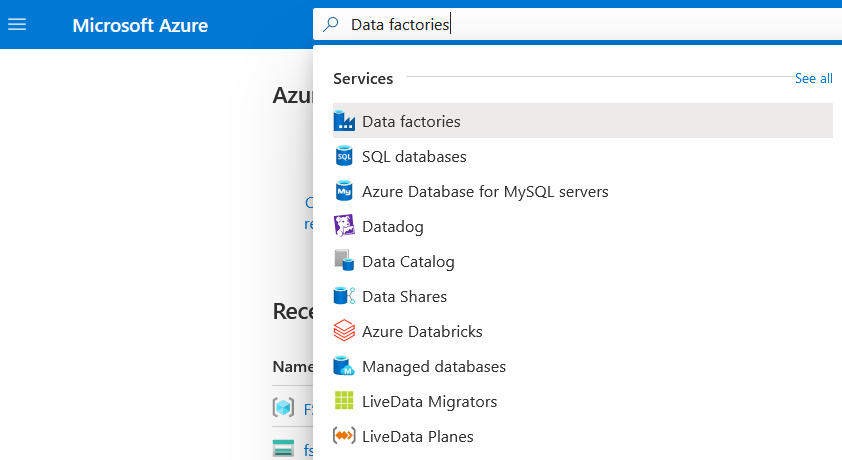](../media/data-factories.png#lightbox)

1. Select **Create** to create a new data factory.

    > [!div class="mx-imgBorder"]
    > 

1. Fill out the following information:

    - **Subscription** - Your Azure subscription

    - **Resource group** - Your previously created resource group

    - **Region** - Same region as your resource group

    - **Name** - myfsidatafactory

    - **Version** - V2

    > [!div class="mx-imgBorder"]
    > [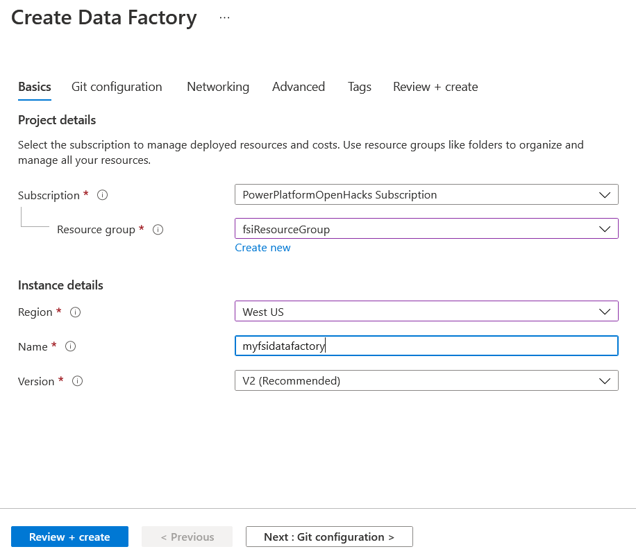](../media/create-data-factory.png#lightbox)

1. Select the **Git configuration** tab and then select **Configure Git later**. Select **Review + create**.

    > [!div class="mx-imgBorder"]
    > 

1. Select **Create** to create the Azure data factory.

    > [!div class="mx-imgBorder"]
    > 

Congratulations, you've created an Azure data factory.

## Task 6: Run a data pipeline in Azure Data Factory

In this task, you'll run a data pipeline in your Azure Data Factory by using an Azure Resource Manager (ARM) template. This data pipeline will ingest the sample data from the storage container that is linked to your Microsoft Cloud for Financial Services Dataverse environment. Then, the data pipeline will move the sample data to the staging container to be ingested by Dynamics 365 Customer Insights. For more information, see [Pipelines and activities in Azure Data Factory and Azure Synapse Analytics](/azure/data-factory/concepts-pipelines-activities/?azure-portal=true).

1. In your Azure Data Factory, go to **Overview** and then select **Open Azure Data Factory Studio**.

    > [!div class="mx-imgBorder"]
    > 

1. Select your Azure data factory from the **Data Factory name** dropdown menu and then select **Continue**.

    > [!div class="mx-imgBorder"]
    > [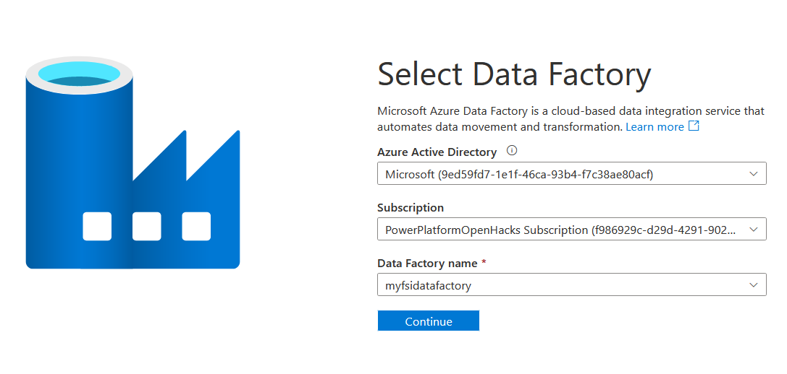](../media/select-factory.png#lightbox)

1. In the left navigation, select the **Manage** icon (toolbox), select **ARM template**, and then select the **Import ARM template** tile.

    > [!div class="mx-imgBorder"]
    > 

1. Select **Build your own template in the editor**.

    > [!div class="mx-imgBorder"]
    > 

1. Select **Load file** to upload the ARM template file that was provided in the lab resources.

    > [!div class="mx-imgBorder"]
    > 

1. Return to your storage account. Go to **Access keys** and then select **Show keys**. Copy the **key1** key.

    > [!div class="mx-imgBorder"]
    > 

1. Edit the following parameters and then select **Save**:

    - **factoryName: defaultValue** - Your Data Factory name

    - **lnkFSICDM_accountKey: metadata** - The Storage Account key that you copied in the previous step

    - **lnkCICDM_accountKey: metadata** - The Storage Account key that you copied in the previous step

    - **lnkFSICDM_properties_typeProperties_url: metadata** - `https://STORAGEACCOUNTNAAME.dfs.core.windows.net`

    - **lnkCICDM_properties_typeProperties_url: metadata** - `https://STORAGEACCOUNTNAAME.dfs.core.windows.net`

    > [!div class="mx-imgBorder"]
    > 

1. Select your **Resource group** from the dropdown menu. Fill in the remaining two parameters with the **Storage Account key** that you copied in the previous step. Select **Review + create**.

    > [!div class="mx-imgBorder"]
    > [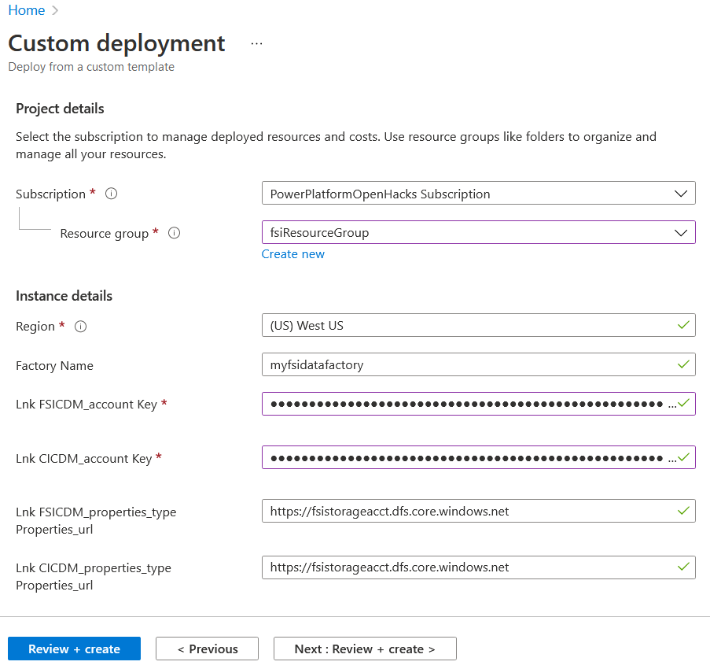](../media/custom-deployment.png#lightbox)

1. Select **Create** to create the data pipeline.

    > [!div class="mx-imgBorder"]
    > 

1. Return to your Data Factory and **refresh** the page. Select **Linked services**. Two connections should now display.

    > [!div class="mx-imgBorder"]
    > [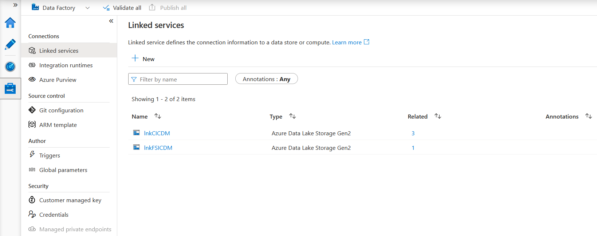](../media/linked.png#lightbox)

1. Select the **Author** (pencil) icon. Expand and select the **Pipeline**, and then enter the following parameters:

    - **pipFSICDM** - The full name of your storage container that is linked to Azure Synapse Link, for example, `dataverse-AZURESYNAPSE-unqab48050868e14fef9572fa91f02ff`

    - **pipCICDM** - The name of your Customer Insights staging storage container, for example, `cistagingcontainer`

    > [!div class="mx-imgBorder"]
    > 

1. To publish your changes, select **Publishing > Publish**.

    > [!div class="mx-imgBorder"]
    > [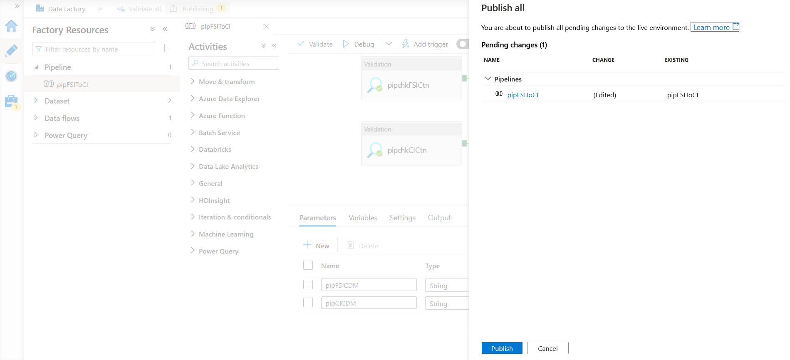](../media/publish.png#lightbox)

1. To enable the data flow debug option, select the **Data flow debug** field and then select **OK**. You should receive a detailed error message if the pipeline fails to run. It will take a couple minutes for this process to complete.

    > [!div class="mx-imgBorder"]
    > [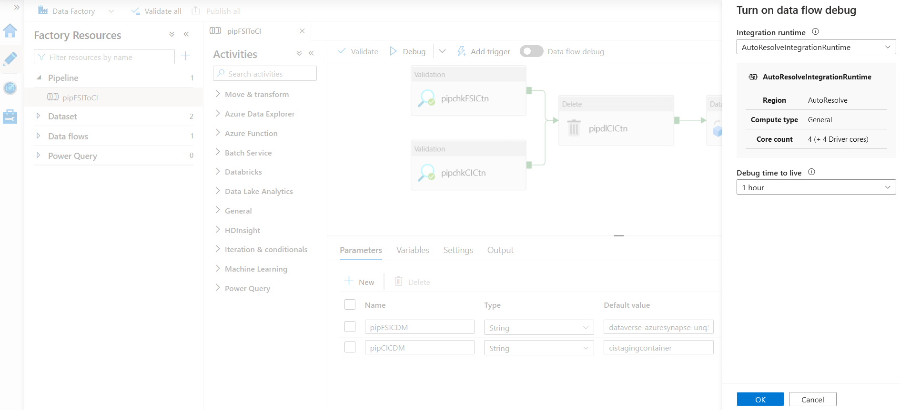](../media/debug.png#lightbox)

1. After you have turned on the **Data flow debug** toggle, select **Debug** and then select **OK** to trigger the pipeline.

    > [!div class="mx-imgBorder"]
    > 

    > [!div class="mx-imgBorder"]
    > 

1. If the run is successful, you'll receive a status of **Succeeded** for the **Data flow**.

    > [!div class="mx-imgBorder"]
    > 

1. Return to your Customer Insights staging storage container to observe data being populated in a newly created data folder.

    > [!div class="mx-imgBorder"]
    > 

Congratulations, you've successfully built and run a data pipeline in Azure Data Factory.
