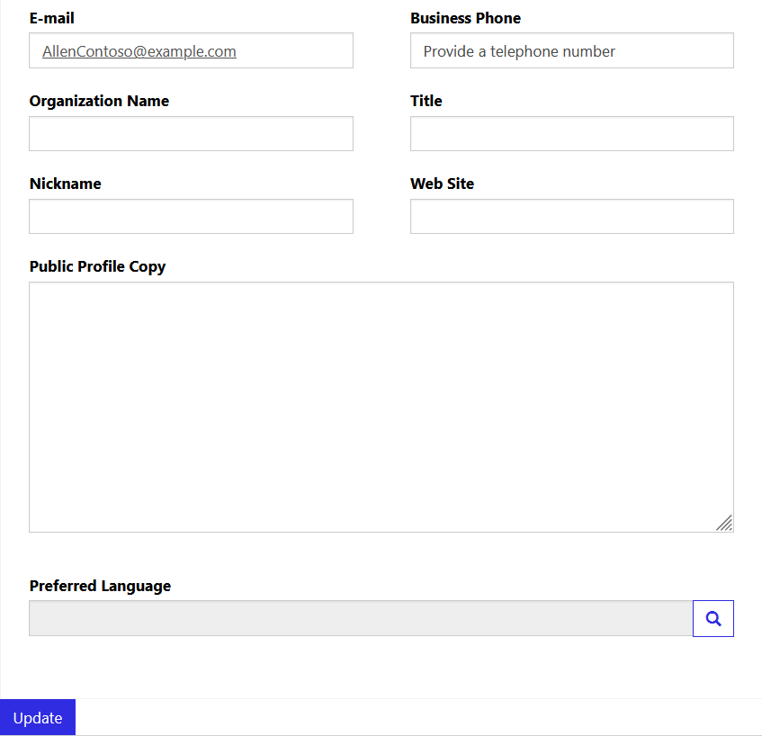

In this exercise, you will learn how to:

- Set up an external website to the Retail Banking Portal template.

- Create a registration code and invite a client to create an account for the website.

- Sign in as a loan applicant to navigate the features of the retail banking website.

The **Retail Banking Portal** template was installed in your environment by the Customer onboarding module in Microsoft Cloud Solution Center when Microsoft Cloud for Financial Services was deployed.

A portal is an external website that allows for communication between a company and its users. In this module's scenario, Woodgrove Bank wants an external website for their clients to access their loan history and communicate effectively with the institution. The **Retail Banking Portal** template tailors the website's user interface (UI) for a financial services company to focus on more secure communication, information access, and an overall improved customer experience.

The following image is an example what should display after you have set up and opened the Retail Banking Portal.

> [!div class="mx-imgBorder"]
> 

For more information, see [What are Power Apps portals?](/powerapps/maker/portals/overview/?azure-portal=true).

## Task 1: Set up the Retail Banking Portal

Prior to deploying Microsoft Cloud for Financial Services, you created a portal in your environment by using the **Customer Self-Service** template. Creating this portal was a prerequisite to installing the Retail Banking Portal as part of the Customer onboarding module.

Woodgrove Bank wants to associate the previously installed Customer Self-Service portal with the **Retail Banking Portal** template so that the correct website is displayed to the user. The following steps will guide you through how to bind your website to the proper template and restart the portal for changes to apply.

First, open the portal to show the Customer Self-Service template that is currently bound. After the configuration steps in this task, the new Retail Banking Portal user interface will display.

1.  Use an In-Private or Incognito window and go to [Microsoft Power Apps](https://make.powerapps.com/?azure-portal=true).

1.  Select the correct environment from the **Environment** dropdown menu in the upper-right corner.

	> [!div class="mx-imgBorder"]
	> 

1.  Select **Apps** on the left navigation bar.

	> [!div class="mx-imgBorder"]
	> 

1.  Find the retail banking portal that you want (**Woodgrove Banking Portal**), select the **More Commands** ellipsis (**...**), and then select **Settings**.

	> [!div class="mx-imgBorder"]
	> 

1.  Select **Administration**.

	> [!div class="mx-imgBorder"]
	> 

1.  Scroll down to **Update Portal Binding** and change the website record from Customer Self-Service to **Retail Banking Sample Portal**. Select **Update**.

	> [!div class="mx-imgBorder"]
	> 

1.  Go to **Portal Actions** on the left menu and select **Restart** to restart the portal.

	> [!div class="mx-imgBorder"]
	> 

1.  Return to **Apps** and open **Woodgrove Banking Portal** to view the sample banking portal.

	> [!div class="mx-imgBorder"]
	> 

    Congratulations, you have set up the Retail Banking Sample Portal in Microsoft Cloud for Financial Services.

## Task 2: Create a new customer

Now that you have set up the Retail Banking Sample Portal, you will create an invitation for one contact in the system so that you can access the portal as a customer.

1.  Use an In-Private or Incognito window and go to [Power Apps](https://make.powerapps.com/?azure-portal=true).

1.  Select the correct environment from the **Environment** dropdown menu in the upper-right corner.

	> [!div class="mx-imgBorder"]
	> 

1.  Select **Apps** on the left navigation bar.

	> [!div class="mx-imgBorder"]
	> 

1.  Open **Woodgrove Banking Portal**.

	> [!div class="mx-imgBorder"]
	> 

1.  Select the **Sign in** button in the upper-right corner.

	> [!div class="mx-imgBorder"]
	> 

1.  Select **Register**, fill in the following information, and then select **Register**:

	- **Email** - AllenContoso@example.com

	- **Username** - AllenContoso

	- **Password** - AllenContoso123

	- **Confirm password** - AllenContoso123

	> [!div class="mx-imgBorder"]
	> 

1.  Fill in the following information and then scroll down and select **Update**:

	- **First Name** - Allen

	- **Last Name** - Contoso

	> [!div class="mx-imgBorder"]
	> 

	> [!div class="mx-imgBorder"]
	> 

Congratulations, you have successfully created a customer profile in the Retail Banking Sample Portal.
