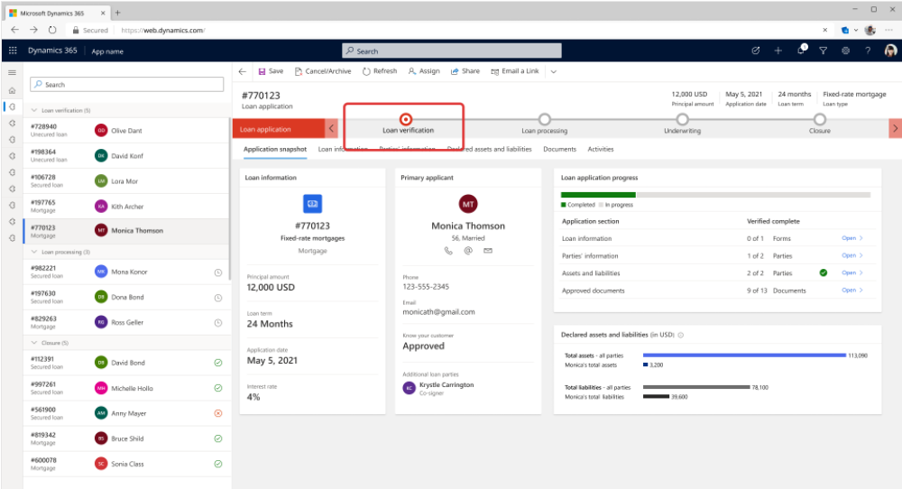
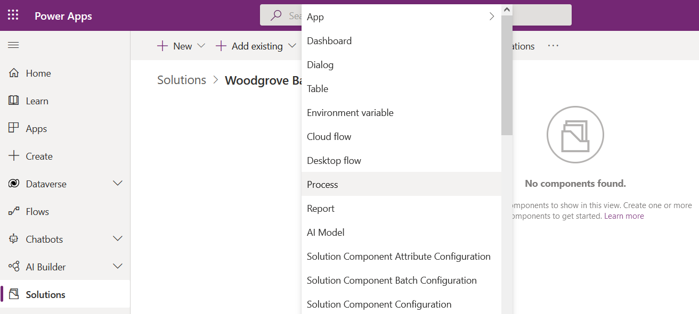
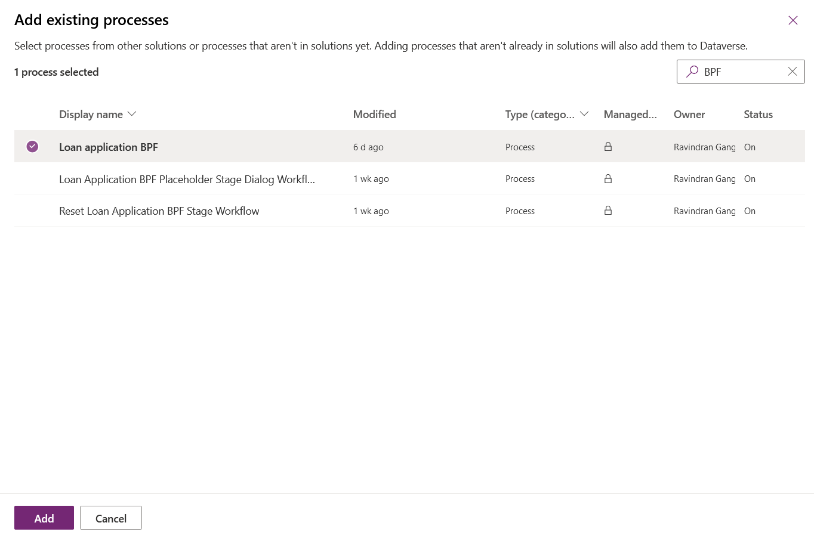
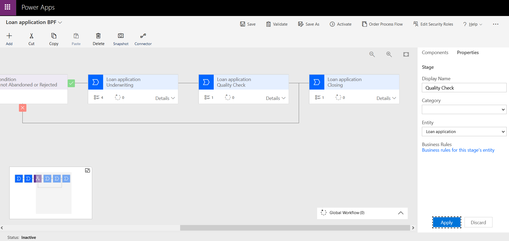
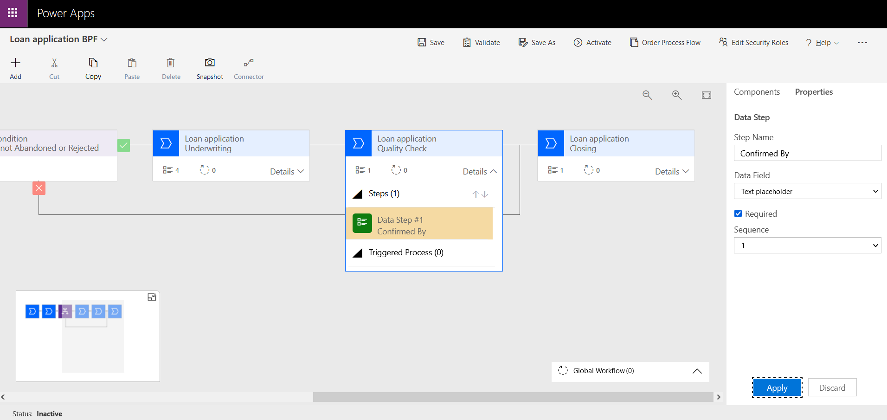

In this exercise, you will learn how to:

- Create a new Power Apps solution.

- Create a new business process flow for tracking loans in the Loan Tracker application.

- Publish the business process flow to the Loan Tracker application.

The business process flow presents the current application stage. This feature allows the loan manager to see the application's current stage in the process. The bank can choose to set as many stages as needed.

When the Loan Tracker application is installed, the business process flow contains four stages:

-   Loan verification

-   Loan processing

-   Underwriting

-   Closure

In this exercise, you will extend the business process flow for loans to include a new **Quality Check** stage.

> [!div class="mx-imgBorder"]
> 

## Task 1: Create a new Power Apps solution

To create a new Power Apps solution, follow these steps:

1.  Use an In-Private or Incognito window and go to [Power Apps](https://make.powerapps.com/?azure-portal=true).

1.  Select the correct environment from the **Environment** dropdown menu in the upper-right corner.

	> [!div class="mx-imgBorder"]
	> 

1.  Select **Solutions** on the left navigation bar.

	> [!div class="mx-imgBorder"]
	> 

1.  Select **+ New solution**.

	> [!div class="mx-imgBorder"]
	> 

1.  Name the new solution **Woodgrove Banking**, select **CDS Default Publisher**, and then select **Create**.

	> [!div class="mx-imgBorder"]
	> 

## Task 2: Extend the loan application business process flow

To extend the loan application business process flow, follow these steps:

1.  Select **Woodgrove Banking** to open the solution.

	> [!div class="mx-imgBorder"]
	> 

1.  Select **+ Add existing** and then select **Process**.

	> [!div class="mx-imgBorder"]
	> 

1.  In the search box, enter **BPF**, select **Loan application BPF**, and then select **Add**.

	> [!div class="mx-imgBorder"]
	> 

1.  Open **Loan application BPF**.

	> [!div class="mx-imgBorder"]
	> 

1.  Deactivate the business process flow.

	> [!div class="mx-imgBorder"]
	> 

	> [!div class="mx-imgBorder"]
	> 

1.  Extend the business process flow by selecting and dragging a stage in between the **Underwriting** and **Closure** stages.

	> [!div class="mx-imgBorder"]
	> 

1.  Select the new stage, give it a **Display Name** of **Quality Check**, and then select **Apply**.

	> [!div class="mx-imgBorder"]
	> 

1.  Expand **Steps** under the new stage and then select **Data Step #1**.

	> [!div class="mx-imgBorder"]
	> 

1.  Enter the following information and then select **Apply**:

	- **Step Name** - Confirmed By
	
	- **Data Field** - Text placeholder
	
	- **Required** - Yes

	> [!div class="mx-imgBorder"]
	> 

1. Select **Save** to save your changes.

	> [!div class="mx-imgBorder"]
	> 

1. Select **Activate** to activate the business process flow.

	> [!div class="mx-imgBorder"]
	> 

	> [!div class="mx-imgBorder"]
	> 

Congratulations, you have extended the Loan application business process flow by adding another stage for loan applications in Microsoft Cloud for Financial Services.
