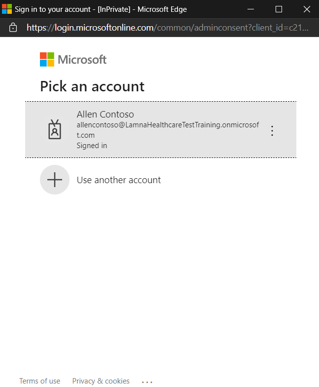
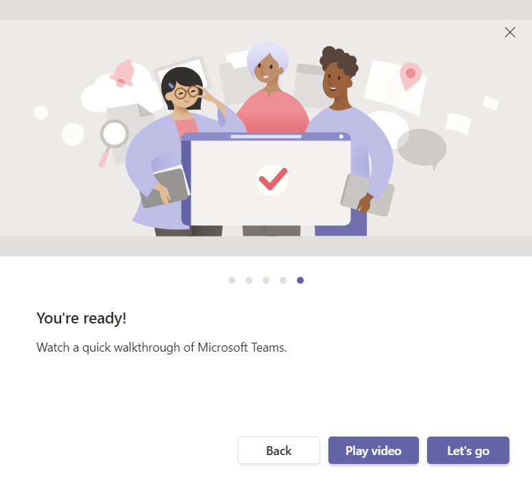
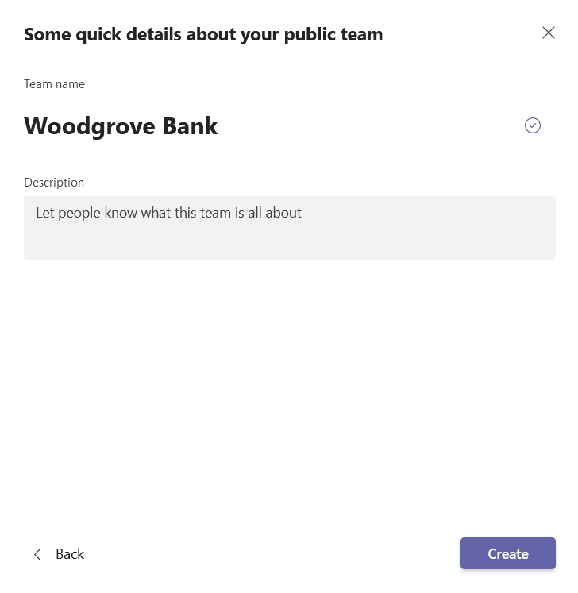

In this exercise, you will set up integration with Microsoft Teams for BANK. Microsoft Teams offers several features that are useful for banks and other financial institutions. By integrating Microsoft Cloud for Financial Services with Microsoft Teams, you can improve the collaboration between your staff and enhance customer service.

Additionally, your care team can use Microsoft Teams internally for the following actions:

-   Chat, call, post messages, and communicate as a team.

-   Store and share files and documents to collaborate.

-   Use Shifts to create, manage, and share schedules among your staff.

## Task 1: Install and set up Microsoft Teams integration

By default, the Basic and Enhanced Microsoft Teams integration is disabled for customer engagement apps in Microsoft Dynamics 365. In this task, you will enable Microsoft Teams in Dynamics 365.

1.  Go to [make.powerapps.com](https://make.powerapps.com/?azure-portal=true).

1.  Select the **gear** in the upper-right corner and then select **Advanced Settings**.

	> [!div class="mx-imgBorder"]
	> 

1.  You will be directed to the Business Management section in Dynamics 365.

	> [!div class="mx-imgBorder"]
	> 

1.  Go to **Settings > System > Administration**.

	> [!div class="mx-imgBorder"]
	> 

1.  Select **System Settings**.

	> [!div class="mx-imgBorder"]
	> 

1.  Under **Microsoft Teams Integration**, set the **Enable Basic Microsoft Teams Integration** option to **Yes**.

	> [!div class="mx-imgBorder"]
	> 

1.  When the pop-up window opens, select **OK**. This setting will take several minutes to set up. 

	> [!div class="mx-imgBorder"]
	> 

1.  When the process has completed, select **Finish**.

	> [!div class="mx-imgBorder"]
	> 

1.  Return to **System Settings** and set the **Enable Enhanced Microsoft Teams integration** option to **Yes**.

	> [!div class="mx-imgBorder"]
	> 

1. When the pop-up window opens, select **OK**.

	> [!div class="mx-imgBorder"]
	> 

1. Another pop-up window will open. Select the user whom you are signed in as currently.

	> [!div class="mx-imgBorder"]
	> 

1. Select **Accept**.

	> [!div class="mx-imgBorder"]
	> 

1. Select **Finish**.

	> [!div class="mx-imgBorder"]
	> 

1. Both Microsoft Teams integration settings should now be set to **Yes**. Select **OK**.

	> [!div class="mx-imgBorder"]
	> 

Congratulations, you have enabled Microsoft Teams integration for Dynamics 365.

## Task 2: Embed the Loan Tracker app in Microsoft Teams

In this task, you will customize the Microsoft Teams experience for a practitioner by embedding the Loan Tracker app to the Teams channel in your environment.

You will be using the Microsoft Teams web experience for this task.

1.  While signed in to your Microsoft 365 tenant, open a new tab and go to [Microsoft Teams](https://teams.microsoft.com/?azure-portal=true).

1.  Select **Next** through the prompts, and then select **Let's go**.

	> [!div class="mx-imgBorder"]
	> 

1.  Select **Teams** on the left navigation bar and then select **Create team**.

	> [!div class="mx-imgBorder"]
	> 

1.  Select **From scratch**.

	> [!div class="mx-imgBorder"]
	> 

1.  Select **Public**.

	> [!div class="mx-imgBorder"]
	> 

1.  Name the team **Woodgrove Bank** and then select **Create**.

	> [!div class="mx-imgBorder"]
	> 

1.  After the team has been created and the **General** channel has been selected, select the plus (**+**) button to add a tab.

	> [!div class="mx-imgBorder"]
	> 

1.  Search for and then select **Power Apps**.

	> [!div class="mx-imgBorder"]
	> 

1.  Select **Add**.

	> [!div class="mx-imgBorder"]
	> 

1. Select **Model-driven apps** from the dropdown menu. Search for and then select **Loan Tracker**. Select **Save**.

	> [!div class="mx-imgBorder"]
	> 

The Loan Tracker app will now show as embedded in Microsoft Teams.

  > [!div class="mx-imgBorder"]
  > 

Congratulations, you have embedded the Loan Tracker app in Microsoft Teams.
