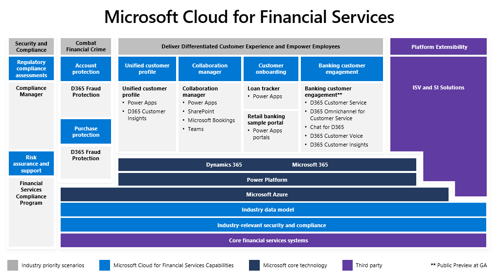

Microsoft Cloud for Financial Services uses a combination of Microsoft products to address the industry's prioritized scenarios that are focused on retail banking. The following illustration shows the required and recommended capabilities along with the external extensions that are driven by independent software vendors and system integrators.

> [!div class="mx-imgBorder"]
> 

The preceding illustration is a logical, layered architecture that highlights the following components:

-   **Core financial services systems** - Represented as a layer of retail banking core systems that will form the fundamental data for the core capabilities. On top of these systems are the consistent and compliant Microsoft Cloud for Financial Services capabilities.

-   **Industry data model** - Comprehensive data tables and relationships that help make it easier for financial services organizations to quickly set up and deploy solutions by using a common collection of entities. The data model is broadly divided into Cloud for Financial Services, Common Data Model, Loan Onboarding data model, and Retail Banking Core Model.

-   **Microsoft platform layer** - The core capabilities are built on top of Microsoft's industry-leading cloud technologies from Microsoft Azure, Microsoft Power Platform, Dynamics 365, and Microsoft 365.

-   **Delver differentiated customer experiences and empower employees** - You can deliver this core retail banking capability by using the following components:

    -   **Unified customer profile** - Built by using Microsoft's Customer Data Platform and Dynamics 365 Customer Insights, and the functionality is delivered to the user by using Microsoft Power Apps.

    -   **Collaboration manager** - This functionality is delivered by using a combination of Microsoft Bookings apps, Microsoft Teams, SharePoint, and Power Apps.

    -   **Customer banking** - This functionality is broadly divided into a customer-facing, self-service portal by using Power Apps portals and a model-driven loan tracker app from Power Apps.

    -   **Banking customer engagement** - This functionality is delivered by using a combination of Dynamics 365 Customer Service, Omnichannel for Customer Service, Dynamics 365 Chat, Dynamics 365 Customer Voice, and Dynamics 365 Customer Insights.

-   **Security and compliance** - This capability consists of two components:

    -   **Regulatory compliance assessments** - A set of prebuilt assessments that are delivered by using Compliance Manager.

    -   **Risk assurance and support** - A white-glove service that is delivered by Microsoft resources.

-   **Combat financial crime** - This capability includes Account protection and Purchase protection, both delivered by using the Microsoft Dynamics 365 Fraud Protection application.

-   **Platform extensibility** - This capability is delivered by independent software vendors and system integrators by extending the industry data model and integrating their bespoke solutions with Microsoft Cloud for Financial Services.
