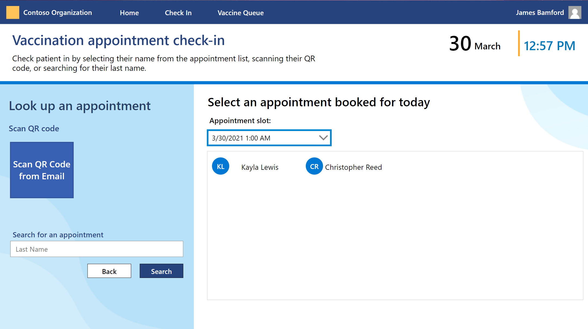
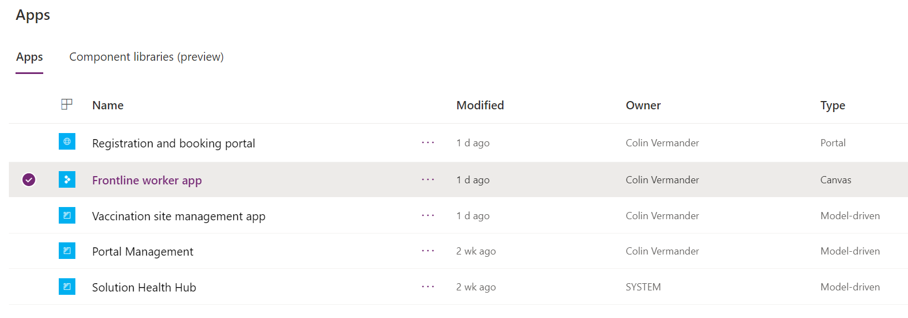
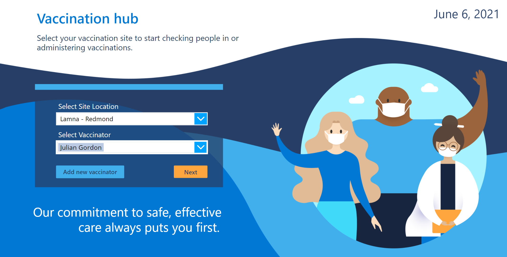

The **Frontline worker** app in Microsoft Vaccination Management is a canvas app from Microsoft Power Apps that is designed for those who need to be quick and resourceful. Power Apps canvas applications are business applications that you can build by dragging and dropping elements onto a canvas, similar to designing a slide in PowerPoint. You can then create expressions that are similar to Microsoft Excel expressions for specifying logic and working with data. When ready, the app can be shared so that users can run it in a browser or a mobile device, or they can embed it in places like Microsoft Teams.

The **Frontline worker** app address several scenarios for vaccine site workers, such as:

- Check in residents by scanning a QR code

- Check in residents by manually looking them up

- Administer and record vaccinations

In this exercise, you'll use two methods for checking in a resident: scanning a QR code and manually looking up the resident in the **Frontline worker** app.

> [!NOTE]
> To complete this exercise, make sure that you download the [Power Apps mobile app](https://powerapps.microsoft.com/downloads/?azure-portal=true) from Apple App Store or Google Play Store.

- For **Apple** devices with iOS, such as an iPhone or iPad, use [**App store**](https://aka.ms/powerappsios/?azure-portal=true).

- For **Android** devices, use [**Google Play**](https://aka.ms/powerappsandroid/?azure-portal=true).

> [!div class="mx-imgBorder"]
> 

> [!div class="mx-imgBorder"]
> 

## Task 1: Check in a resident with a QR code

In this task, you'll check in one of the residents that you registered and booked in the previous set of exercises. You'll use a QR code to check in the resident with the **Frontline worker** app on your mobile device.

1. On your **mobile device**, open the Power Apps application that you downloaded from either Apple App Store or Google Play Store.

1. Sign in by using the credentials that were supplied in the training for your user.

1. Find and open the **Frontline worker** app.

1. On your PC or Mac, open the email confirmation that you received after registering and booking **Madison Butler** in the previous set of exercises, and then scroll down to the **QR code**.

1. In the **Frontline worker** app, look up an appointment by selecting the **Scan QR Code from Email** button.

    > [!div class="mx-imgBorder"]
    > 

    > [!NOTE]
    > You'll need to grant the **Frontline worker** app permission to use the camera on your mobile device to complete this task.

    > [!div class="mx-imgBorder"]
    > 

1. Add the resident to the Vaccine Queue or have them go directly to a vaccination booth. In this instance, you'll add the resident to the Vaccine Queue.

    > [!div class="mx-imgBorder"]
    > 

1. Stop here. You'll record the vaccination details for this resident in the next exercise.

## Task 2: Check in a resident by manual lookup

In this task, you'll check in another resident that you registered and booked in the previous set of exercises. To accomplish this task, you'll manually look up the resident with the **Frontline worker** app in your internet browser.

1. Launch an internet browser in **InPrivate** or **Incognito** mode and then go to [Power Apps](https://make.powerapps.com/?azure-portal=true).

1. Sign in by using the credentials that were supplied in the training for your user.

1. Select the correct environment from the **Environment** dropdown menu in the upper-right corner.

    > [!div class="mx-imgBorder"]
    > 

1. Select **Apps** on the left navigation pane.

1. Find and select the **Frontline worker** app.

    > [!div class="mx-imgBorder"]
    > 

1. Select your **Vaccinator** and then select **Next**.

    > [!div class="mx-imgBorder"]
    > 

1. Search for the **Christopher Reed** appointment that you created in the previous set of exercises by entering the last name (**Reed**) into the **Search for an appointment** text box. Select **Search**.

    > [!div class="mx-imgBorder"]
    > 

1. Add the resident to the Vaccine Queue or have them go directly to a vaccination booth. In this instance, you'll add the resident to the Vaccine Queue.

    > [!div class="mx-imgBorder"]
    > 

1. Stop here. You'll record the vaccination details for this resident in the next exercise.
