In this exercise, you'll create a new column in the Immunization table in Dataverse to represent a new question to ask a resident during their immunization appointment. Then, you'll add that new column as a field on the form in the **Frontline worker** app.

## Task 1: Create a new column in your MVM In A Day environment

In this task, you'll create a new column in the Immunization table that will allow a resident to inform the frontline worker of their favorite color. This information will be tracked and later used for reporting in the Microsoft Vaccination Management command center.

1. Launch an internet browser in **InPrivate** or **Incognito** mode and then go to [Power Apps](https://make.powerapps.com/?azure-portal=true).

1. Sign in by using the credentials that were supplied in the training for your user.

1. Select the correct environment from the **Environment** dropdown menu in the upper-right corner.

    > [!div class="mx-imgBorder"]
    > 

1. Select **Solutions** on the left navigation pane.

1. Find and open the solution that you created in **01: Post-deployment configuration**.

1. On the top menu bar, select **+ Add existing** and then select **Table**.

    > [!div class="mx-imgBorder"]
    > 

1. Search for and select the **Immunization** table and then select **Next**.

    > [!div class="mx-imgBorder"]
    > [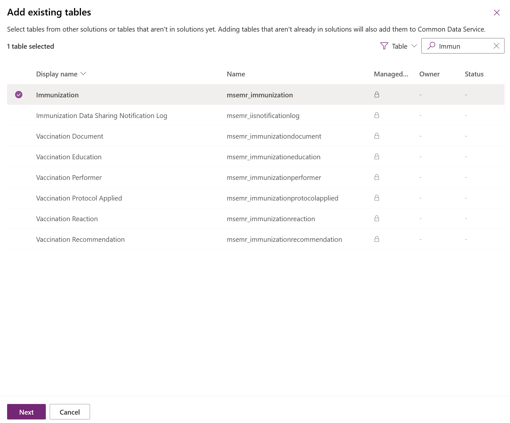](../media/5-3-immunization.png#lightbox)

1. Leave the boxes cleared and then select **Add**.

    > [!div class="mx-imgBorder"]
    > 

1. Select the newly added Immunization table and then select **Edit**.

    > [!div class="mx-imgBorder"]
    > 

1. Select **+ Add column** on the upper menu bar.

    > [!div class="mx-imgBorder"]
    > 

1. In the pop-out screen, enter **Favorite Color** as the **Display name** and then leave the other fields as defaults. Select **Done**.

    > [!div class="mx-imgBorder"]
    > 

1. Select the **Save Table** button in the lower-right corner of the screen.

    > [!div class="mx-imgBorder"]
    > [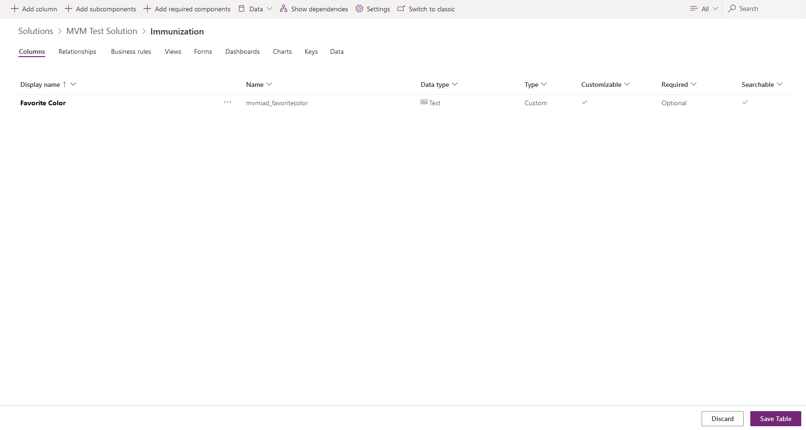](../media/5-8-save.png#lightbox)

1. Return to the solution by selecting the solution name in the breadcrumb.

    > [!div class="mx-imgBorder"]
    > 

1. Select **Publish all customizations** on the upper menu bar.

    > [!div class="mx-imgBorder"]
    > 

Congratulations, you've successfully added a new field to a solution in Dataverse.

## Task 2: Add the new column as a field in the Frontline worker app

In this task, you'll modify the **Frontline worker** app by adding a field to the form. This field will be a new question that vaccination site workers will ask residents during the vaccination process.

1. Launch an internet browser in **InPrivate** or **Incognito** mode and then go to [Power Apps](https://make.powerapps.com/?azure-portal=true).

1. Sign in by using the credentials that were supplied in the training for your user.

1. Select the correct environment from the **Environment** dropdown menu in the upper-right corner.

    > [!div class="mx-imgBorder"]
    > 

1. Select **Solutions** on the left navigation pane and then select the solution that you've created.

1. On the upper menu, select **+ Add existing > App > Canvas app**.

    > [!div class="mx-imgBorder"]
    > 

1. Select **Frontline worker app** and then select **Add**.

    > [!div class="mx-imgBorder"]
    > [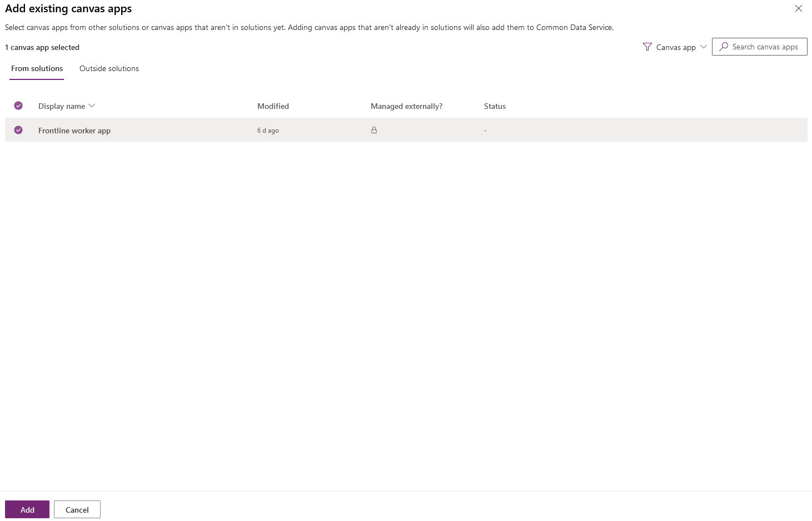](../media/5-12-frontline.png#lightbox)

1. Select **Frontline worker app** and then select **Edit**.

    > [!div class="mx-imgBorder"]
    > 

1. When the canvas app opens, select to expand the **pgDose1** screen.

    > [!div class="mx-imgBorder"]
    > [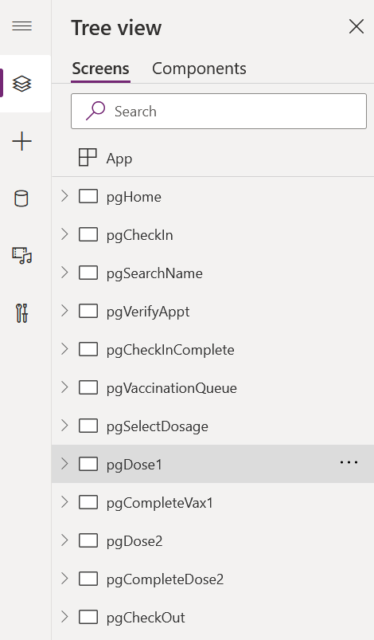](../media/5-14-dose.png#lightbox)

1. Scroll down and select **pgDose1ImmunizationForm** and then select **Edit fields** on the **EDIT** menu.

    > [!div class="mx-imgBorder"]
    > 

    > [!div class="mx-imgBorder"]
    > [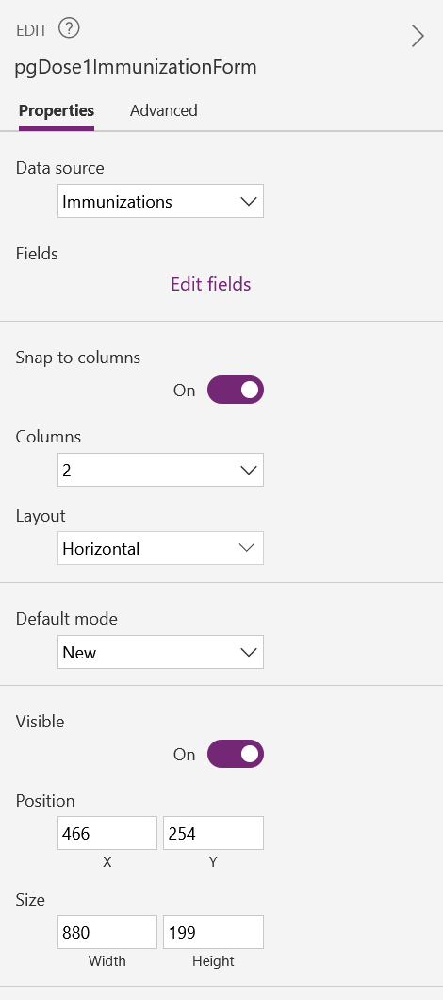](../media/5-16-edit-fields.png#lightbox)

1. Select **Add field** to add the **Favorite Color** field that you created in the previous task.

    > [!div class="mx-imgBorder"]
    > 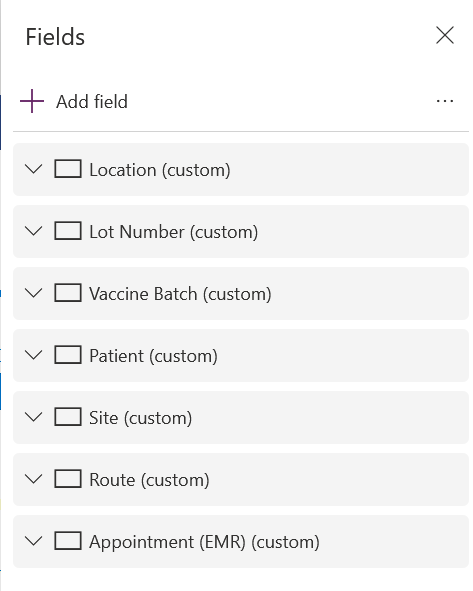

1. Search for and select the "**Favorite Color**" field and then select **Add**.

    > [!div class="mx-imgBorder"]
    > 

1. The **Favorite Color** field will now be added to the bottom of the data card and will overlap the **Dose Number** field.

    > [!div class="mx-imgBorder"]
    > [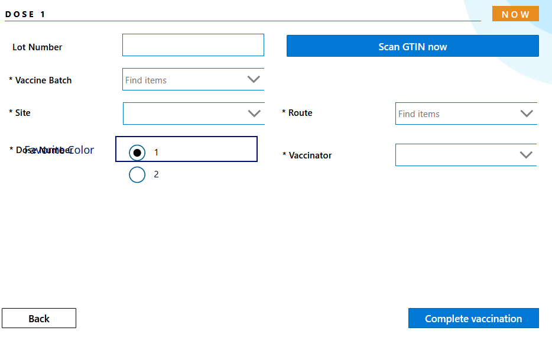](../media/5-19-data-card.png#lightbox)

1. Select the Dose Number data card and drag it lower on the form so that it doesn't overlap the **Favorite Color** field.

    > [!div class="mx-imgBorder"]
    > [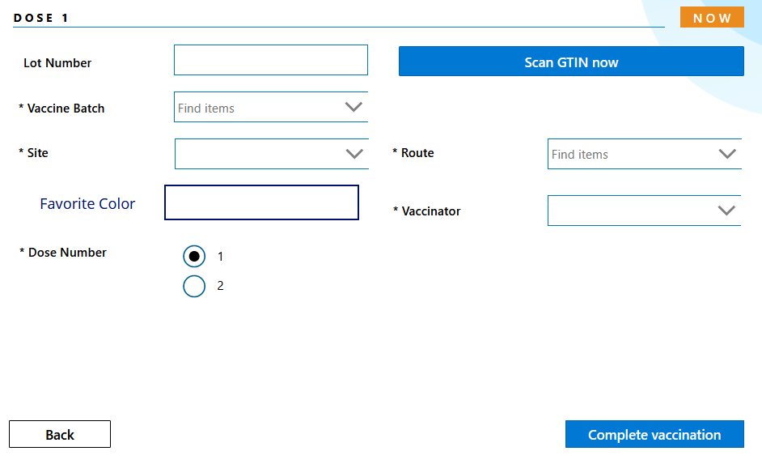](../media/5-20-fixed.png#lightbox)

1. Select the **Favorite Color** label and change the font to **Segoe UI 11**, font size to **11**, and color to **black**. Drag the label to the left so that it aligns with other labels on the form.

    > [!div class="mx-imgBorder"]
    > 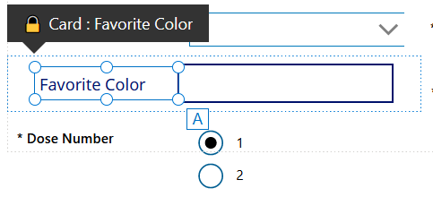

1. Select the text box and change the font to **Segoe UI**, font size to **11**, and height to **35**. You can change other configurations to suit your needs.

    > [!div class="mx-imgBorder"]
    > 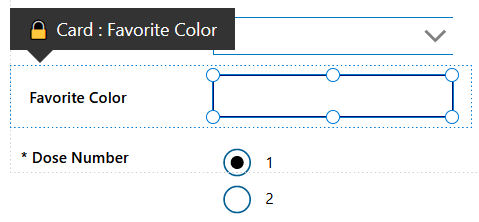

1. Go to **File > Save**.

1. Go to **File > Publish > Publish this version**.

1. Select **Close**.

Congratulations, you've successfully added a new field to a form in the **Frontline worker** app.

## Task 3: Test the new scenario

In this task, you'll test the new scenario by checking in and recording the vaccination details of the third resident (Kayle Lewis) that you created in **03: Registration and booking process** in the **Frontline worker** app by using your internet browser.

1. Launch an internet browser in **InPrivate** or **Incognito** mode and then go to [Power Apps](https://make.powerapps.com/?azure-portal=true).

1. Sign in by using the credentials that were supplied in the training for your user.

1. Select the correct environment from the **Environment** dropdown menu in the upper-right corner.

    > [!div class="mx-imgBorder"]
    > 

1. Select **Apps** on the left navigation pane.

1. Select **Frontline worker app**.

1. Go though the steps to check in another resident. Select **Vaccinate now** and then select **Dose 1**.

1. The **Favorite Color** field should be added to the form. Fill out the various fields and then select **Complete Vaccination**.

    > [!div class="mx-imgBorder"]
    > [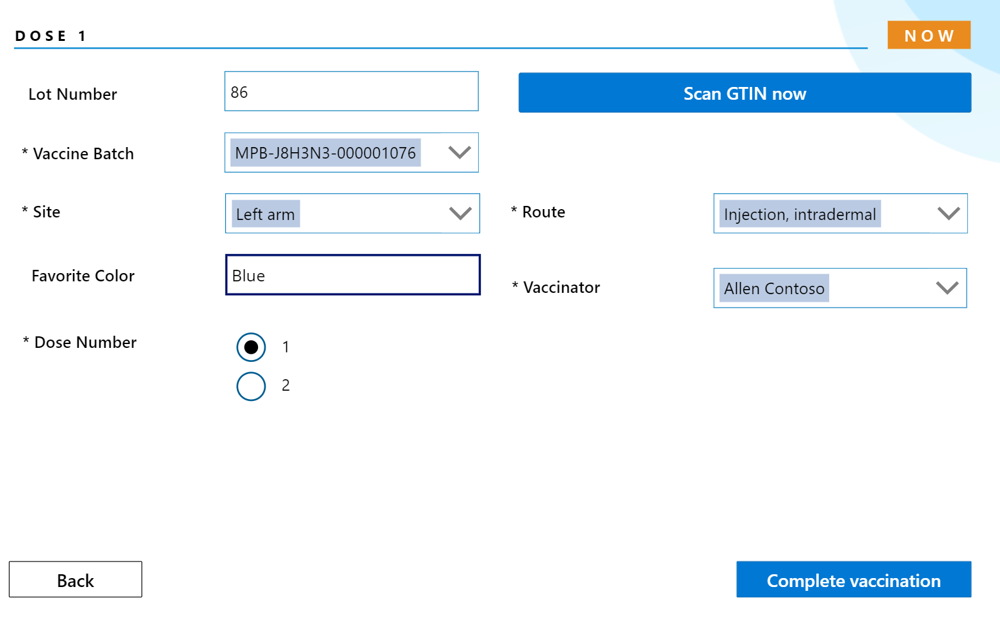](../media/5-23-new-field.png#lightbox)

1. For the **Do you want to mark vaccination complete for the selected patient** screen, select **Yes**.

    > [!div class="mx-imgBorder"]
    > 

    > [!div class="mx-imgBorder"]
    > 

1. Return to the **Vaccination site management** app and then go to **Registration**. Under **Data Sharing**, a Vaccination Data Sharing Notification Log will show for each resident that you vaccinated.

    > [!div class="mx-imgBorder"]
    > [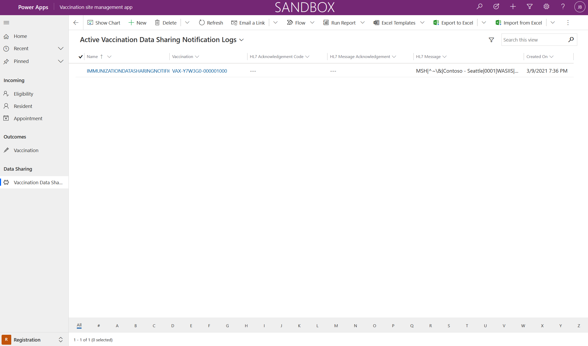](../media/5-26-log.png#lightbox)

> [!NOTE]
> The **HL7 message** generation is triggered after the vaccination has been administered and the vaccinator has selected **Complete vaccination** in the **Frontline worker** app. This action creates a vaccination record in Dataverse that can be viewed in the **Vaccination site management** app under **Vaccination**. After the business logic to associate vaccination documents is complete, the **Completed** flag on the vaccination record is set. This action will trigger the message generation plug-in. Each message generation will create a record in the Vaccination Data Sharing Notification Log.
>
> After the message is generated successfully, a **Vaccination Data Sharing Notification Log** is created for the vaccination. This log will trigger the plug-in to send the **HL7 message** to the state agency's immunization system. The response from the immunization system will be stored in the same record. The message generation can also be triggered by setting the **Generate HL7** flag on the vaccination record in the **Vaccination site management** app under **Vaccination**. This action will allow the administrator, in case of errors when sending the data to the state, to fix data issues that pertain to vaccination and then regenerate the message.
>
> The message structure to report the vaccination information to state healthcare agencies varies across states and countries. The message generation and sharing capability in Vaccination Management provides a template and reference design for integration with the state agency's immunization system. As an implementor, you'll need to ascertain the structure of the message that is being generated and then make necessary modifications to adapt the message structure according to the respective immunization system.

Congratulations, you tested the end-to-end scenario by vaccinating a resident, recording vaccination details with the **Frontline worker** app, and viewing the **Vaccination Data Sharing** record in the **Vaccination site management** app.
