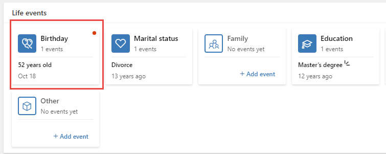
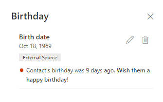

Knowing key information about your customers when you need it is key to offering a seamless experience for your customers across business lines and for building a deeper relationship with them. With the Unified Customer Profile application, you can view a 360-degree perspective of the customer in a clear and intuitive way. With this feature, you can view the most relevant information across multiple business lines, consolidated into a unified dashboard that offers an accurate, consistent, and cohesive source of truth about the customer. Additionally, the application allows you to apply the information to provide personalized experiences, reveal important opportunities, prevent potential loss, or churn and improve customer satisfaction. For example, by tracking life events, you might know that your customer has recently had a birthday or received a promotion, so you will have an opportunity to offer them congratulations the next time that you speak with them.

Key areas of the Unified Customer Profile application include:

- **Summary** - View a summary of the customer, their personal details, life moments, financial holdings, and credit and debit cards.

- **Connections** - View the groups that the customer is a part of, which will help you know the overall financial strength for each group (such as household). In this area, you can create group records, associate customer records with groups, and update general information and financial holdings that are relevant to the group. Furthermore, you can capture relationships between contacts based on an expandable option set.

- **Financial holdings** - View detailed information about all financial holdings that are associated with the customer.

The following video demonstrates how people might use the Unified Customer Profile application to better know their customer.

> [!VIDEO https://www.microsoft.com/videoplayer/embed/RWOUkW]

## Use the application

The **Summary** tab contains areas that include consumable pieces of information that highlight the details about your customer:

- **Customer snapshot** - This area shows personal information (for example, name, demographics, and branch information), financial information (financial measures, regular income), and the preferred channel of communication. You can enrich the **Customer snapshot** area with customer intelligence-driven information, such as segments and churn score.

- **Life events** - This area provides insight into the customer and their family's past and future life milestones. This area can help you identify upcoming opportunities, devise personalized offers, and provide a consistent engagement experience. Each category in the **Life events** area, such as **Marital Status**, can include multiple life event entries. You can also edit these items as needed.

> [!div class="mx-imgBorder"]
> 

Users will be notified of relevant events, such as a recent birthday. This notification feature allows you to send a birthday message to the customer, which will help you continue to build on the relationship.

> [!div class="mx-imgBorder"]
> 

- **Financial holdings** - This area on the **Summary** tab provides a view of the customer's relationship with the bank, showing wallet share, assets and liabilities, and other aspects of the customer's holdings with the bank.

- **Cards** - This area shows the credit and debit cards that the customer holds. You can enrich the **Cards** area with insights, such as alerts on expiring cards and cards that are pending activation. Additionally, you can view information on cards on the **Financial holdings** tab, in the **Credit Lines or Accounts** section. In that section, you can view the credit cards that are associated with the specific credit line or debit cards that are associated with an account.

The **Connections** tab offers a view of the groups that the customer belongs to, such as a household. The **Connections** tab also provides a comprehensive view of all groups that the customer is a part of, including other households and other groups, and their relationships to other customers.

> [!div class="mx-imgBorder"]
> 

- **All groups that the customer is a part of** - The customer's main household is selected by default. Other group members, and the customer's role in the group, are visible.

- **Selected customer group** - The information shows the address (which is derived from the group's primary member's address), total income, total assets, total liabilities (converted to the system's default currency), and the shared financial holdings of that group.

-   **Relationships** - This area provides information on relationships between a customer and other contacts, which covers family and professional relationships. The system supports many different types of relationships, including family (parent, child, siblings, extended family), professional (lawyer, accountant), and financial (power of attorney). An administrator can customize the list of possible relationship types between two contacts.

The **Financial holdings** tab expands on what was described for the **Summary** view.

The **Overview** tab in the **Financial holdings** area provides high-level information on the customer's financial holdings. The default selection is an overview of the customer's assets and liabilities, including relevant alert indicators that are located to the right of the area. Hover your cursor over an indicator to view the indicator message. The other tabs offer a summary view of other financial holdings, such as accounts, investments, loans, credit lines, and long-term savings.

When you select an item on the left, you can view details of that item on the right.

> [!div class="mx-imgBorder"]
> 

## Deployment considerations

The Unified Customer Profile application allows you to bring together the data from your core banking systems into a single place for an extensive view of your customer and their business with your organization. Unified Customer Profile is a model-driven app from Microsoft Power Apps, and you can further customize it to meet your organization's specific requirements.

### Work with multiple currencies

Customers might have financial relationships with the bank (financial holdings and financial instruments) in the default currency of the organization and in other currencies.

Unified Customer Profile within Microsoft Cloud for Financial Services allows sophisticated treatment of multi-currency holdings. For each financial holding, a different currency might be passed from the bank's core systems. The total balance of a financial holding (if different than the default currency of the system) is shown in the original currency of the holding and converted to the default currency of the system. The conversion is based on the financial holding's exchange rate terms and conditions. Currency presentation follows the ISO 4217 standard.

In the preceding example, the sample account is in euros, whereas the default currency of the system is US dollars. For the total balance, the converted amount is shown in the default currency.

Where assets or liabilities are summed up (in the **Summary** view of financial holdings, group financial holdings, and in total customer assets and liabilities), the sum is calculated based on the value of each holding in the default currency of the organization.

> [!NOTE]
> The original and converted financial holding values are passed from the bank's core systems rather than being converted within Unified Customer Profile.

