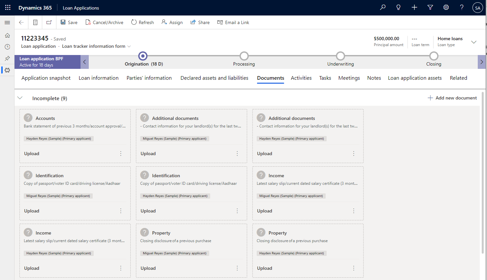
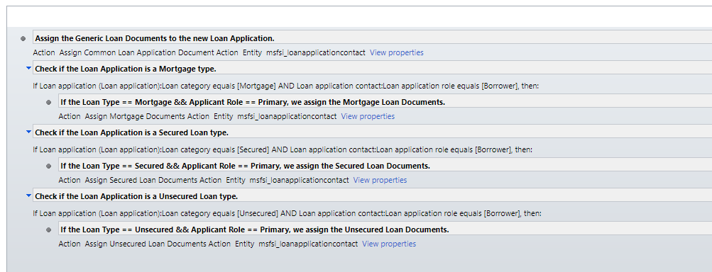
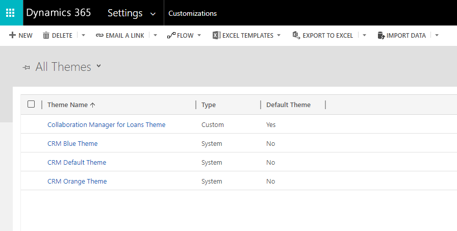

Customer onboarding from the time that they apply for a loan to tracking the loan progress can be a key differentiator between financial organizations. By streamlining the customer onboarding experience, offering self-service tools through mobile apps and portals, and enabling relationship managers to monitor the loan process, you can help ensure that customers can efficiently apply for and keep track of a loan. The automated pipeline helps you review and validate application information and keep the loan application on track for a successful close. Relationship managers can monitor the loan process and ensure consistent, reliable customer experiences.

As part of the Retail Banking solutions, Dynamics 365 provides a loan tracker, which helps the relationship manager to manage, verify, and track the loan application.

The Loan Tracker application contains the relevant information for the loan application, including information about the loan amount, the loan duration, interest rate, and personal and financial details.

Key capabilities of the Loan Tracker application include:

- **Application queue** - Allows the relationship manager to view where loan applications are in their pipeline. The manager can select applications and manage work as a team with others in the process.

- **Business process flow** - Track an individual loan's progress in your overall loan process, and manage the collection of information that is needed to process the loan application. Allows you to tailor from simple to complex loan processes.

- **Application snapshot** - A snapshot for the loan manager that presents a summary of the loan application, including *to do* issues that are related to missing information. The snapshot contains key loan information highlights, primary applicant information, and a progress tracker to visualize the current status of the application.

- **Personal and financial information** - Relevant information that is related to the applicant and includes personal details, first name, last name, address, email, and more. Financial details include the loan details and the financial details, such as assets and liabilities, collaterals, employment status, and more.

- **Documents management** - An ability to view and manage approved or rejected documents with an ability to require the relevant documents according to the type of loan.

- **Activities** - An option to view and trace all activities that are related to the application, including emails, appointments, phone calls, and more.

- **Related** - A dynamic default tab that contains quick access to internal entities within the loan tracking application.

The following video demonstrates how app users will work with the loan application and its associated details.

> [!VIDEO https://www.microsoft.com/videoplayer/embed/RWOZwr]

Organizations can choose to deploy a self-service portal. The loan onboarding sample portal is also part of Microsoft Cloud for Financial Services. It allows customers, or potential customers, to go through the loan application process.

The sample portal allows the applicant to pick the relevant type of loan and then continue through a workflow that collects the relevant information for the application, such as:

-   Information about the loan.

-   The applicant's personal and financial information, including assets and liabilities.

-   An option to add parties to the application and the relevant information for any other parties.

The sample portal allows you to upload documents according to the type of loan, as defined in advance by the bank. The sample portal contains a page that allows the applicant to view the status of the application, including alerts for missing details or documents. The page also lets the applicant upload missing documents.

For more information, see [Work with Power Apps portals.](/learn/paths/work-power-apps-portals/?azure-portal=true)

## Deployment considerations

As you set up the solution and prepare it for your users, make sure that you set up a few components to meet your specific business needs.

### Set up the business process flow

The system will deploy a business process flow that requires customization. This flow allows you to customize the system to match your established loan process. You will add stages to help guide your users along a defined path and to help reduce errors and redundancies.

The business process flow is installed with a placeholder stage so that you can customize it specifically for your business needs.

> [!div class="mx-imgBorder"]
> 

As a maker, you will configure the business process flow with the stages and steps of your business.

> [!div class="mx-imgBorder"]
> 

Then, people who are using the Loan Application app will use the custom process that was defined by you during initial setup.

> [!div class="mx-imgBorder"]
> 

### Define required documents for loan applications

During the loan application process, the applicants will be asked to provide verification for specific details. You might need to view and save reference copies of documents, such as proof of job and pay, current assets or liabilities statements, marriage papers, and more. Additionally, you might require documents from all applicants and cosigners. You can create the document requests with types and the targeted applicant.

> [!div class="mx-imgBorder"]
> 

To create specific documents for your business, or to edit documents that are created for you, go to the data records in Microsoft Dataverse and make the necessary additions and edits.

> [!div class="mx-imgBorder"]
> 

### Set up a workflow for documents

The system will create a workflow for the handling of documents. When you create your own required documents, make sure that you edit the workflow to process the new documents according to your organization's specific policies and needs.

> [!div class="mx-imgBorder"]
> 

### Add branding or theming

All model-driven apps from Power Apps allow makers to apply themes to certain elements in the user interface. This feature allows your users to quickly identify your own brand colors, logos, and more. To define and apply a theme, go to **Advanced Settings**. For more information, go to [Use a theme to create a custom look for your app](/powerapps/maker/model-driven-apps/create-themes-organization-branding/?azure-portal=true).

> [!div class="mx-imgBorder"]
> 
