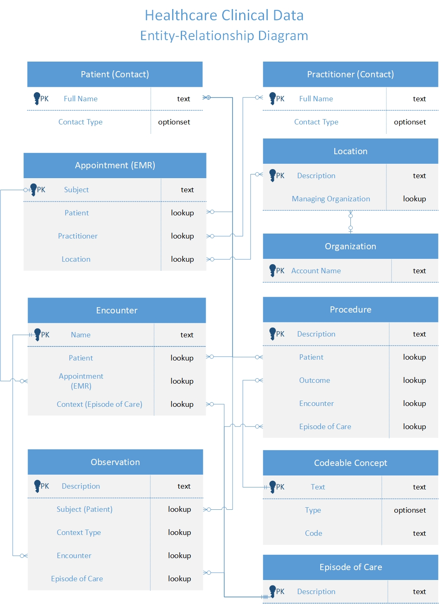
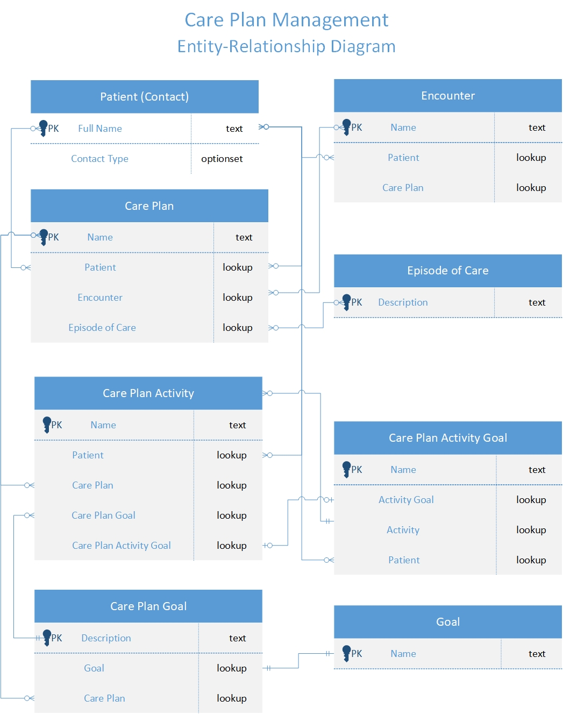

In this exercise, you'll learn about the core Care Management data tables. If you want to explore the tables in more detail on Microsoft Docs, go to [Overview of Microsoft Cloud for Healthcare entities](/common-data-model/schema/core/industrycommon/healthcare/healthcare-overview/?azure-portal=true).

The healthcare data model uses some out-of-the-box tables from Dynamics 365 applications. The following healthcare solutions use the built-in Dynamics 365 tables.

|     Healthcare   solution     |     Dynamics 365 tables                                           |
|-------------------------------|-------------------------------------------------------------------|
|     Care   Management         |     Account, Activities, Contact, Tasks                           |
|     Home Health               |     Bookings, Incident, Products, Work Order                      |
|     Patient Outreach          |     Lead/Lead Score, Marketing Emails, Contact,   Tasks           |
|     Patient Service Center    |     Agent Script, Knowledge Article, Queues,   Survey Response    |

For more information, see [Healthcare data model overview](/dynamics365/industry/healthcare/overview-data-model/?azure-portal=true).

## Task 1: Navigate patient details tables and relationships

In this task, you'll explore the main tables that are related to patient data. 

### Patient details table definitions

Select each table name to navigate to the Microsoft Docs page that provides details about each table.

- [Patient (Contact)](/common-data-model/schema/core/industrycommon/healthcare/administration/administrationcore/contact/?azure-portal=true) - Person with whom a business unit has a relationship, such as customer, supplier, and colleague.
  
- [AllergyIntolerance](/common-data-model/schema/core/industrycommon/healthcare/clinical/clinicalcore/allergyintolerance/?azure-portal=true) - Risk of a harmful or an undesirable physiological response that is unique to an individual and associated with exposure to a substance.
  
- [Condition](/common-data-model/schema/core/industrycommon/healthcare/foundational/commoncore/condition/?azure-portal=true) - A clinical condition, problem, diagnosis, or other event, situation, issue, or clinical concept that has risen to a level of concern.
  
- [MedicationRequest](/common-data-model/schema/core/industrycommon/healthcare/foundational/commoncore/medicationrequest/?azure-portal=true) - An order or request for supply of the medication and the instructions for administration of the medication to a patient.
  
- [RelatedPerson](/common-data-model/schema/core/industrycommon/healthcare/foundational/commoncore/relatedperson/?azure-portal=true) - Information about a person who is involved in the care for a patient but isn't the target of healthcare or has a formal responsibility in the care process.

> [!div class="mx-imgBorder"]
> 

## Task 2: Navigate clinical data tables and relationships

In this task, you'll explore the main tables that are related to clinical data.

### Clinical data table definitions

Select each table name to navigate to the Microsoft Docs page that provides details about each table.

- [Patient or Practitioner (Contact)](/common-data-model/schema/core/industrycommon/healthcare/administration/administrationcore/contact/?azure-portal=true) - Person with whom a business unit has a relationship, such as customer, supplier, and colleague.
                                                                                                                                                                            
- [Organization](/common-data-model/schema/core/applicationcommon/organization/?azure-portal=true) - Top level of the Microsoft Dynamics 365 business hierarchy. The organization can be a specific business, holding company, or corporation.
  
- [Location](/common-data-model/schema/core/industrycommon/healthcare/foundational/commoncore/location/?azure-portal=true) - Details and position information for a physical place where services are provided and resources and participants might be stored, found, contained, or accommodated.
  
- [AppointmentEMR](/common-data-model/schema/core/industrycommon/healthcare/foundational/commoncore/appointmentemr/?azure-portal=true) - A booking of a healthcare event among patient(s), practitioner(s), related person(s) and/or device(s) for a specific date/time. This event might result in one or more Encounter(s).
  
- [Procedure](/common-data-model/schema/core/industrycommon/healthcare/foundational/commoncore/procedure/?azure-portal=true) - An action that is or was performed on a patient. This action can be a physical intervention (such as an operation) or less invasive (such as counseling or hypnotherapy).
  
- [Encounter](/common-data-model/schema/core/industrycommon/healthcare/foundational/commoncore/encounter/?azure-portal=true) - An interaction between a patient and healthcare provider(s) for the purpose of providing healthcare service(s) or assessing the health status of a patient.
  
- [EpisodeOfCare](/common-data-model/schema/core/industrycommon/healthcare/foundational/commoncore/episodeofcare/?azure-portal=true) - An association between a patient and an organization/healthcare provider(s) during which time encounters might occur.
  
- [Observation](/common-data-model/schema/core/industrycommon/healthcare/foundational/commoncore/observation/?azure-portal=true) - Measurements and simple assertions that are made about a patient, device, or other subject.
  
- [CodeableConcept](/common-data-model/schema/core/industrycommon/healthcare/foundational/commoncore/codeableconcept/?azure-portal=true) - Represents a value that is supplied by providing a reference to one or more terminologies, but it might also be defined by the provision of text.

> [!div class="mx-imgBorder"]
> 

## Task 3: Navigate care plan management tables and relationships

In this task, you'll explore the main tables that are related to care plan management.

### Care plan management table definitions

 Select each table name to navigate to the Microsoft Docs page that goes into detail about each table.

- [Patient (Contact)](/common-data-model/schema/core/industrycommon/healthcare/administration/administrationcore/contact/?azure-portal=true) - Person with whom a business unit has a relationship, such as customer, supplier, and colleague.
  
- [CarePlan](/common-data-model/schema/core/industrycommon/healthcare/foundational/commoncore/careplan/?azure-portal=true) - Describes the intention of how one or more practitioners intend to deliver care for a particular patient, group, or community for a period of time, possibly limited to care for a specific condition.
  
- [CarePlanActivity](/common-data-model/schema/core/industrycommon/healthcare/clinical/clinicalcareteam/careplanactivity/?azure-portal=true) - Identifies a planned action to occur as part of the plan, such as a medication to be used, lab tests to perform, self-monitoring, education, and so on.
  
- [CarePlanActivityGoal](/common-data-model/schema/core/industrycommon/healthcare/clinical/clinicalcareteam/careplanactivitygoal/?azure-portal=true) - Internal reference that identifies the goals that this activity is intended to contribute toward meeting.
  
- [Goal](/common-data-model/schema/core/industrycommon/healthcare/clinical/clinicalcareteam/goal/?azure-portal=true) - Target objective for a user or a team for a specified time period.
  
- [CarePlanGoal](/common-data-model/schema/core/industrycommon/healthcare/clinical/clinicalcareteam/overview/?azure-portal=true) - Describes the intended objective(s) of carrying out the care plan.
  
- [Encounter](/common-data-model/schema/core/industrycommon/healthcare/foundational/commoncore/encounter/?azure-portal=true) - An interaction between a patient and healthcare provider(s) for the purpose of providing healthcare service(s) or assessing the health status of a patient.
  
- [Episode of Care](/common-data-model/schema/core/industrycommon/healthcare/foundational/commoncore/episodeofcare/?azure-portal=true) - An association between a patient and an organization/healthcare provider(s) during which time encounters might occur.

> [!div class="mx-imgBorder"]
> 
