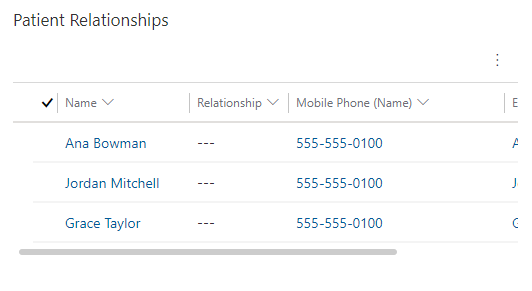
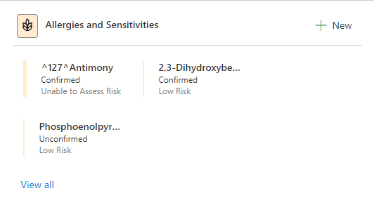
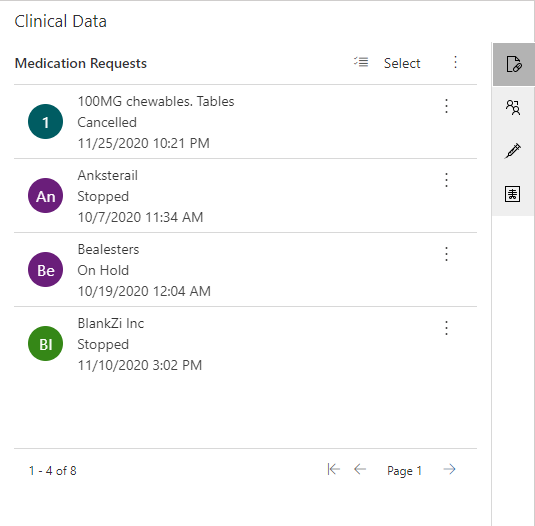
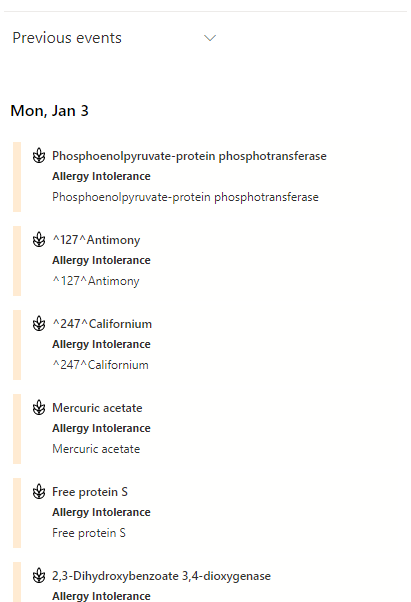
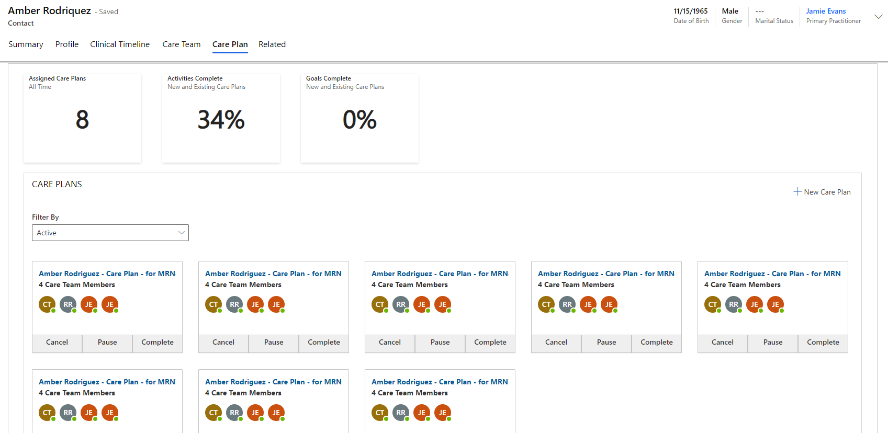

In this exercise, you will navigate the patient record and explore all the detailed information that is captured about the patient by Microsoft Cloud for Healthcare. In this case, we will examine the healthcare information of Amber Rodriguez to see how a care team member would obtain a full view of the patient.

1.  Navigate to [Power Apps](http://make.powerapps.com/?azure-portal=true) in an In-Private or Incognito window.

1.  Select the proper **Environment** in the upper right.

	> [!div class="mx-imgBorder"]
	> 

1.  In Power Apps, select **Apps** in the left sitemap. Select and open **Care Management**.

	> [!div class="mx-imgBorder"]
	> 

1.  You will be landed in the **Health Analytics** section showing the **Care Coordinator Dashboard**. This is a helpful tool for care coordinators to get a complete view of their healthcare organization data, including care plans, care plan activities, care plan goals, appointments (EMR), and activity timeline.

	> [!div class="mx-imgBorder"]
	> 

1.  Select **People** in the left Site Map.

	> [!div class="mx-imgBorder"]
	> 

1.  Find and select **Amber Rodriguez** from the Active Patients view. Open the record by double-clicking or selecting Edit in the command bar.

	> [!div class="mx-imgBorder"]
	> 

1.  Take a moment to examine the **Summary** tab on Amber's patient record. The purpose of the Amber patient record is to give a comprehensive view of Amber's latest information. In the summary tab, the care team member will have a full view of Amber's **Conditions**, **Test Results**, **Patient Relationships**, **Allergies** **and** **Sensitivities**, **Clinical Data**, and **Patient Interactions**.

	> [!div class="mx-imgBorder"]
	> 

1.  In the **Conditions** section, the care provider can get a view of all of Amber's pre-existing conditions.

	> [!div class="mx-imgBorder"]
	> 

1.  In the **Patient Relationships** section, you can see Amber's related people in the system.

	> [!div class="mx-imgBorder"]
	> 

1. In the **Allergies and Sensitivities** section, you can get a singular point of view of all the reported allergies that the care givers need to be aware of for the patient.

	> [!div class="mx-imgBorder"]
	> 

1. In the **Clinical Data** section, you can cycle through the various icons to see different medical details including **medical requests**, **encounters**, **procedures**, and **observations**. This is a simple and efficient way to observe patient healthcare details.

	> [!div class="mx-imgBorder"]
	> 
		
	> [!div class="mx-imgBorder"]
	> 

	> [!div class="mx-imgBorder"]
	> 

	> [!div class="mx-imgBorder"]
	> 

1. The **Patient Interactions** section shows any activity, note, or post and can be filtered or sorted.

	> [!div class="mx-imgBorder"]
	> 

1. Select the Profile Tab to get **Patient Information, Address Information, and Insurance Information.** In the Patient Information, notice that key patient data such as Date of Birth and Primary Practitioner are shown. The healthcare data model uses the contact entity from the Common Data Model and defines the type of contact as patient, practitioner, or related person. This determines the type of form shown.

	> [!div class="mx-imgBorder"]
	> 

1. Select the **Clinical Timeline** tab. On this tab, a care team member will be able to view a weekly calendar of the patient's clinical information and a list of any upcoming or previous events.

	> [!div class="mx-imgBorder"]
	> 

1. Select the **Upcoming events** dropdown in the right pane and switch to **previous events**.

	> [!div class="mx-imgBorder"]
	> 

1. See the list of events Amber had previously including **Appointments, Care Plans, Encounters, and Medication Requests**.

	> [!div class="mx-imgBorder"]
	> 

1. Select the **Care Team** tab. On this tab, the care team member can find other members who may be providing care to the patient for any current conditions and care plans.

	> [!div class="mx-imgBorder"]
	> 

1. Select the **Care Plan** tab. On this tab, the care team member will be able to see a full view of all the Care Plans associated to the patient. This includes a list of their care plan activities and statistics for completed activities and goals. You can create a new care plan or filter by care plan type in this view.

	> [!div class="mx-imgBorder"]
	> 

1. Finally, select the **Related** tab to see any other details related to the patient record.

	> [!div class="mx-imgBorder"]
	> 

**Congratulations!** You have explored the Care Management app and its featured data within a patient record.