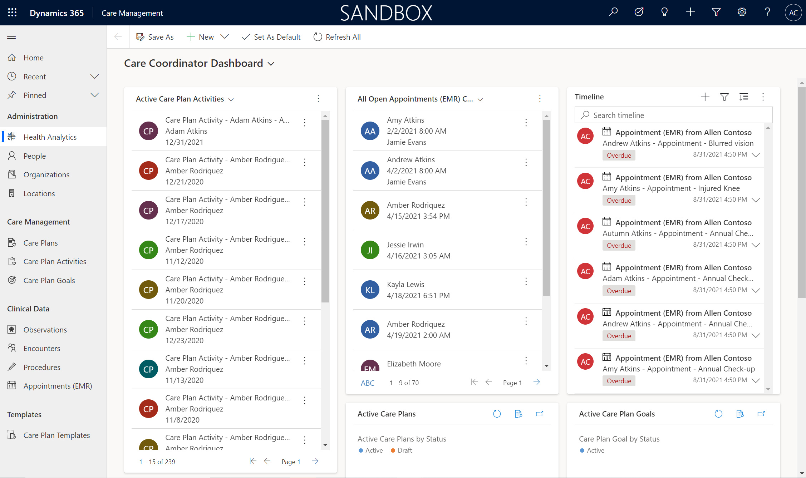
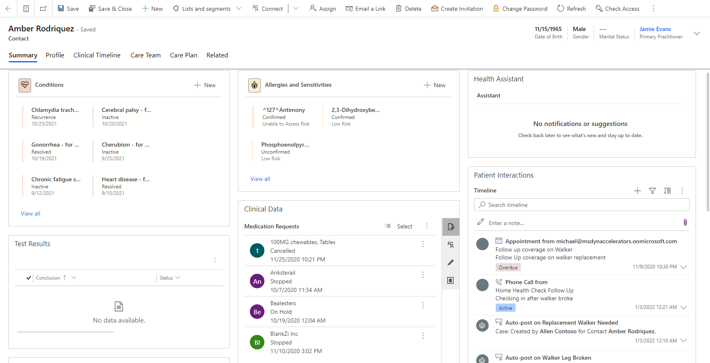
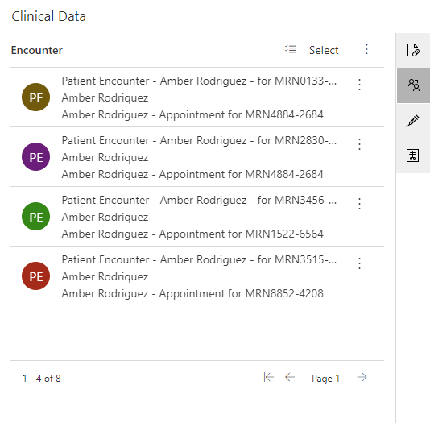
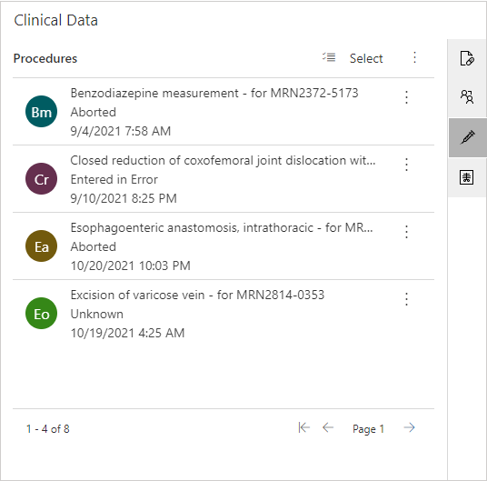
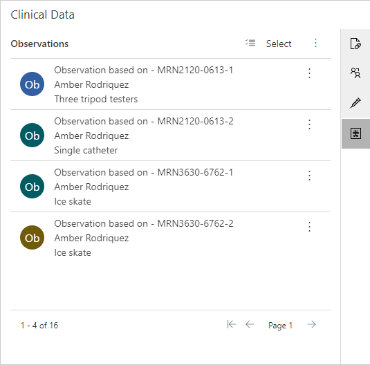
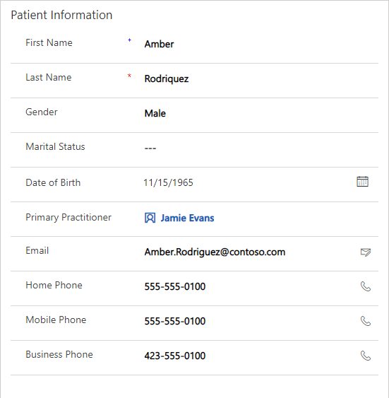
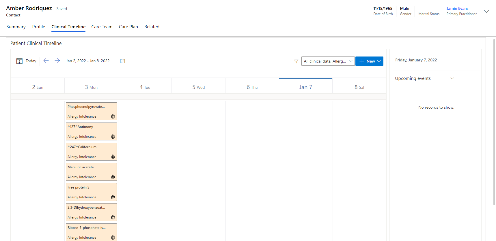
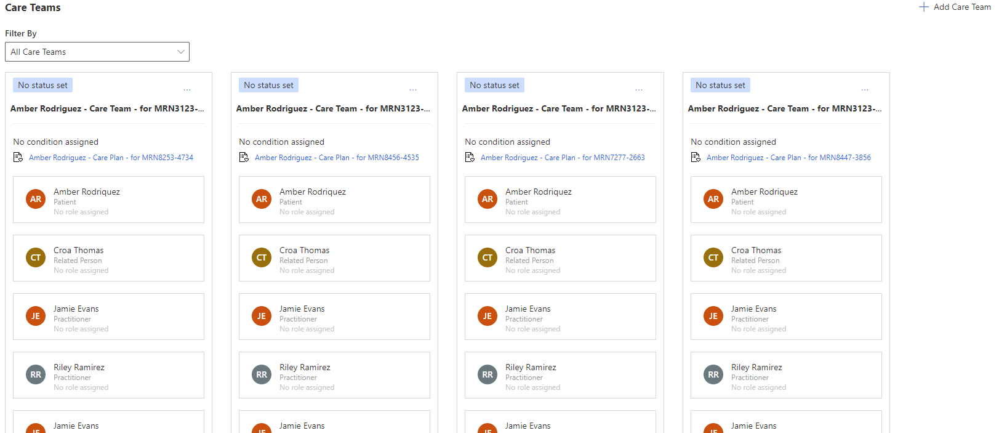
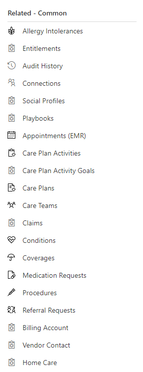

In this exercise, you'll navigate the patient record and explore the detailed information that is captured about the patient by Microsoft Cloud for Healthcare. In this scenario, you'll examine the healthcare information of Amber Rodriguez to determine how a care team member would obtain a full view of the patient.

1.  Go to [Power Apps](http://make.powerapps.com/?azure-portal=true) in an In-Private or Incognito window.

1.  Select the proper **Environment** in the upper right.

	> [!div class="mx-imgBorder"]
	> 

1.  In Power Apps, select **Apps** in the left site map. Select and open **Care Management**.

	> [!div class="mx-imgBorder"]
	> 

1.  You'll be directed to the **Health Analytics** section, showing the **Care Coordinator Dashboard**. This dashboard is a helpful tool for care coordinators to get a complete view of their healthcare organization data, including care plans, care plan activities, care plan goals, appointments (EMR), and activity timeline.

	> [!div class="mx-imgBorder"]
	> 

1.  Select **People** in the left site map.

	> [!div class="mx-imgBorder"]
	> 

1.  Find and select **Amber Rodriguez** from the **Active Patients** view. Open the record by double-clicking or selecting **Edit** in the command bar.

	> [!div class="mx-imgBorder"]
	> 

1.  Examine the **Summary** tab on Amber's patient record. The purpose of the patient record is to give a comprehensive view of Amber's latest information. In the **Summary** tab, the care team member will have a full view of Amber's **Conditions**, **Test Results**, **Patient Relationships**, **Allergies and Sensitivities**, **Clinical Data**, and **Patient Interactions**.

	> [!div class="mx-imgBorder"]
	> 

1.  In the **Conditions** section, review Amber's preexisting conditions.

	> [!div class="mx-imgBorder"]
	> 

1.  In the **Patient Relationships** section, review Amber's related people in the system.

	> [!div class="mx-imgBorder"]
	> 

1. In the **Allergies and Sensitivities** section, review the reported allergies that the care givers need to be aware of for the patient.

	> [!div class="mx-imgBorder"]
	> 

1. In the **Clinical Data** section, cycle through the various icons to review different medical details, including **Medication Requests**, **Encounters**, **Procedures**, and **Observations**. This method is simple and efficient for observing patient healthcare details.

	> [!div class="mx-imgBorder"]
	> 
		
	> [!div class="mx-imgBorder"]
	> 

	> [!div class="mx-imgBorder"]
	> 

	> [!div class="mx-imgBorder"]
	> 

1. Review the **Patient Interactions** section, which shows any activity, note, or post. You can filter and sort this section if necessary.

	> [!div class="mx-imgBorder"]
	> 

1. Select the **Profile** tab for the **Patient Information**, **Address Information**, and **Insurance Information** sections. In the **Patient Information** section, review key patient data such as **Date of Birth** and **Primary Practitioner**. The healthcare data model uses the contact entity from the Common Data Model and defines the type of contact as patient, practitioner, or related person. This information determines the type of form that will be shown.

	> [!div class="mx-imgBorder"]
	> 

1. Select the **Clinical Timeline** tab. On this tab, a care team member can view a weekly calendar of the patient's clinical information and a list of upcoming or previous events.

	> [!div class="mx-imgBorder"]
	> 

1. Select the **Upcoming events** dropdown menu in the right pane and then switch to **Previous events**.

	> [!div class="mx-imgBorder"]
	> 

1. Review the list of events that Amber had previously, including appointments, care plans, encounters, and medication requests.

	> [!div class="mx-imgBorder"]
	> 

1. Select the **Care Team** tab. On this tab, the care team member can find other members who might be providing care to the patient for current conditions and care plans.

	> [!div class="mx-imgBorder"]
	> 

1. Select the **Care Plan** tab. On this tab, the care team member has a full view of all care plans that are associated with the patient. This tab also includes a list of the patient's care plan activities and statistics for completed activities and goals. You can create a new care plan or filter by care plan type in this view.

	> [!div class="mx-imgBorder"]
	> 

1. Select the **Related** tab to view other details that are related to the patient record.

	> [!div class="mx-imgBorder"]
	> 

Congratulations, you have explored the Care Management app and its featured data within a patient record.
